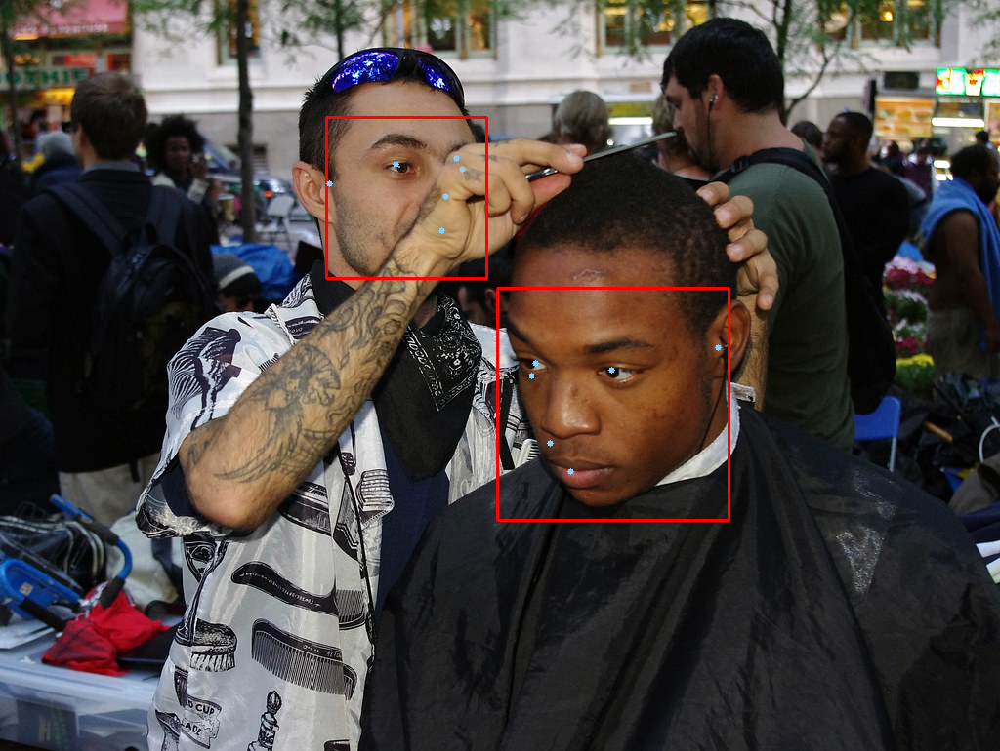

# ailia-models

The collection of pre-trained, state-of-the-art models.

# About ailia SDK

[ailia SDK](https://ailia.jp/en/) is a cross-platform high speed inference SDK. The ailia SDK provides a consistent C++ API on Windows, Mac, Linux, iOS, Android and Jetson. It supports Unity, Python and JNI for efficient AI implementation. The ailia SDK makes great use of the GPU via Vulkan and Metal to serve accelerated computing.

# Supported models

## Action recognition

| | Model | Reference | Exported From | Supported Ailia Version |
|:-----------|------------:|:------------:|:------------:|:------------:|
| [](action_recognition/mars/) | [mars](/action_recognition/mars/) | [MARS: Motion-Augmented RGB Stream for Action Recognition](https://github.com/craston/MARS) | Pytorch | 1.2.4 and later |
| [](action_recognition/st_gcn/) | [st-gcn](/action_recognition/st_gcn/) | [ST-GCN](https://github.com/yysijie/st-gcn) | Pytorch | 1.2.5 and later |

## Audio Processing

| | Model | Reference | Exported From | Supported Ailia Version |
|:-----------|------------:|:------------:|:------------:|:------------:|
| | [crnn_audio_classification](/audio_processing/crnn_audio_classification/) | [crnn-audio-classification](https://github.com/ksanjeevan/crnn-audio-classification) | Pytorch | 1.2.5 and later |
| | [deepspeech2](/audio_processing/deepspeech2/) | [deepspeech.pytorch](https://github.com/SeanNaren/deepspeech.pytorch) | Pytorch | 1.2.2 and later |

## Crowd counting

| | Model | Reference | Exported From | Supported Ailia Version |
|:-----------|------------:|:------------:|:------------:|:------------:|
| [](crowd_counting/crowdcount-cascaded-mtl/) | [crowdcount-cascaded-mtl](/crowd_counting/crowdcount-cascaded-mtl) | [CNN-based Cascaded Multi-task Learning of <br/>High-level Prior and Density Estimation for Crowd Counting <br/>(Single Image Crowd Counting)](https://github.com/svishwa/crowdcount-cascaded-mtl) | Pytorch | 1.2.1 and later | 

## Deep fashion

| | Model | Reference | Exported From | Supported Ailia Version |
|:-----------|------------:|:------------:|:------------:|:------------:|
|[](deep_fashion/clothing-detection/) | [clothing-detection](/deep_fashion/clothing-detection/) | [Clothing-Detection](https://github.com/simaiden/Clothing-Detection) | Pytorch | 1.2.1 and later |
[](deep_fashion/mmfashion/) | [mmfashion](/deep_fashion/mmfashion/) | [MMFashion](https://github.com/open-mmlab/mmfashion) | Pytorch | 1.2.5 and later |
|[](deep_fashion/fashionai-key-points-detection/) | [fashionai-key-points-detection](/deep_fashion/fashionai-key-points-detection/) | [A Pytorch Implementation of Cascaded Pyramid Network for FashionAI Key Points Detection](https://github.com/gathierry/FashionAI-KeyPointsDetectionOfApparel) | Pytorch | 1.2.5 and later |

## Depth estimation

| | Model | Reference | Exported From | Supported Ailia Version |
|:-----------|------------:|:------------:|:------------:|:------------:|
| [](depth_estimation/monodepth2/) | [monodepth2](depth_estimation/monodepth2)| [Monocular depth estimation from a single image](https://github.com/nianticlabs/monodepth2) | Pytorch | 1.2.2 and later |
| [](depth_estimation/midas/) |[midas](depth_estimation/midas)| [Towards Robust Monocular Depth Estimation:<br/> Mixing Datasets for Zero-shot Cross-dataset Transfer](https://github.com/intel-isl/MiDaS) | Pytorch | 1.2.4 and later |

## Face detection

| | Model | Reference | Exported From | Supported Ailia Version |
|:-----------|------------:|:------------:|:------------:|:------------:|
| [](face_detection/yolov1-face/) | [yolov1-face](/face_detection/yolov1-face/) | [YOLO-Face-detection](https://github.com/dannyblueliu/YOLO-Face-detection/) | Darknet | 1.1.0 and later |
| [](face_detection/yolov3-face/) | [yolov3-face](/face_detection/yolov3-face/) | [Face detection using keras-yolov3](https://github.com/axinc-ai/yolov3-face) | Keras | 1.2.1 and later |
| [](face_detection/blazeface/) |[blazeface](/face_detection/blazeface/)| [BlazeFace-PyTorch](https://github.com/hollance/BlazeFace-PyTorch) | Pytorch | 1.2.1 and later |
| [](face_detection/face-mask-detection/)| [face-mask-detection](/face_detection/face-mask-detection/) | [Face detection using keras-yolov3](https://github.com/axinc-ai/yolov3-face) | Keras | 1.2.1 and later | 
| [](face_detection/dbface/)| [dbface](face_detection/dbface/) | [DBFace : real-time, single-stage detector for face detection, <br/>with faster speed and higher accuracy](https://github.com/dlunion/DBFace) | Pytorch | 1.2.2 and later | 

## Face identification

| | Model | Reference | Exported From | Supported Ailia Version |
|:-----------|------------:|:------------:|:------------:|:------------:|
| [](face_identification/vggface2/) |[vggface2](/face_identification/vggface2) | [VGGFace2 Dataset for Face Recognition](https://github.com/ox-vgg/vgg_face2) | Caffe | 1.1.0 and later |
| [](face_identification/arcface/)|[arcface](/face_identification/arcface) | [pytorch implement of arcface](https://github.com/ronghuaiyang/arcface-pytorch) | Pytorch | 1.2.1 and later |
| [](face_identification/insightface/)|[insightface](/face_identification/insightface) | [InsightFace: 2D and 3D Face Analysis Project](https://github.com/deepinsight/insightface) | Pytorch | 1.2.5 and later |

## Face recognition

| | Model | Reference | Exported From | Supported Ailia Version |
|:-----------|------------:|:------------:|:------------:|:------------:|
| [](face_recognition/face_classification/) |[face_classification](/face_recognition/face_classification) | [Real-time face detection and emotion/gender classification](https://github.com/oarriaga/face_classification) | Keras | 1.1.0 and later |
| [](face_recognition/facial_feature/) |[facial_feature](/face_recognition/facial_feature/)|[kaggle-facial-keypoints](https://github.com/axinc-ai/kaggle-facial-keypoints)|Pytorch| 1.2.0 and later |
| [](face_recognition/face_alignment/) |[face_alignment](/face_recognition/face_alignment/)| [2D and 3D Face alignment library build using pytorch](https://github.com/1adrianb/face-alignment) | Pytorch | 1.2.1 and later |
| [](face_recognition/prnet/) |[prnet](/face_recognition/prnet)| [Joint 3D Face Reconstruction and Dense Alignment <br/>with Position Map Regression Network](https://github.com/YadiraF/PRNet) | TensorFlow | 1.2.2 and later |
| [](face_recognition/gazeml/) | [gazeml](/face_recognition/gazeml/) | [A deep learning framework based on Tensorflow <br/>for the training of high performance gaze estimation](https://github.com/swook/GazeML) | TensorFlow | 1.2.0 and later |

## Generative adversarial networks

| | Model | Reference | Exported From | Supported Ailia Version |
|:-----------|------------:|:------------:|:------------:|:------------:|
| [](generative_adversarial_networks/pytorch-gan/) |[pytorch-gan](/generative_adversarial_networks/pytorch-gan) | [Code repo for the Pytorch GAN Zoo project (used to train this model)](https://github.com/facebookresearch/pytorch_GAN_zoo)| Pytorch | 1.2.4 and later |
| [](generative_adversarial_networks/council-GAN/) | [council-GAN](/generative_adversarial_networks/council-GAN)| [Council-GAN](https://github.com/Onr/Council-GAN)| Pytorch | 1.2.4 and later |

## Hand detection

| | Model | Reference | Exported From | Supported Ailia Version |
|:-----------|------------:|:------------:|:------------:|:------------:|
| [](hand_detection/yolov3-hand/) | [yolov3-hand](/hand_detection/yolov3-hand/) | [Hand detection branch of Face detection using keras-yolov3](https://github.com/axinc-ai/yolov3-face/tree/hand_detection) | Keras | 1.2.1 and later |
| [](hand_detection/hand_detection_pytorch/) | [hand_detection_pytorch](/hand_detection/hand_detection_pytorch/) | [hand-detection.PyTorch](https://github.com/zllrunning/hand-detection.PyTorch) | Pytorch | 1.2.2 and later |
| [](hand_detection/blazepalm/) |[blazepalm](/hand_detection/blazepalm/) | [MediaPipePyTorch](https://github.com/zmurez/MediaPipePyTorch) | Pytorch | 1.2.5 and later |

## Image captioning

| | Model | Reference | Exported From | Supported Ailia Version |
|:-----------|------------:|:------------:|:------------:|:------------:|
| [](image_captioning/illustration2vec/) | [illustration2vec](/image_captioning/illustration2vec/)|[Illustration2Vec](https://github.com/rezoo/illustration2vec) | Caffe | 1.2.2 and later |
| [](image_captioning/image_captioning_pytorch/) | [image_captioning_pytorch](/image_captioning/image_captioning_pytorch/)|[Image Captioning pytorch](https://github.com/ruotianluo/ImageCaptioning.pytorch) | Pytorch | 1.2.5 and later |


## Image classification

| | Model | Reference | Exported From | Supported Ailia Version |
|:-----------|------------:|:------------:|:------------:|:------------:|
| [](image_classification/vgg16/) | [vgg16](/image_classification/vgg16/) |[Very Deep Convolutional Networks for Large-Scale Image Recognition]( https://arxiv.org/abs/1409.1556 )|Keras| 1.1.0 and later|
| [](image_classification/googlenet/) | [googlenet](/image_classification/googlenet/) |[Going Deeper with Convolutions]( https://arxiv.org/abs/1409.4842 )|Pytorch| 1.2.0 and later|
| [](image_classification/resnet50/) | [resnet50](/image_classification/resnet50/) | [Deep Residual Learning for Image Recognition]( https://github.com/KaimingHe/deep-residual-networks) | Chainer | 1.2.0 and later |
| [](image_classification/inceptionv3/) | [inceptionv3](/image_classification/inceptionv3/)|[Rethinking the Inception Architecture for Computer Vision](http://arxiv.org/abs/1512.00567)|Pytorch| 1.2.0 and later |
| [](image_classification/mobilenetv2/) | [mobilenetv2](/image_classification/mobilenetv2/)|[PyTorch Implemention of MobileNet V2](https://github.com/d-li14/mobilenetv2.pytorch)|Pytorch| 1.2.0 and later |
| [](image_classification/mobilenetv3/) | [mobilenetv3](/image_classification/mobilenetv3/)|[PyTorch Implemention of MobileNet V3](https://github.com/d-li14/mobilenetv3.pytorch)|Pytorch| 1.2.1 and later |
| [](image_classification/partialconv/) | [partialconv](/image_classification/partialconv/)|[Partial Convolution Layer for Padding and Image Inpainting](https://github.com/NVIDIA/partialconv)|Pytorch| 1.2.0 and later |
| [](image_classification/efficientnet/)| [efficientnet](/image_classification/efficientnet/)|[A PyTorch implementation of EfficientNet]( https://github.com/lukemelas/EfficientNet-PyTorch)|Pytorch| 1.2.3 and later |

## Image manipulation

| | Model | Reference | Exported From | Supported Ailia Version |
|:-----------|------------:|:------------:|:------------:|:------------:|
| [](image_manipulation/noise2noise/) | [noise2noise](/image_manipulation/noise2noise/) | [Learning Image Restoration without Clean Data](https://github.com/joeylitalien/noise2noise-pytorch) | Pytorch | 1.2.0 and later |
| [](image_manipulation/dewarpnet/) | [dewarpnet](/image_manipulation/dewarpnet) | [DewarpNet: Single-Image Document Unwarping With Stacked 3D and 2D Regression Networks](https://github.com/cvlab-stonybrook/DewarpNet) | Pytorch | 1.2.1 and later |
| [](image_manipulation/illnet/) | [illnet](/image_manipulation/illnet/) | [Document Rectification and Illumination Correction using a Patch-based CNN](https://github.com/xiaoyu258/DocProj) | Pytorch | 1.2.2 and later |
| [](image_manipulation/colorization/) | [colorization](/image_manipulation/colorization/) | [Colorful Image Colorization](https://github.com/richzhang/colorization) | Pytorch | 1.2.2 and later |
| [](image_manipulation/u2net_portrait/) | [u2net_portrait](/image_manipulation/u2net_portrait/) | [U^2-Net: Going Deeper with Nested U-Structure for Salient Object Detection](https://github.com/NathanUA/U-2-Net) | Pytorch | 1.2.2 and later |


## Image segmentation


| | Model | Reference | Exported From | Supported Ailia Version |
|:-----------|------------:|:------------:|:------------:|:------------:|
| [](image_segmentation/deeplabv3/) | [deeplabv3](/image_segmentation/deeplabv3/) | [Xception65 for backbone network of DeepLab v3+](https://github.com/tensorflow/models/tree/master/research/deeplab) | Chainer | 1.2.0 and later |
| [](image_segmentation/hrnet_segmentation/) | [hrnet_segmentation](/image_segmentation/hrnet_segmentation/) | [High-resolution networks (HRNets) for Semantic Segmentation](https://github.com/HRNet/HRNet-Semantic-Segmentation) | Pytorch | 1.2.1 and later |
| [](image_segmentation/hair_segmentation/) | [hair_segmentation](/image_segmentation/hair_segmentation/) | [hair segmentation in mobile device](https://github.com/thangtran480/hair-segmentation) | Keras | 1.2.1 and later |
| [](image_segmentation/pspnet-hair-segmentation/) | [pspnet-hair-segmentation](/image_segmentation/pspnet-hair-segmentation/) | [pytorch-hair-segmentation](https://github.com/YBIGTA/pytorch-hair-segmentation) | Pytorch | 1.2.2 and later |
| [](image_segmentation/u2net/) | [U-2-Net](/image_segmentation/u2net/) | [U^2-Net: Going Deeper with Nested U-Structure for Salient Object Detection](https://github.com/NathanUA/U-2-Net) | Pytorch | 1.2.2 and later |
| [](image_segmentation/deep-image-matting/) | [deep-image-matting](/image_segmentation/deep-image-matting/) | [Deep Image Matting](https://github.com/foamliu/Deep-Image-Matting)| Keras | 1.2.3 and later |
| [](image_segmentation/human_part_segmentation/) | [human_part_segmentation](/image_segmentation/human_part_segmentation/) | [Self Correction for Human Parsing](https://github.com/PeikeLi/Self-Correction-Human-Parsing) | Pytorch | 1.2.4 and later |
| [](image_segmentation/semantic-segmentation-mobilenet-v3/) | [semantic-segmentation-mobilenet-v3](/image_segmentation/semantic-segmentation-mobilenet-v3) | [Semantic segmentation with MobileNetV3](https://github.com/OniroAI/Semantic-segmentation-with-MobileNetV3) | TensorFlow | 1.2.5 and later |
| [](image_segmentation/pytorch-unet/) | [pytorch-unet](/image_segmentation/pytorch-unet/) | [Pytorch-Unet](https://github.com/milesial/Pytorch-UNet) | Pytorch | 1.2.5 and later |

## Natural language processing

| | Model | Reference | Exported From | Supported Ailia Version |
|:-----------|------------:|:------------:|:------------:|:------------:|
| |[bert](/neural_language_processing/bert) | [pytorch-pretrained-bert](https://pypi.org/project/pytorch-pretrained-bert/) | Pytorch | 1.2.2 and later |
| |[bert_maskedlm](/neural_language_processing/bert_maskedlm) | [huggingface/transformers](https://github.com/huggingface/transformers) | Pytorch | 1.2.5 and later |
| |[bert_ner](/neural_language_processing/bert_ner) | [huggingface/transformers](https://github.com/huggingface/transformers) | Pytorch | 1.2.5 and later |
| |[bert_question_answering](/neural_language_processing/bert_question_answering) | [huggingface/transformers](https://github.com/huggingface/transformers) | Pytorch | 1.2.5 and later |
| |[bert_sentiment_analysis](/neural_language_processing/bert_sentiment_analysis) | [huggingface/transformers](https://github.com/huggingface/transformers) | Pytorch | 1.2.5 and later |
| |[bert_zero_shot_classification](/neural_language_processing/bert_zero_shot_classification) | [huggingface/transformers](https://github.com/huggingface/transformers) | Pytorch | 1.2.5 and later |
| |[bert_tweets_sentiment](/neural_language_processing/bert_tweets_sentiment) | [huggingface/transformers](https://github.com/huggingface/transformers) | Pytorch | 1.2.5 and later |

## Object detection

| | Model | Reference | Exported From | Supported Ailia Version |
|:-----------|------------:|:------------:|:------------:|:------------:|
| [](object_detection/yolov1-tiny/) | [yolov1-tiny](/object_detection/yolov1-tiny/) | [YOLO: Real-Time Object Detection](https://pjreddie.com/darknet/yolov1/) | Darknet | 1.1.0 and later |
| [](object_detection/yolov2/) | [yolov2](/object_detection/yolov2/) | [YOLO: Real-Time Object Detection](https://pjreddie.com/darknet/yolo/) | Pytorch | 1.2.0 and later |
| [](object_detection/yolov3/) | [yolov3](/object_detection/yolov3/) | [YOLO: Real-Time Object Detection](https://pjreddie.com/darknet/yolo/) | ONNX Runtime | 1.2.1 and later |
| [](object_detection/yolov3-tiny/) | [yolov3-tiny](/object_detection/yolov3-tiny/) | [YOLO: Real-Time Object Detection](https://pjreddie.com/darknet/yolo/) | ONNX Runtime | 1.2.1 and later |
| [](object_detection/yolov4/) | [yolov4](/object_detection/yolov4/) | [Pytorch-YOLOv4](https://github.com/Tianxiaomo/pytorch-YOLOv4) | Pytorch | 1.2.4 and later |
| [](object_detection/yolov4-tiny/) | [yolov4-tiny](/object_detection/yolov4-tiny/) | [Pytorch-YOLOv4](https://github.com/Tianxiaomo/pytorch-YOLOv4) | Pytorch | 1.2.5 and later |
| [](object_detection/mobilenet_ssd/) | [mobilenet_ssd](/object_detection/mobilenet_ssd/) | [MobileNetV1, MobileNetV2, VGG based SSD/SSD-lite implementation in Pytorch](https://github.com/qfgaohao/pytorch-ssd) | Pytorch | 1.2.1 and later |
| [](object_detection/maskrcnn/) | [maskrcnn](/object_detection/maskrcnn/) | [Mask R-CNN: real-time neural network for object instance segmentation](https://github.com/onnx/models/tree/master/vision/object_detection_segmentation/mask-rcnn) | Pytorch | 1.2.3 and later |
| [](object_detection/m2det/) | [m2det](/object_detection/m2det/) | [M2Det: A Single-Shot Object Detector based on Multi-Level Feature Pyramid Network](https://github.com/qijiezhao/M2Det) | Pytorch | 1.2.3 and later |
| [](object_detection/centernet/) | [centernet](/object_detection/centernet/) | [CenterNet : Objects as Points](https://github.com/xingyizhou/CenterNet) | Pytorch | 1.2.1 and later |

## Object tracking

| | Model | Reference | Exported From | Supported Ailia Version |
|:-----------|------------:|:------------:|:------------:|:------------:|
| [](object_tracking/deepsort/) | [deepsort](/object_tracking/deepsort/) | [Deep Sort with PyTorch](https://github.com/ZQPei/deep_sort_pytorch) | Pytorch | 1.2.3 and later |

## Pose estimation

| | Model | Reference | Exported From | Supported Ailia Version |
|:-----------|------------:|:------------:|:------------:|:------------:|
| [](pose_estimation/openpose/) |[openpose](/pose_estimation/openpose/) | [Code repo for realtime multi-person pose estimation in CVPR'17 (Oral)](https://github.com/ZheC/Realtime_Multi-Person_Pose_Estimation) | Caffe | 1.2.1 and later |
| [](pose_estimation/lightweight-human-pose-estimation/)  |[lightweight-human-pose-estimation](/pose_estimation/lightweight-human-pose-estimation/) | [Fast and accurate human pose estimation in PyTorch.<br/>Contains implementation of <br/>"Real-time 2D Multi-Person Pose Estimation on CPU: Lightweight OpenPose" paper.](https://github.com/Daniil-Osokin/lightweight-human-pose-estimation.pytorch) | Pytorch | 1.2.1 and later |
| [](pose_estimation/lightweight-human-pose-estimation-3d/) |[lightweight-human-pose-estimation-3d](/pose_estimation/lightweight-human-pose-estimation-3d/) | [Real-time 3D multi-person pose estimation demo in PyTorch.<br/>OpenVINO backend can be used for fast inference on CPU.](https://github.com/Daniil-Osokin/lightweight-human-pose-estimation-3d-demo.pytorch) | Pytorch | 1.2.1 and later |
| [](pose_estimation/3d-pose-baseline/) |[3d-pose-baseline](/pose_estimation/3d-pose-baseline/) | [A simple baseline for 3d human pose estimation in tensorflow.<br/>Presented at ICCV 17.](https://github.com/una-dinosauria/3d-pose-baseline) | TensorFlow | 1.2.3 and later |
| [](pose_estimation/pose_resnet/) |[pose_resnet](/pose_estimation/pose_resnet/) | [Simple Baselines for Human Pose Estimation and Tracking](https://github.com/microsoft/human-pose-estimation.pytorch) | Pytorch | 1.2.1 and later |
| [](pose_estimation/blazepose/) |[blazepose](/pose_estimation/blazepose/) | [MediaPipePyTorch](https://github.com/zmurez/MediaPipePyTorch) | Pytorch | 1.2.5 and later |

## Rotation prediction

| | Model | Reference | Exported From | Supported Ailia Version |
|:-----------|------------:|:------------:|:------------:|:------------:|
| [](rotation_prediction/rotnet/) |[rotnet](/rotation_prediction/rotnet) | [CNNs for predicting the rotation angle of an image to correct its orientation](https://github.com/d4nst/RotNet) | Keras | 1.2.1 and later |

## Style transfer

| | Model | Reference | Exported From | Supported Ailia Version |
|:-----------|------------:|:------------:|:------------:|:------------:|
| [](style_transfer/adain/) | [adain](/style_transfer/adain/) | [Arbitrary Style Transfer in Real-time with Adaptive Instance Normalization](https://github.com/naoto0804/pytorch-AdaIN)| Pytorch | 1.2.1 and later |


## Super resolution

| | Model | Reference | Exported From | Supported Ailia Version |
|:-----------|------------:|:------------:|:------------:|:------------:|
| [](super_resolution/srresnet/) | [srresnet](/super_resolution/srresnet/) | [Photo-Realistic Single Image Super-Resolution Using a Generative Adversarial Network](https://github.com/twtygqyy/pytorch-SRResNet) | Pytorch | 1.2.0 and later |

## Text detection

| | Model | Reference | Exported From | Supported Ailia Version |
|:-----------|------------:|:------------:|:------------:|:------------:|
| [](text_detection/craft_pytorch/) |[craft_pytorch](/text_detection/craft_pytorch) | [CRAFT: Character-Region Awareness For Text detection](https://github.com/clovaai/CRAFT-pytorch) | Pytorch | 1.2.2 and later |

## Text recognition

| | Model | Reference | Exported From | Supported Ailia Version |
|:-----------|------------:|:------------:|:------------:|:------------:|
| [](text_recognition/etl/) |[etl](/text_recognition/etl) | Japanese Character Classification | Keras | 1.1.0 and later |

## Commercial model

| | Model | Reference | Exported From | Supported Ailia Version |
|:-----------|------------:|:------------:|:------------:|:------------:|
| |[acculus-pose](/commercial_model/acculus-pose) | [Acculus, Inc.](https://acculus.jp/) | Caffe | 1.2.3 and later |

# Launcher

You can display a list of models and select them with the mouse by using the command below.

```
python3 launcher.py
```

# Setup

## Tutorial

[ailia SDK tutorial (Python API) (EN)](https://medium.com/axinc-ai/ailia-sdk-tutorial-python-ea29ae990cf6)

[ailia SDK tutorial (Python API) (JP)](https://medium.com/axinc/ailia-sdk-%E3%83%81%E3%83%A5%E3%83%BC%E3%83%88%E3%83%AA%E3%82%A2%E3%83%AB-python-28379dbc9649)


## Requirements

- Python 3.6 and later

## Install ailia SDK

- [Download a free evaluation version of ailia SDK](https://ailia.jp/en/trial)
- Unzip ailia SDK
- Run the following command

```
cd ailia_sdk/python
python3 bootstrap.py
pip3 install ./
```

- In the evaluation version, place the license file in the same folder as libailia.dll ([python_path]/site_packages/ailia) on Windows and in ~/Library/SHALO/ on Mac.

- You can find the location of Python site-packages directory using the following command.

```
python -c "import site; print (site.getsitepackages())"
```

## Install required libraries for Python

### For Windows, Mac and Linux

```
pip install -r requirements.txt
```

### For Jetson

```
sudo apt install python3-pip
sudo apt install python3-matplotlib
sudo apt install python3-scipy
pip3 install cython
pip3 install numpy
```

[OpenCV for python3 is pre-installed on Jetson.](https://forums.developer.nvidia.com/t/install-opencv-for-python3-in-jetson-nano/74042/3) You only need to run this command if you get a cv2 import error.

```
sudo apt install nvidia-jetpack
```

### For Raspberry Pi

```
pip3 install numpy
pip3 install opencv-python
pip3 install matplotlib
pip3 install scikit-image
sudo apt-get install libatlas-base-dev
```

# Other languages

[unity version](https://github.com/axinc-ai/ailia-models-unity)

[c++ version](https://github.com/axinc-ai/ailia-models-cpp)
