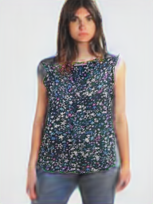
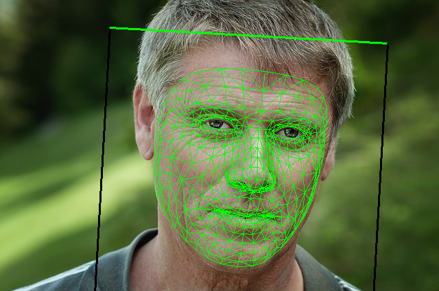
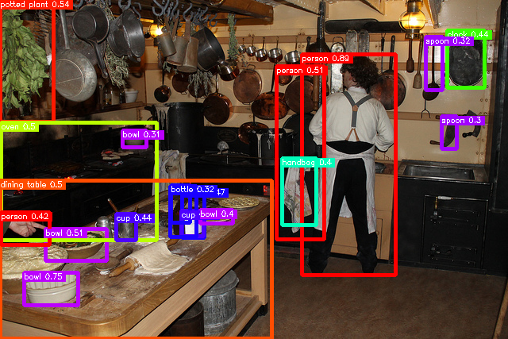
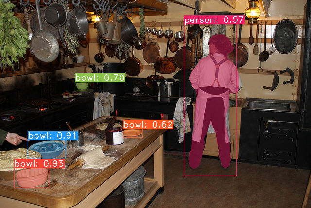
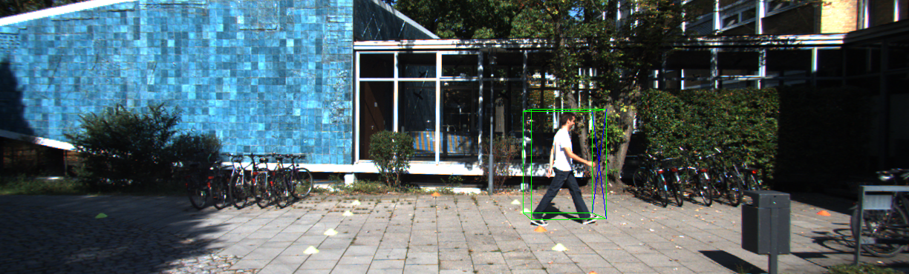
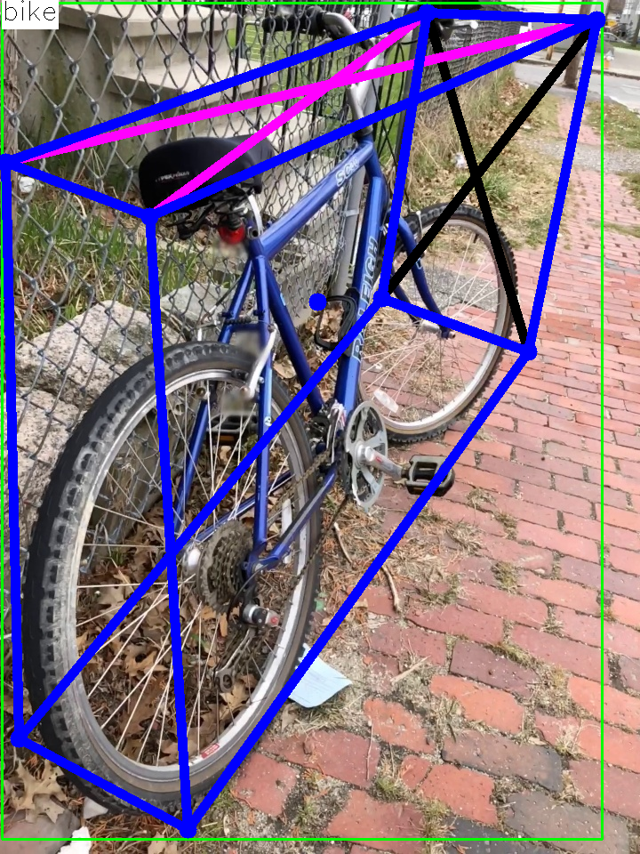

The collection of pre-trained, state-of-the-art AI models.

# About ailia SDK

[ailia SDK](https://axinc.jp/en/solutions/ailia_sdk.html) is a self-contained cross-platform high speed inference SDK for AI.  ailia SDK provides a consistent C++ API on Windows, Mac, Linux, iOS, Android, Jetson and Raspberry Pi. It also supports Unity(C#), Python and JNI for efficient AI implementation. The ailia SDK makes great use of the GPU via Vulkan and Metal to serve accelerated computing.

# How to use

[ailia MODELS tutorial](TUTORIAL.md)

[ailia MODELS tutorial 日本語版](TUTORIAL_jp.md)

# Supported models 
273 models as of 2023/04/10

## Action recognition

| | Model | Reference | Exported From | Supported Ailia Version | Blog |
|:-----------|------------:|:------------:|:------------:|:------------:|:------------:|
|  | [mars](/action_recognition/mars/) | [MARS: Motion-Augmented RGB Stream for Action Recognition](https://github.com/craston/MARS) | Pytorch | 1.2.4 and later | [EN](https://medium.com/axinc-ai/mars-a-machine-learning-model-for-identifying-actions-from-videos-6b93c06ac6a5) [JP](https://medium.com/axinc/mars-%E5%8B%95%E7%94%BB%E3%81%8B%E3%82%89%E3%82%A2%E3%82%AF%E3%82%B7%E3%83%A7%E3%83%B3%E3%82%92%E8%AD%98%E5%88%A5%E3%81%99%E3%82%8B%E6%A9%9F%E6%A2%B0%E5%AD%A6%E7%BF%92%E3%83%A2%E3%83%87%E3%83%AB-c03b0b8804a8) |
|  | [st-gcn](/action_recognition/st_gcn/) | [ST-GCN](https://github.com/yysijie/st-gcn) | Pytorch | 1.2.5 and later | [EN](https://medium.com/axinc-ai/st-gcn-a-machine-learning-model-for-detecting-human-actions-from-skeletons-46a95b31b5db) [JP](https://medium.com/axinc/st-gcn-%E9%AA%A8%E6%A0%BC%E3%81%8B%E3%82%89%E4%BA%BA%E7%89%A9%E3%81%AE%E3%82%A2%E3%82%AF%E3%82%B7%E3%83%A7%E3%83%B3%E3%82%92%E6%A4%9C%E5%87%BA%E3%81%99%E3%82%8B%E6%A9%9F%E6%A2%B0%E5%AD%A6%E7%BF%92%E3%83%A2%E3%83%87%E3%83%AB-af3196e38d1f) |
|  | [ax_action_recognition](/action_recognition/ax_action_recognition/) | [Realtime-Action-Recognition](https://github.com/felixchenfy/Realtime-Action-Recognition) | Pytorch | 1.2.7 and later | |
|  | [va-cnn](/action_recognition/va-cnn/) | [View Adaptive Neural Networks (VA) for Skeleton-based Human Action Recognition](https://github.com/microsoft/View-Adaptive-Neural-Networks-for-Skeleton-based-Human-Action-Recognition) | Pytorch | 1.2.7 and later ||
|  | [driver-action-recognition-adas](/action_recognition/driver-action-recognition-adas/) | [driver-action-recognition-adas-0002](https://github.com/openvinotoolkit/open_model_zoo/tree/master/models/intel/driver-action-recognition-adas-0002) | OpenVINO | 1.2.5 and later | |
|  | [action_clip](/action_recognition/action_clip/) | [ActionCLIP](https://github.com/sallymmx/ActionCLIP) | Pytorch | 1.2.7 and later | |

## Anomaly detection

| | Model | Reference | Exported From | Supported Ailia Version | Blog |
|:-----------|------------:|:------------:|:------------:|:------------:|:------------:|
|  | [padim](/anomaly_detection/padim/) | [PaDiM-Anomaly-Detection-Localization-master](https://github.com/xiahaifeng1995/PaDiM-Anomaly-Detection-Localization-master) | Pytorch | 1.2.6 and later | [EN](https://medium.com/axinc-ai/padim-a-machine-learning-model-for-detecting-defective-products-without-retraining-5daa6f203377) [JP](https://medium.com/axinc/padim-%E5%86%8D%E5%AD%A6%E7%BF%92%E4%B8%8D%E8%A6%81%E3%81%A7%E4%B8%8D%E8%89%AF%E5%93%81%E6%A4%9C%E7%9F%A5%E3%82%92%E8%A1%8C%E3%81%86%E6%A9%9F%E6%A2%B0%E5%AD%A6%E7%BF%92%E3%83%A2%E3%83%87%E3%83%AB-69add653fbd3) |
|  | [spade-pytorch](/anomaly_detection/spade-pytorch/) | [Sub-Image Anomaly Detection with Deep Pyramid Correspondences](https://github.com/byungjae89/SPADE-pytorch) | Pytorch | 1.2.6 and later | |

## Audio processing

| Model | Reference | Exported From | Supported Ailia Version | Blog |
|------------:|:------------:|:------------:|:------------:|:------------:|
| [crnn_audio_classification](/audio_processing/crnn_audio_classification/) | [crnn-audio-classification](https://github.com/ksanjeevan/crnn-audio-classification) | Pytorch | 1.2.5 and later | [EN](https://medium.com/axinc-ai/crnnsoundclassification-a-machine-learning-model-for-classifying-sound-8e45d1f22fa) [JP](https://medium.com/axinc/crnnsoundclassification-%E9%9F%B3%E5%A3%B0%E3%82%92%E5%88%86%E9%A1%9E%E3%81%99%E3%82%8B%E6%A9%9F%E6%A2%B0%E5%AD%A6%E7%BF%92%E3%83%A2%E3%83%87%E3%83%AB-2a35564dad42) |
| [deepspeech2](/audio_processing/deepspeech2/) | [deepspeech.pytorch](https://github.com/SeanNaren/deepspeech.pytorch) | Pytorch | 1.2.2 and later |  [EN](https://medium.com/axinc-ai/deepspeech2-a-machine-learning-model-for-speech-recognition-d9e64c0d1afc) [JP](https://medium.com/axinc/deepspeech2-%E9%9F%B3%E5%A3%B0%E8%AA%8D%E8%AD%98%E3%82%92%E8%A1%8C%E3%81%86%E6%A9%9F%E6%A2%B0%E5%AD%A6%E7%BF%92%E3%83%A2%E3%83%87%E3%83%AB-8288c5f53eea) |
| [pytorch-dc-tts](/audio_processing/pytorch-dc-tts/) | [Efficiently Trainable Text-to-Speech System Based on Deep Convolutional Networks with Guided Attention](https://github.com/tugstugi/pytorch-dc-tts)   | Pytorch | 1.2.6 and later | [EN](https://medium.com/axinc-ai/pytorchdctts-a-machine-learning-model-for-text-to-speech-synthesis-2273e269b480) [JP](https://medium.com/axinc/pytorchdctts-%E3%83%86%E3%82%AD%E3%82%B9%E3%83%88%E3%81%8B%E3%82%89%E9%9F%B3%E5%A3%B0%E5%90%88%E6%88%90%E3%82%92%E8%A1%8C%E3%81%86%E6%A9%9F%E6%A2%B0%E5%AD%A6%E7%BF%92%E3%83%A2%E3%83%87%E3%83%AB-dcb5eb07c883) |
| [unet_source_separation](/audio_processing/unet_source_separation/) | [source_separation](https://github.com/AppleHolic/source_separation)  | Pytorch | 1.2.6 and later | [EN](https://medium.com/axinc-ai/unetsourceseparation-a-machine-learning-model-to-remove-audio-noise-and-extract-voices-5acae8c37291) [JP](https://medium.com/axinc/unetsourceseparation-%E9%9B%91%E9%9F%B3%E3%82%92%E9%99%A4%E5%8E%BB%E3%81%97%E3%81%A6%E5%A3%B0%E3%81%A0%E3%81%91%E3%82%92%E6%8A%BD%E5%87%BA%E3%81%99%E3%82%8B%E6%A9%9F%E6%A2%B0%E5%AD%A6%E7%BF%92%E3%83%A2%E3%83%87%E3%83%AB-5d23fd054eac) |
| [transformer-cnn-emotion-recognition](/audio_processing/transformer-cnn-emotion-recognition/) | [Combining Spatial and Temporal Feature Representions of Speech Emotion by Parallelizing CNNs and Transformer-Encoders](https://github.com/IliaZenkov/transformer-cnn-emotion-recognition)  | Pytorch | 1.2.5 and later |
| [auto_speech](/audio_processing/auto_speech/) | [AutoSpeech: Neural Architecture Search for Speaker Recognition](https://github.com/VITA-Group/AutoSpeech)  | Pytorch | 1.2.5 and later | [EN](https://medium.com/axinc-ai/autospeech-speech-based-person-identification-model-f01822f6d8e5) [JP](https://medium.com/axinc/autospeech-%E9%9F%B3%E5%A3%B0%E3%81%AB%E3%82%88%E3%82%8B%E5%80%8B%E4%BA%BA%E8%AD%98%E5%88%A5%E3%83%A2%E3%83%87%E3%83%AB-267a00f26a4a) |
| [voicefilter](/audio_processing/voicefilter/) | [VoiceFilter](https://github.com/mindslab-ai/voicefilter)  | Pytorch | 1.2.7 and later | [EN](https://medium.com/axinc-ai/voicefilter-targeted-voice-separation-model-6fe6f85309ea) [JP](https://medium.com/axinc/voicefilter-%E4%BB%BB%E6%84%8F%E3%81%AE%E4%BA%BA%E7%89%A9%E3%81%AE%E5%A3%B0%E3%82%92%E6%8A%BD%E5%87%BA%E3%81%A7%E3%81%8D%E3%82%8B%E9%9F%B3%E5%A3%B0%E5%88%86%E9%9B%A2%E3%83%A2%E3%83%87%E3%83%AB-d5b88a8549d9) |
| [whisper](/audio_processing/whisper/) | [Whisper](https://github.com/openai/whisper) | Pytorch | 1.2.10 and later | [JP](https://medium.com/axinc/whisper-%E6%97%A5%E6%9C%AC%E8%AA%9E%E3%82%92%E5%90%AB%E3%82%8099%E8%A8%80%E8%AA%9E%E3%82%92%E8%AA%8D%E8%AD%98%E3%81%A7%E3%81%8D%E3%82%8B%E9%9F%B3%E5%A3%B0%E8%AA%8D%E8%AD%98%E3%83%A2%E3%83%87%E3%83%AB-b6e578f55c87) |
| [clap](/audio_processing/clap/) | [CLAP](https://github.com/LAION-AI/CLAP) | Pytorch | 1.2.6 and later | |
| [wespeaker](/audio_processing/wespeaker/) | [WeSpeaker](https://github.com/wenet-e2e/wespeaker) | Onnxruntime | 1.2.9 and later | |
| [tacotron2](/audio_processing/tacotron2/) | [Tacotron2](https://github.com/NVIDIA/tacotron2) | Pytorch | 1.2.15 and later | [JP](https://medium.com/axinc/tacotron2-%E6%B3%A2%E5%BD%A2%E5%A4%89%E6%8F%9B%E3%82%92ai%E3%81%A7%E8%A1%8C%E3%81%86%E9%AB%98%E5%93%81%E8%B3%AA%E3%81%AA%E9%9F%B3%E5%A3%B0%E5%90%88%E6%88%90%E3%83%A2%E3%83%87%E3%83%AB-bc592217a399) |
| [silero-vad](/audio_processing/silero-vad/) | [Silero VAD](https://github.com/snakers4/silero-vad) | Pytorch | 1.2.15 and later | [JP](https://medium.com/axinc/silerovad-%E7%99%BA%E8%A9%B1%E5%8C%BA%E9%96%93%E3%82%92%E6%A4%9C%E5%87%BA%E3%81%99%E3%82%8B%E6%A9%9F%E6%A2%B0%E5%AD%A6%E7%BF%92%E3%83%A2%E3%83%87%E3%83%AB-2ad6cf395703) |
| [rvc](/audio_processing/rvc/) | [Retrieval-based-Voice-Conversion-WebUI](https://github.com/RVC-Project/Retrieval-based-Voice-Conversion-WebUI) | Pytorch | 1.2.12 and later | [JP](https://medium.com/axinc/rvc-ai%E3%82%92%E4%BD%BF%E7%94%A8%E3%81%97%E3%81%9F%E3%83%9C%E3%82%A4%E3%82%B9%E3%83%81%E3%82%A7%E3%83%B3%E3%82%B8%E3%83%A3%E3%83%BC-64a813c7a0c4) |
| [crepe](/audio_processing/crepe/) | [torchcrepe](https://github.com/maxrmorrison/torchcrepe) | Pytorch | 1.2.10 and later | [JP](https://medium.com/axinc/crepe-%E9%AB%98%E7%B2%BE%E5%BA%A6%E3%81%AA%E3%83%94%E3%83%83%E3%83%81%E6%8E%A8%E5%AE%9A%E3%82%92%E8%A1%8C%E3%81%86%E6%A9%9F%E6%A2%B0%E5%AD%A6%E7%BF%92%E3%83%A2%E3%83%87%E3%83%AB-dfb09b5e1f6b) |
| [vall-e-x](/audio_processing/vall-e-x/) | [VALL-E-X](https://github.com/Plachtaa/VALL-E-X) | Pytorch | 1.2.15 and later |  |

## Background removal

| | Model | Reference | Exported From | Supported Ailia Version | Blog |
|:-----------|------------:|:------------:|:------------:|:------------:|:------------:|
|  | [U-2-Net](/background_removal/u2net/) | [U^2-Net: Going Deeper with Nested U-Structure for Salient Object Detection](https://github.com/NathanUA/U-2-Net) | Pytorch | 1.2.2 and later | [EN](https://medium.com/axinc-ai/u2net-a-machine-learning-model-that-performs-object-cropping-in-a-single-shot-48adfc158483) [JP](https://medium.com/axinc/u2net-%E3%82%B7%E3%83%B3%E3%82%B0%E3%83%AB%E3%82%B7%E3%83%A7%E3%83%83%E3%83%88%E3%81%A7%E7%89%A9%E4%BD%93%E3%81%AE%E5%88%87%E3%82%8A%E6%8A%9C%E3%81%8D%E3%82%92%E8%A1%8C%E3%81%86%E6%A9%9F%E6%A2%B0%E5%AD%A6%E7%BF%92%E3%83%A2%E3%83%87%E3%83%AB-e346f2787cdb) |
|  | [u2net-portrait-matting](/background_removal/u2net-portrait-matting/) | [U^2-Net - Portrait matting](https://github.com/dennisbappert/u-2-net-portrait) | Pytorch | 1.2.7 and later |
|  | [u2net-human-seg](/background_removal/u2net-human-seg/) | [U^2-Net - human segmentation](https://github.com/xuebinqin/U-2-Net) | Pytorch | 1.2.4 and later |
|  | [deep-image-matting](/background_removal/deep-image-matting/) | [Deep Image Matting](https://github.com/foamliu/Deep-Image-Matting)| Keras | 1.2.3 and later | [EN](https://medium.com/axinc-ai/deep-image-matting-a-machine-learning-model-to-improve-the-accuracy-of-image-matting-2ff98e0b47d6) [JP](https://medium.com/axinc/deep-image-matting-%E7%89%A9%E4%BD%93%E3%81%AE%E5%88%87%E3%82%8A%E6%8A%9C%E3%81%8D%E3%82%92%E9%AB%98%E7%B2%BE%E5%BA%A6%E5%8C%96%E3%81%99%E3%82%8B%E6%A9%9F%E6%A2%B0%E5%AD%A6%E7%BF%92%E3%83%A2%E3%83%87%E3%83%AB-45580882966f) |
|  | [indexnet](/background_removal/indexnet/) | [Indices Matter: Learning to Index for Deep Image Matting](https://github.com/open-mmlab/mmediting/tree/master/configs/mattors/indexnet) | Pytorch | 1.2.7 and later |
|  | [modnet](/background_removal/modnet/) | [MODNet: Trimap-Free Portrait Matting in Real Time](https://github.com/ZHKKKe/MODNet) | Pytorch | 1.2.7 and later |
|  | [background_matting_v2](/background_removal/background_matting_v2/) | [Real-Time High-Resolution Background Matting](https://github.com/PeterL1n/BackgroundMattingV2) | Pytorch | 1.2.9 and later |
|  | [cascade_psp](/background_removal/cascade_psp/) | [CascadePSP](https://github.com/hkchengrex/CascadePSP) | Pytorch | 1.2.9 and later |
|  | [rembg](/background_removal/rembg/) | [Rembg](https://github.com/danielgatis/rembg) | Pytorch | 1.2.4 and later |
|  | [dis_seg](/background_removal/dis_seg/) | [Highly Accurate Dichotomous Image Segmentation](https://github.com/xuebinqin/DIS) | Pytorch | 1.2.10 and later |
|  | [gfm](/background_removal/gfm/) | [Bridging Composite and Real: Towards End-to-end Deep Image Matting](https://github.com/JizhiziLi/GFM) | Pytorch | 1.2.10 and later |

## Crowd counting

| | Model | Reference | Exported From | Supported Ailia Version | Blog |
|:-----------|------------:|:------------:|:------------:|:------------:|:------------:|
|  | [crowdcount-cascaded-mtl](/crowd_counting/crowdcount-cascaded-mtl) | [CNN-based Cascaded Multi-task Learning of  High-level Prior and Density Estimation for Crowd Counting  (Single Image Crowd Counting)](https://github.com/svishwa/crowdcount-cascaded-mtl) | Pytorch | 1.2.1 and later | [EN](https://medium.com/axinc-ai/crowdcounting-a-machine-learning-model-for-counting-people-a7b274a7c2af) [JP](https://medium.com/axinc/crowdcounting-%E7%94%BB%E5%83%8F%E3%81%8B%E3%82%89%E4%BA%BA%E6%95%B0%E3%82%92%E8%A8%88%E6%B8%AC%E3%81%99%E3%82%8B%E6%A9%9F%E6%A2%B0%E5%AD%A6%E7%BF%92%E3%83%A2%E3%83%87%E3%83%AB-459e8b3fc184) |
|  | [c-3-framework](/crowd_counting/c-3-framework) | [Crowd Counting Code Framework(C^3-Framework)](https://github.com/gjy3035/C-3-Framework) | Pytorch | 1.2.5 and later | |

## Deep fashion

| | Model | Reference | Exported From | Supported Ailia Version | Blog |
|:-----------|------------:|:------------:|:------------:|:------------:|:------------:|
| | [clothing-detection](/deep_fashion/clothing-detection/) | [Clothing-Detection](https://github.com/simaiden/Clothing-Detection) | Pytorch | 1.2.1 and later | [EN](https://medium.com/axinc-ai/clothingdetection-a-machine-learning-model-for-detecting-clothing-dab99e1492eb) [JP](https://medium.com/axinc/clothingdetection-%E6%9C%8D%E8%A3%85%E3%82%92%E6%A4%9C%E5%87%BA%E3%81%99%E3%82%8B%E6%A9%9F%E6%A2%B0%E5%AD%A6%E7%BF%92%E3%83%A2%E3%83%87%E3%83%AB-e75cc8bc75b7) |
| | [mmfashion](/deep_fashion/mmfashion/) | [MMFashion](https://github.com/open-mmlab/mmfashion) | Pytorch | 1.2.5 and later | [EN](https://medium.com/axinc-ai/mmfashion-a-machine-learning-model-for-fashion-segmentation-a043fa972a2a) [JP](https://medium.com/axinc/mmfashion-%E3%83%95%E3%82%A1%E3%83%83%E3%82%B7%E3%83%A7%E3%83%B3%E3%82%92%E3%82%BB%E3%82%B0%E3%83%A1%E3%83%B3%E3%83%86%E3%83%BC%E3%82%B7%E3%83%A7%E3%83%B3%E3%81%99%E3%82%8B%E6%A9%9F%E6%A2%B0%E5%AD%A6%E7%BF%92%E3%83%A2%E3%83%87%E3%83%AB-c486af72fdb5) |
| | [mmfashion_tryon](/deep_fashion/mmfashion_tryon/) | [MMFashion virtual try-on](https://github.com/open-mmlab/mmfashion) | Pytorch | 1.2.8 and later |
| | [mmfashion_retrieval](/deep_fashion/mmfashion_retrieval/) | [MMFashion In-Shop Clothes Retrieval](https://github.com/open-mmlab/mmfashion) | Pytorch | 1.2.5 and later |
| | [fashionai-key-points-detection](/deep_fashion/fashionai-key-points-detection/) | [A Pytorch Implementation of Cascaded Pyramid Network for FashionAI Key Points Detection](https://github.com/gathierry/FashionAI-KeyPointsDetectionOfApparel) | Pytorch | 1.2.5 and later |
| | [person-attributes-recognition-crossroad](/deep_fashion/person-attributes-recognition-crossroad/) | [person-attributes-recognition-crossroad-0230](https://github.com/openvinotoolkit/open_model_zoo/tree/master/models/intel/person-attributes-recognition-crossroad-0230) | Pytorch | 1.2.10 and later |

## Depth estimation

| | Model | Reference | Exported From | Supported Ailia Version | Blog |
|:-----------|------------:|:------------:|:------------:|:------------:|:------------:|
|  | [monodepth2](depth_estimation/monodepth2)| [Monocular depth estimation from a single image](https://github.com/nianticlabs/monodepth2) | Pytorch | 1.2.2 and later |
|  |[midas](depth_estimation/midas)| [Towards Robust Monocular Depth Estimation:  Mixing Datasets for Zero-shot Cross-dataset Transfer](https://github.com/intel-isl/MiDaS) | Pytorch | 1.2.4 and later | [EN](https://medium.com/axinc-ai/midas-a-machine-learning-model-for-depth-estimation-e96119cc1a3c) [JP](https://medium.com/axinc/midas-%E5%A5%A5%E8%A1%8C%E3%81%8D%E3%82%92%E6%8E%A8%E5%AE%9A%E3%81%99%E3%82%8B%E6%A9%9F%E6%A2%B0%E5%AD%A6%E7%BF%92%E3%83%A2%E3%83%87%E3%83%AB-71e65a041e0f) |
|  |[fcrn-depthprediction](depth_estimation/fcrn-depthprediction)| [Deeper Depth Prediction with Fully Convolutional Residual Networks](https://github.com/iro-cp/FCRN-DepthPrediction) | TensorFlow | 1.2.6 and later |
|  |[fast-depth](depth_estimation/fast-depth)| [ICRA 2019 "FastDepth: Fast Monocular Depth Estimation on Embedded Systems"](https://github.com/dwofk/fast-depth) | Pytorch | 1.2.5 and later |
|  |[lap-depth](depth_estimation/lap-depth)| [LapDepth-release](https://github.com/tjqansthd/LapDepth-release) | Pytorch | 1.2.9 and later |
|  |[hitnet](depth_estimation/hitnet)| [ONNX-HITNET-Stereo-Depth-estimation](https://github.com/ibaiGorordo/ONNX-HITNET-Stereo-Depth-estimation) | Pytorch | 1.2.9 and later |
|  |[crestereo](depth_estimation/crestereo)| [ONNX-CREStereo-Depth-Estimation](https://github.com/ibaiGorordo/ONNX-CREStereo-Depth-Estimation) | Pytorch | 1.2.13 and later |
|  |[mobilestereonet](depth_estimation/mobilestereonet)| [MobileStereoNet](https://github.com/cogsys-tuebingen/mobilestereonet) | Pytorch | 1.2.13 and later |

## Diffusion

| | Model | Reference | Exported From | Supported Ailia Version | Blog |
|:-----------|------------:|:------------:|:------------:|:------------:|:------------:|
|  | [latent-diffusion-txt2img](/diffusion/latent-diffusion-txt2img/) | [Latent Diffusion - txt2img](https://github.com/CompVis/latent-diffusion) | Pytorch | 1.2.10 and later |
|  | [latent-diffusion-inpainting](/diffusion/latent-diffusion-inpainting/) | [Latent Diffusion - inpainting](https://github.com/CompVis/latent-diffusion) | Pytorch | 1.2.10 and later |
|  | [latent-diffusion-superresolution](/diffusion/latent-diffusion-superresolution/) | [Latent Diffusion - Super-resolution](https://github.com/CompVis/latent-diffusion) | Pytorch | 1.2.10 and later |
|  | [stable-diffusion-txt2img](/diffusion/stable-diffusion-txt2img/) | [Stable Diffusion](https://github.com/CompVis/stable-diffusion) | Pytorch | 1.2.14 and later | [JP](https://medium.com/axinc/stablediffusion-%E3%83%86%E3%82%AD%E3%82%B9%E3%83%88%E3%81%8B%E3%82%89%E7%94%BB%E5%83%8F%E3%82%92%E7%94%9F%E6%88%90%E3%81%99%E3%82%8B%E6%A9%9F%E6%A2%B0%E5%AD%A6%E7%BF%92%E3%83%A2%E3%83%87%E3%83%AB-aa3676787a09) |
|  | [control_net](/diffusion/control_net/) | [ControlNet](https://github.com/lllyasviel/ControlNet) | Pytorch | 1.2.15 and later |

## Face detection

| | Model | Reference | Exported From | Supported Ailia Version | Blog |
|:-----------|------------:|:------------:|:------------:|:------------:|:------------:|
|  | [yolov1-face](/face_detection/yolov1-face/) | [YOLO-Face-detection](https://github.com/dannyblueliu/YOLO-Face-detection/) | Darknet | 1.1.0 and later |
|  | [yolov3-face](/face_detection/yolov3-face/) | [Face detection using keras-yolov3](https://github.com/axinc-ai/yolov3-face) | Keras | 1.2.1 and later |
|  |[blazeface](/face_detection/blazeface/)| [BlazeFace-PyTorch](https://github.com/hollance/BlazeFace-PyTorch) | Pytorch | 1.2.1 and later | [EN](https://medium.com/axinc-ai/blazeface-a-machine-learning-model-for-fast-detection-of-face-positions-and-key-points-5dcfb9429d72) [JP](https://medium.com/axinc/blazeface-%E9%A1%94%E3%81%AE%E4%BD%8D%E7%BD%AE%E3%81%A8%E3%82%AD%E3%83%BC%E3%83%9D%E3%82%A4%E3%83%B3%E3%83%88%E3%82%92%E9%AB%98%E9%80%9F%E3%81%AB%E6%A4%9C%E5%87%BA%E3%81%99%E3%82%8B%E6%A9%9F%E6%A2%B0%E5%AD%A6%E7%BF%92%E3%83%A2%E3%83%87%E3%83%AB-e851c348a32b) |
| | [face-mask-detection](/face_detection/face-mask-detection/) | [Face detection using keras-yolov3](https://github.com/axinc-ai/yolov3-face) | Keras | 1.2.1 and later | [EN](https://medium.com/axinc-ai/facemaskdetection-a-machine-learning-model-to-determine-if-a-person-is-wearing-a-mask-e5a581ea8af9) [JP](https://medium.com/axinc/facemaskdetection-%E3%83%9E%E3%82%B9%E3%82%AF%E3%82%92%E4%BB%98%E3%81%91%E3%81%A6%E3%81%84%E3%82%8B%E3%81%8B%E3%82%92%E5%88%A4%E5%AE%9A%E3%81%99%E3%82%8B%E6%A9%9F%E6%A2%B0%E5%AD%A6%E7%BF%92%E3%83%A2%E3%83%87%E3%83%AB-b06793f79a97) |
| | [dbface](face_detection/dbface/) | [DBFace : real-time, single-stage detector for face detection,  with faster speed and higher accuracy](https://github.com/dlunion/DBFace) | Pytorch | 1.2.2 and later |
| | [retinaface](face_detection/retinaface/) | [RetinaFace: Single-stage Dense Face Localisation in the Wild.](https://github.com/biubug6/Pytorch_Retinaface) | Pytorch | 1.2.5 and later |
| | [anime-face-detector](face_detection/anime-face-detector/) | [Anime Face Detector](https://github.com/hysts/anime-face-detector) | Pytorch | 1.2.6 and later |
| | [face-detection-adas](face_detection/face-detection-adas/) | [face-detection-adas-0001](https://github.com/openvinotoolkit/open_model_zoo/tree/master/models/intel/face-detection-adas-0001) | OpenVINO | 1.2.5 and later |
| | [mtcnn](face_detection/mtcnn/) | [mtcnn](https://github.com/ipazc/mtcnn) | Keras | 1.2.10 and later |

## Face identification

| | Model | Reference | Exported From | Supported Ailia Version | Blog |
|:-----------|------------:|:------------:|:------------:|:------------:|:------------:|
|  |[vggface2](/face_identification/vggface2) | [VGGFace2 Dataset for Face Recognition](https://github.com/ox-vgg/vgg_face2) | Caffe | 1.1.0 and later | |
| |[arcface](/face_identification/arcface) | [pytorch implement of arcface](https://github.com/ronghuaiyang/arcface-pytorch) | Pytorch | 1.2.1 and later | [EN](https://medium.com/axinc-ai/arcface-a-machine-learning-model-for-face-recognition-5f743cdac6fa) [JP](https://medium.com/axinc/arcface-%E9%A1%94%E8%AA%8D%E8%A8%BC%E3%82%92%E8%A1%8C%E3%81%86%E6%A9%9F%E6%A2%B0%E5%AD%A6%E7%BF%92%E3%83%A2%E3%83%87%E3%83%AB-cbb0e127bd0a) |
| |[insightface](/face_identification/insightface) | [InsightFace: 2D and 3D Face Analysis Project](https://github.com/deepinsight/insightface) | Pytorch | 1.2.5 and later | |
|  |[cosface](/face_identification/cosface) | [Pytorch implementation of CosFace](https://github.com/MuggleWang/CosFace_pytorch) | Pytorch | 1.2.10 and later | |

## Face recognition

| | Model | Reference | Exported From | Supported Ailia Version | Blog |
|:-----------|------------:|:------------:|:------------:|:------------:|:------------:|
|  |[face_classification](/face_recognition/face_classification) | [Real-time face detection and emotion/gender classification](https://github.com/oarriaga/face_classification) | Keras | 1.1.0 and later |
|  |[facial_feature](/face_recognition/facial_feature/)|[kaggle-facial-keypoints](https://github.com/axinc-ai/kaggle-facial-keypoints)|Pytorch| 1.2.0 and later |
|  |[face_alignment](/face_recognition/face_alignment/)| [2D and 3D Face alignment library build using pytorch](https://github.com/1adrianb/face-alignment) | Pytorch | 1.2.1 and later | [EN](https://medium.com/axinc-ai/facealignment-a-machine-learning-model-for-recognizing-key-points-on-a-face-956f5e796efa) [JP](https://medium.com/axinc/facealignment-%E9%A1%94%E3%81%AE%E3%82%AD%E3%83%BC%E3%83%9D%E3%82%A4%E3%83%B3%E3%83%88%E3%82%92%E8%AA%8D%E8%AD%98%E3%81%99%E3%82%8B%E6%A9%9F%E6%A2%B0%E5%AD%A6%E7%BF%92%E3%83%A2%E3%83%87%E3%83%AB-a46654c4da14) |
|  |[prnet](/face_recognition/prnet)| [Joint 3D Face Reconstruction and Dense Alignment  with Position Map Regression Network](https://github.com/YadiraF/PRNet) | TensorFlow | 1.2.2 and later |
|  | [gazeml](/face_recognition/gazeml/) | [A deep learning framework based on Tensorflow  for the training of high performance gaze estimation](https://github.com/swook/GazeML) | TensorFlow | 1.2.0 and later |
|  | [facemesh](/face_recognition/facemesh/) | [facemesh.pytorch](https://github.com/thepowerfuldeez/facemesh.pytorch) | Pytorch | 1.2.2 and later | [EN](https://medium.com/axinc-ai/facemesh-detecting-key-points-on-faces-in-real-time-977c03f1bab) [JP](https://medium.com/axinc/facemesh-%E3%83%AA%E3%82%A2%E3%83%AB%E3%82%BF%E3%82%A4%E3%83%A0%E3%81%A7%E9%A1%94%E3%81%AE%E3%82%AD%E3%83%BC%E3%83%9D%E3%82%A4%E3%83%B3%E3%83%88%E3%82%92%E6%A4%9C%E5%87%BA%E3%81%99%E3%82%8B%E6%A9%9F%E6%A2%B0%E5%AD%A6%E7%BF%92%E3%83%A2%E3%83%87%E3%83%AB-bf223a50b7d6) |
|  | [mediapipe_iris](/face_recognition/mediapipe_iris/) | [irislandmarks.pytorch](https://github.com/cedriclmenard/irislandmarks.pytorch) | Pytorch | 1.2.2 and later | [EN](https://medium.com/axinc-ai/mediapipe-iris-detecting-key-points-in-the-eye-637f5c1e728e) [JP](https://medium.com/axinc/mediapipe-iris-%E7%9B%AE%E3%81%AE%E3%82%AD%E3%83%BC%E3%83%9D%E3%82%A4%E3%83%B3%E3%83%88%E3%82%92%E6%A4%9C%E5%87%BA%E3%81%99%E3%82%8B%E6%A9%9F%E6%A2%B0%E5%AD%A6%E7%BF%92%E3%83%A2%E3%83%87%E3%83%AB-a4742f143551) |
|  | [hopenet](/face_recognition/hopenet/) | [deep-head-pose](https://github.com/natanielruiz/deep-head-pose) | Pytorch | 1.2.2 and later | [EN](https://medium.com/axinc-ai/hope-net-a-machine-learning-model-for-estimating-face-orientation-83d5af26a513) [JP](https://medium.com/axinc/hope-net-%E9%A1%94%E3%81%AE%E5%90%91%E3%81%8D%E3%82%92%E6%8E%A8%E5%AE%9A%E3%81%99%E3%82%8B%E6%A9%9F%E6%A2%B0%E5%AD%A6%E7%BF%92%E3%83%A2%E3%83%87%E3%83%AB-6db21979f935) |
|  | [ax_gaze_estimation](/face_recognition/ax_gaze_estimation/) | ax Gaze Estimation | Pytorch | 1.2.2 and later | [EN](https://medium.com/axinc-ai/axgazeestimation-a-machine-learning-model-for-estimating-gaze-c9648042d637) [JP](https://medium.com/axinc/axgazeestimation-%E8%A6%96%E7%B7%9A%E3%82%92%E6%8E%A8%E5%AE%9A%E3%81%99%E3%82%8B%E6%A9%9F%E6%A2%B0%E5%AD%A6%E7%BF%92%E3%83%A2%E3%83%87%E3%83%AB-8446a791968) |
|  | [age-gender-recognition-retail](/face_recognition/age-gender-recognition-retail/) | [age-gender-recognition-retail-0013](https://github.com/openvinotoolkit/open_model_zoo/tree/master/models/intel/age-gender-recognition-retail-0013) | OpenVINO | 1.2.5 and later | [EN](https://medium.com/axinc-ai/agegenderrecognitionretail-a-machine-learning-model-to-identify-age-and-gender-8506510414b) [JP](https://medium.com/axinc/agegenderrecognitionretail-%E5%B9%B4%E9%BD%A2%E3%81%A8%E6%80%A7%E5%88%A5%E3%82%92%E4%BA%88%E6%B8%AC%E3%81%99%E3%82%8B%E6%A9%9F%E6%A2%B0%E5%AD%A6%E7%BF%92%E3%83%A2%E3%83%87%E3%83%AB-3632935d19ec) |
|  | [ferplus](/face_recognition/ferplus/) | [FER+](https://github.com/microsoft/FERPlus) | CNTK | 1.2.2 and later |
|  | [face-anti-spoofing](/face_recognition/face-anti-spoofing/) | [Lightweight Face Anti Spoofing](https://github.com/kprokofi/light-weight-face-anti-spoofing) | Pytorch | 1.2.5 and later | [EN](https://medium.com/axinc-ai/faceantispoofing-a-machine-learning-model-to-determine-if-a-face-is-real-b6c30f12abb6) [JP](https://medium.com/axinc/faceantispoofing-%E6%9C%AC%E7%89%A9%E3%81%AE%E9%A1%94%E3%81%8B%E3%81%A9%E3%81%86%E3%81%8B%E3%82%92%E5%88%A4%E5%AE%9A%E3%81%99%E3%82%8B%E6%A9%9F%E6%A2%B0%E5%AD%A6%E7%BF%92%E3%83%A2%E3%83%87%E3%83%AB-c7092c1dde43) |
|  | [ax_facial_features](/face_recognition/ax_facial_features/)| ax Facial Features | Pytorch | 1.2.5 and later |[EN](https://medium.com/axinc-ai/ax-facial-features-eyelids-eyelashes-and-facial-hair-classification-9b3b12f1d6a1) |
|  | [6d_repnet](/face_recognition/6d_repnet/) | [6D Rotation Representation for Unconstrained Head Pose Estimation (Pytorch)](https://github.com/thohemp/6DRepNet) | Pytorch | 1.2.6 and later |
|  | [hsemotion](/face_recognition/hsemotion/) | [HSEmotion (High-Speed face Emotion recognition) library](https://github.com/HSE-asavchenko/face-emotion-recognition) | Pytorch | 1.2.5 and later |
|  | [facemesh_v2](/face_recognition/facemesh_v2/) | [MediaPipe Face landmark detection](https://developers.google.com/mediapipe/solutions/vision/face_landmarker) | Pytorch | 1.2.9 and later | |

## Frame Interpolation

| | Model | Reference | Exported From | Supported Ailia Version | Blog |
|:-----------|------------:|:------------:|:------------:|:------------:|:------------:|
|  | [flavr](/frame_interpolation/flavr/) | [FLAVR: Flow-Agnostic Video Representations for Fast Frame Interpolation](https://github.com/tarun005/FLAVR) | Pytorch | 1.2.7 and later | [EN](https://medium.com/axinc-ai/flavr-a-machine-learning-model-to-increase-video-frame-rate-758fe8132818) [JP](https://medium.com/axinc/flavr-%E5%8B%95%E7%94%BB%E3%81%AE%E3%83%95%E3%83%AC%E3%83%BC%E3%83%A0%E3%83%AC%E3%83%BC%E3%83%88%E3%82%92%E4%B8%8A%E3%81%92%E3%82%8B%E6%A9%9F%E6%A2%B0%E5%AD%A6%E7%BF%92%E3%83%A2%E3%83%87%E3%83%AB-6a18211445da) |
|  | [cain](/frame_interpolation/cain/) | [Channel Attention Is All You Need for Video Frame Interpolation](https://github.com/myungsub/CAIN) | Pytorch | 1.2.5 and later | |
|  | [film](/frame_interpolation/film/) | [FILM: Frame Interpolation for Large Motion](https://github.com/google-research/frame-interpolation) | Tensorflow | 1.2.10 and later | |

## Generative adversarial networks

| | Model | Reference | Exported From | Supported Ailia Version | Blog |
|:-----------|------------:|:------------:|:------------:|:------------:|:------------:|
|  |[pytorch-gan](/generative_adversarial_networks/pytorch-gan) | [Code repo for the Pytorch GAN Zoo project (used to train this model)](https://github.com/facebookresearch/pytorch_GAN_zoo)| Pytorch | 1.2.4 and later |
|  | [council-gan](/generative_adversarial_networks/council-gan)| [Council-GAN](https://github.com/Onr/Council-GAN)| Pytorch | 1.2.4 and later |
|  | [restyle-encoder](/generative_adversarial_networks/restyle-encoder)| [ReStyle](https://github.com/yuval-alaluf/restyle-encoder)| Pytorch | 1.2.9 and later |
|  | [sam](/generative_adversarial_networks/sam)| [Age Transformation Using a Style-Based Regression Model](https://github.com/yuval-alaluf/SAM)| Pytorch | 1.2.9 and later |
|  | [gfpgan](/generative_adversarial_networks/gfpgan)| [GFP-GAN: Towards Real-World Blind Face Restoration with Generative Facial Prior](https://github.com/TencentARC/GFPGAN)| Pytorch | 1.2.10 and later |
|  | [sber-swap](/generative_adversarial_networks/sber-swap/) | [SberSwap](https://github.com/ai-forever/sber-swap) | Pytorch | 1.2.12 and later | |
|  | [encoder4editing](/generative_adversarial_networks/encoder4editing/) | [Designing an Encoder for StyleGAN Image Manipulation](https://github.com/omertov/encoder4editing) | Pytorch | 1.2.10 and later | |
|  | [lipgan](/generative_adversarial_networks/lipgan/) | [LipGAN](https://github.com/Rudrabha/LipGAN) | Keras | 1.2.15 and later | |

## Hand detection

| | Model | Reference | Exported From | Supported Ailia Version | Blog |
|:-----------|------------:|:------------:|:------------:|:------------:|:------------:|
|  | [yolov3-hand](/hand_detection/yolov3-hand/) | [Hand detection branch of Face detection using keras-yolov3](https://github.com/axinc-ai/yolov3-face/tree/hand_detection) | Keras | 1.2.1 and later |
|  | [hand_detection_pytorch](/hand_detection/hand_detection_pytorch/) | [hand-detection.PyTorch](https://github.com/zllrunning/hand-detection.PyTorch) | Pytorch | 1.2.2 and later |
|  |[blazepalm](/hand_detection/blazepalm/) | [MediaPipePyTorch](https://github.com/zmurez/MediaPipePyTorch) | Pytorch | 1.2.5 and later |

## Hand recognition

| | Model | Reference | Exported From | Supported Ailia Version | Blog |
|:-----------|------------:|:------------:|:------------:|:------------:|:------------:|
|  |[blazehand](/hand_recognition/blazehand/) | [MediaPipePyTorch](https://github.com/zmurez/MediaPipePyTorch) | Pytorch | 1.2.5 and later | [EN](https://medium.com/axinc-ai/blazehand-a-machine-learning-model-for-detecting-hand-key-points-c3943b82739a) [JP](https://medium.com/axinc/blazehand-%E6%89%8B%E3%81%AE%E3%82%AD%E3%83%BC%E3%83%9D%E3%82%A4%E3%83%B3%E3%83%88%E3%82%92%E6%A4%9C%E5%87%BA%E3%81%99%E3%82%8B%E6%A9%9F%E6%A2%B0%E5%AD%A6%E7%BF%92%E3%83%A2%E3%83%87%E3%83%AB-e84e011ef7bc) |
|  |[hand3d](/hand_recognition/hand3d/) | [ColorHandPose3D network](https://github.com/lmb-freiburg/hand3d) | TensorFlow | 1.2.5 and later |
|  |[minimal-hand](/hand_recognition/minimal-hand/) | [Minimal Hand](https://github.com/CalciferZh/minimal-hand) | TensorFlow | 1.2.8 and later |
|  |[v2v-posenet](/hand_recognition/v2v-posenet/) | [V2V-PoseNet](https://github.com/mks0601/V2V-PoseNet_RELEASE) | Pytorch | 1.2.6 and later |

## Image captioning

| | Model | Reference | Exported From | Supported Ailia Version | Blog |
|:-----------|------------:|:------------:|:------------:|:------------:|:------------:|
|  | [illustration2vec](/image_captioning/illustration2vec/)|[Illustration2Vec](https://github.com/rezoo/illustration2vec) | Caffe | 1.2.2 and later |
|  | [image_captioning_pytorch](/image_captioning/image_captioning_pytorch/)|[Image Captioning pytorch](https://github.com/ruotianluo/ImageCaptioning.pytorch) | Pytorch | 1.2.5 and later | [EN](https://medium.com/axinc-ai/image-captioning-pytorch-a-machine-learning-model-for-describing-images-d27562b6f15b) [JP](https://medium.com/axinc/image-captioning-pytorch-%E7%94%BB%E5%83%8F%E3%82%92%E8%AA%AC%E6%98%8E%E3%81%99%E3%82%8B%E6%A9%9F%E6%A2%B0%E5%AD%A6%E7%BF%92%E3%83%A2%E3%83%87%E3%83%AB-e690982af19) |

## Image classification

| | Model | Reference | Exported From | Supported Ailia Version | Blog |
|:-----------|------------:|:------------:|:------------:|:------------:|:------------:|
|  | [vgg16](/image_classification/vgg16/) |[Very Deep Convolutional Networks for Large-Scale Image Recognition]( https://arxiv.org/abs/1409.1556 )|Keras| 1.1.0 and later| |
|  | [googlenet](/image_classification/googlenet/) |[Going Deeper with Convolutions]( https://arxiv.org/abs/1409.4842 )|Pytorch| 1.2.0 and later| |
|  | [resnet50](/image_classification/resnet50/) | [Deep Residual Learning for Image Recognition]( https://github.com/KaimingHe/deep-residual-networks) | Chainer | 1.2.0 and later | |
|  | [inceptionv3](/image_classification/inceptionv3/)|[Rethinking the Inception Architecture for Computer Vision](http://arxiv.org/abs/1512.00567)|Pytorch| 1.2.0 and later | [JP](https://medium.com/axinc/ailia-sdk-%E3%83%A2%E3%83%87%E3%83%AB%E7%B4%B9%E4%BB%8B-inceptionv3-b39dd43f285d) |
|  | [inceptionv4](/image_classification/inceptionv4/)|[Keras Inception-V4](https://github.com/kentsommer/keras-inceptionV4)|Keras| 1.2.5 and later | |
|  | [mobilenetv2](/image_classification/mobilenetv2/)|[PyTorch Implemention of MobileNet V2](https://github.com/d-li14/mobilenetv2.pytorch)|Pytorch| 1.2.0 and later | |
|  | [mobilenetv3](/image_classification/mobilenetv3/)|[PyTorch Implemention of MobileNet V3](https://github.com/d-li14/mobilenetv3.pytorch)|Pytorch| 1.2.1 and later | |
|  | [partialconv](/image_classification/partialconv/)|[Partial Convolution Layer for Padding and Image Inpainting](https://github.com/NVIDIA/partialconv)|Pytorch| 1.2.0 and later | |
| | [efficientnet](/image_classification/efficientnet/)|[A PyTorch implementation of EfficientNet]( https://github.com/lukemelas/EfficientNet-PyTorch)|Pytorch| 1.2.3 and later | |
| | [efficientnetv2](/image_classification/efficientnetv2/)|[EfficientNetV2]( https://github.com/google/automl/tree/master/efficientnetv2 )|Pytorch| 1.2.4 and later | |
| | [vit](/image_classification/vit/)|[Pytorch reimplementation of the Vision Transformer (An Image is Worth 16x16 Words: Transformers for Image Recognition at Scale)](https://github.com/jeonsworld/ViT-pytorch)|Pytorch| 1.2.7 and later | [EN](https://medium.com/axinc-ai/vision-transformer-state-of-the-art-image-identification-technology-without-convolutional-fd10097ae9c2) [JP](https://medium.com/axinc/vision-transformer-%E7%95%B3%E3%81%BF%E8%BE%BC%E3%81%BF%E6%BC%94%E7%AE%97%E3%82%92%E7%94%A8%E3%81%84%E3%81%AA%E3%81%84%E6%9C%80%E6%96%B0%E7%94%BB%E5%83%8F%E8%AD%98%E5%88%A5%E6%8A%80%E8%A1%93-84f06978a17f) |
| | [wide_resnet50](/image_classification/wide_resnet50/)|[Wide Resnet](https://pytorch.org/hub/pytorch_vision_wide_resnet/)|Pytorch| 1.2.5 and later | |
|  | [resnet18](/image_classification/resnet18/) | [ResNet18]( https://pytorch.org/vision/main/generated/torchvision.models.resnet18.html) | Pytorch | 1.2.8 and later | |
| | [mlp_mixer](/image_classification/mlp_mixer/)|[MLP-Mixer](https://github.com/jeonsworld/MLP-Mixer-Pytorch)|Pytorch| 1.2.9 and later | |
|  | [alexnet](/image_classification/alexnet/)|[AlexNet PyTorch](https://pytorch.org/hub/pytorch_vision_alexnet/)|Pytorch| 1.2.5 and later | |
|  | [clip](/image_classification/clip/)|[CLIP](https://github.com/openai/CLIP) | Pytorch | 1.2.9 and later | [EN](https://medium.com/axinc-ai/clip-learning-transferable-visual-models-from-natural-language-supervision-4508b3f0ea46) [JP](https://medium.com/axinc/clip-%E8%B6%85%E5%A4%A7%E8%A6%8F%E6%A8%A1%E3%83%87%E3%83%BC%E3%82%BF%E3%82%BB%E3%83%83%E3%83%88%E3%81%A7%E4%BA%8B%E5%89%8D%E5%AD%A6%E7%BF%92%E3%81%95%E3%82%8C-%E5%86%8D%E5%AD%A6%E7%BF%92%E3%81%AA%E3%81%97%E3%81%A7%E4%BB%BB%E6%84%8F%E3%81%AE%E7%89%A9%E4%BD%93%E3%82%92%E8%AD%98%E5%88%A5%E3%81%A7%E3%81%8D%E3%82%8B%E7%89%A9%E4%BD%93%E8%AD%98%E5%88%A5%E3%83%A2%E3%83%87%E3%83%AB-2ebc5c1666f) |
|  | [japanese-clip](/image_classification/japanese-clip/)|[Japanese-CLIP](https://github.com/rinnakk/japanese-clip) | Pytorch | 1.2.15 and later | |
|  | [weather-prediction-from-image](/image_classification/weather-prediction-from-image/)|[Weather Prediction From Image - (Warmth Of Image)](https://github.com/berkgulay/weather-prediction-from-image) | Keras | 1.2.5 and later | |
|  | [swin-transformer](/image_classification/swin-transformer/)|[Swin Transformer](https://github.com/microsoft/Swin-Transformer) | Pytorch | 1.2.6 and later | |
|  | [convnext](/image_classification/convnext/)|[A PyTorch implementation of ConvNeXt](https://github.com/facebookresearch/ConvNeXt) | Pytorch | 1.2.5 and later | |
|  | [mobileone](/image_classification/mobileone/)|[A PyTorch implementation of MobileOne](https://github.com/apple/ml-mobileone) | Pytorch | 1.2.1 and later | |

## Image inpainting

| | Model | Reference | Exported From | Supported Ailia Version | Blog |
|:-----------|------------:|:------------:|:------------:|:------------:|:------------:|
|  | [inpainting-with-partial-conv](/image_inpainting/pytorch-inpainting-with-partial-conv/) | [pytorch-inpainting-with-partial-conv](https://github.com/naoto0804/pytorch-inpainting-with-partial-conv) | PyTorch | 1.2.6 and later | [EN](https://medium.com/axinc-ai/inpainting-with-partial-conv-a-machine-learning-model-that-predicts-and-fills-in-missing-parts-of-53c046343a85) [JP](https://medium.com/axinc/inpainting-with-partial-conv-%E7%94%BB%E5%83%8F%E3%81%AE%E6%AC%A0%E6%90%8D%E9%83%A8%E5%88%86%E3%82%92%E4%BA%88%E6%B8%AC%E3%81%97%E3%81%A6%E5%9F%8B%E3%82%81%E3%82%8B%E6%A9%9F%E6%A2%B0%E5%AD%A6%E7%BF%92%E3%83%A2%E3%83%87%E3%83%AB-9746576e6490) |
|  | [inpainting_gmcnn](/image_inpainting/inpainting_gmcnn/) | [Image Inpainting via Generative Multi-column Convolutional Neural Networks](https://github.com/shepnerd/inpainting_gmcnn) | TensorFlow | 1.2.6 and later |
|  | [3d-photo-inpainting](/image_inpainting/3d-photo-inpainting/) | [3D Photography using Context-aware Layered Depth Inpainting](https://github.com/vt-vl-lab/3d-photo-inpainting) | Pytorch | 1.2.7 and later |
|  | [deepfillv2](/image_inpainting/deepfillv2/) | [Free-Form Image Inpainting with Gated Convolution](https://github.com/open-mmlab/mmediting/tree/master/configs/inpainting/deepfillv2) | Pytorch | 1.2.9 and later |

## Image manipulation

| | Model | Reference | Exported From | Supported Ailia Version | Blog |
|:-----------|------------:|:------------:|:------------:|:------------:|:------------:|
|  | [noise2noise](/image_manipulation/noise2noise/) | [Learning Image Restoration without Clean Data](https://github.com/joeylitalien/noise2noise-pytorch) | Pytorch | 1.2.0 and later |
|  | [dewarpnet](/image_manipulation/dewarpnet) | [DewarpNet: Single-Image Document Unwarping With Stacked 3D and 2D Regression Networks](https://github.com/cvlab-stonybrook/DewarpNet) | Pytorch | 1.2.1 and later |
|  | [illnet](/image_manipulation/illnet/) | [Document Rectification and Illumination Correction using a Patch-based CNN](https://github.com/xiaoyu258/DocProj) | Pytorch | 1.2.2 and later |
|  | [colorization](/image_manipulation/colorization/) | [Colorful Image Colorization](https://github.com/richzhang/colorization) | Pytorch | 1.2.2 and later | [EN](https://medium.com/axinc-ai/colorization-a-machine-learning-model-for-colorizing-black-and-white-images-829e35e4f91c) [JP](https://medium.com/axinc/colorization-%E7%99%BD%E9%BB%92%E7%94%BB%E5%83%8F%E3%82%92%E3%82%AB%E3%83%A9%E3%83%BC%E5%8C%96%E3%81%99%E3%82%8B%E6%A9%9F%E6%A2%B0%E5%AD%A6%E7%BF%92%E3%83%A2%E3%83%87%E3%83%AB-177d3fd52e40) |
|  | [u2net_portrait](/image_manipulation/u2net_portrait/) | [U^2-Net: Going Deeper with Nested U-Structure for Salient Object Detection](https://github.com/NathanUA/U-2-Net) | Pytorch | 1.2.2 and later |
|  | [style2paints](/image_manipulation/style2paints/) | [Style2Paints](https://github.com/lllyasviel/style2paints) | TensorFlow | 1.2.6 and later |
|  | [deep_white_balance](/image_manipulation/deep_white_balance/) | [Deep White-Balance Editing, CVPR 2020 (Oral)](https://github.com/mahmoudnafifi/Deep_White_Balance) | PyTorch | 1.2.6 and later |
|  | [deblur_gan](/image_manipulation/deblur_gan/) | [DeblurGAN](https://github.com/KupynOrest/DeblurGAN) | Pytorch | 1.2.6 and later |
|  | [invertible_denoising_network](/image_manipulation/invertible_denoising_network/) | [Invertible Image Denoising](https://github.com/Yang-Liu1082/InvDN) | Pytorch | 1.2.8 and later |
|  | [dfm](/image_manipulation/dfm/) | [Deep Feature Matching](https://github.com/ufukefe/DFM) | Pytorch | 1.2.6 and later |
|  | [dfe](/image_manipulation/dfe/) | [Deep Fundamental Matrix Estimation](https://github.com/isl-org/DFE) | Pytorch | 1.2.6 and later |
|  | [dehamer](/image_manipulation/dehamer/) | [Image Dehazing Transformer with Transmission-Aware 3D Position Embedding](https://github.com/Li-Chongyi/Dehamer) | Pytorch | 1.2.13 and later |
|  | [pytorch-superpoint](/image_manipulation/pytorch-superpoint/) | [pytorch-superpoint : Self-Supervised Interest Point Detection and Description](https://github.com/eric-yyjau/pytorch-superpoint) | Pytorch | 1.2.6 and later |
|  | [cnngeometric_pytorch](/image_manipulation/cnngeometric_pytorch/) | [CNNGeometric PyTorch implementation](https://github.com/ignacio-rocco/cnngeometric_pytorch) | Pytorch | 1.2.7 and later |
|  | [lightglue](/image_manipulation/lightglue/) | [LightGlue-ONNX](https://github.com/fabio-sim/LightGlue-ONNX) | Pytorch | 1.2.15 and later |

## Image segmentation

| | Model | Reference | Exported From | Supported Ailia Version | Blog |
|:-----------|------------:|:------------:|:------------:|:------------:|:------------:|
|  | [deeplabv3](/image_segmentation/deeplabv3/) | [Xception65 for backbone network of DeepLab v3+](https://github.com/tensorflow/models/tree/master/research/deeplab) | Chainer | 1.2.0 and later |
|  | [hrnet_segmentation](/image_segmentation/hrnet_segmentation/) | [High-resolution networks (HRNets) for Semantic Segmentation](https://github.com/HRNet/HRNet-Semantic-Segmentation) | Pytorch | 1.2.1 and later | |
|  | [hair_segmentation](/image_segmentation/hair_segmentation/) | [hair segmentation in mobile device](https://github.com/thangtran480/hair-segmentation) | Keras | 1.2.1 and later | |
|  | [pspnet-hair-segmentation](/image_segmentation/pspnet-hair-segmentation/) | [pytorch-hair-segmentation](https://github.com/YBIGTA/pytorch-hair-segmentation) | Pytorch | 1.2.2 and later | |
|  | [human_part_segmentation](/image_segmentation/human_part_segmentation/) | [Self Correction for Human Parsing](https://github.com/PeikeLi/Self-Correction-Human-Parsing) | Pytorch | 1.2.4 and later | [EN](https://medium.com/axinc-ai/humanpartsegmentation-a-machine-learning-model-for-segmenting-human-parts-cd7e39480714) [JP](https://medium.com/axinc/humanpartsegmentation-%E5%8B%95%E7%94%BB%E3%81%8B%E3%82%89%E4%BD%93%E3%81%AE%E9%83%A8%E4%BD%8D%E3%82%92%E3%82%BB%E3%82%B0%E3%83%A1%E3%83%B3%E3%83%86%E3%83%BC%E3%82%B7%E3%83%A7%E3%83%B3%E3%81%99%E3%82%8B%E6%A9%9F%E6%A2%B0%E5%AD%A6%E7%BF%92%E3%83%A2%E3%83%87%E3%83%AB-e8a0e405255) |
|  | [semantic-segmentation-mobilenet-v3](/image_segmentation/semantic-segmentation-mobilenet-v3) | [Semantic segmentation with MobileNetV3](https://github.com/OniroAI/Semantic-segmentation-with-MobileNetV3) | TensorFlow | 1.2.5 and later | |
|  | [pytorch-unet](/image_segmentation/pytorch-unet/) | [Pytorch-Unet](https://github.com/milesial/Pytorch-UNet) | Pytorch | 1.2.5 and later | |
|  | [pytorch-enet](/image_segmentation/pytorch-enet/) | [PyTorch-ENet](https://github.com/davidtvs/PyTorch-ENet) | Pytorch | 1.2.8 and later | |
|  | [yet-another-anime-segmenter](/image_segmentation/yet-another-anime-segmenter/) | [Yet Another Anime Segmenter](https://github.com/zymk9/Yet-Another-Anime-Segmenter) | Pytorch | 1.2.6 and later | |
|  | [swiftnet](/image_segmentation/swiftnet/) | [SwiftNet](https://github.com/orsic/swiftnet) | Pytorch | 1.2.6 and later | |
|  | [dense_prediction_transformers](/image_segmentation/dense_prediction_transformers/) | [Vision Transformers for Dense Prediction](https://github.com/intel-isl/DPT)   | Pytorch | 1.2.7 and later | [EN](https://medium.com/axinc-ai/dpt-segmentation-model-using-vision-transformer-b479f3027468) [JP](https://medium.com/axinc/dpt-vision-transformer%E3%82%92%E4%BD%BF%E7%94%A8%E3%81%97%E3%81%9F%E3%82%BB%E3%82%B0%E3%83%A1%E3%83%B3%E3%83%86%E3%83%BC%E3%82%B7%E3%83%A7%E3%83%B3%E3%83%A2%E3%83%87%E3%83%AB-88db4842b4a7) |
|  | [paddleseg](/image_segmentation/paddleseg/) | [PaddleSeg](https://github.com/PaddlePaddle/PaddleSeg/tree/release/2.3/contrib/CityscapesSOTA) | Pytorch | 1.2.7 and later | [EN](https://medium.com/axinc-ai/paddleseg-highly-accurate-segmentation-model-using-hierarchical-attention-18e69363dc2a) [JP](https://medium.com/axinc/paddleseg-%E9%9A%8E%E5%B1%A4%E7%9A%84%E3%81%AA%E3%82%A2%E3%83%86%E3%83%B3%E3%82%B7%E3%83%A7%E3%83%B3%E3%82%92%E4%BD%BF%E7%94%A8%E3%81%97%E3%81%9F%E9%AB%98%E7%B2%BE%E5%BA%A6%E3%81%AA%E3%82%BB%E3%82%B0%E3%83%A1%E3%83%B3%E3%83%86%E3%83%BC%E3%82%B7%E3%83%A7%E3%83%B3%E3%83%A2%E3%83%87%E3%83%AB-acc89bf50423) |
|  | [pp_liteseg](/image_segmentation/pp_liteseg/) | [PP-LiteSeg](https://github.com/PaddlePaddle/PaddleSeg/tree/develop/configs/pp_liteseg) | Pytorch | 1.2.10 and later |  |
|  | [suim](/image_segmentation/suim/) | [SUIM](https://github.com/IRVLab/SUIM) | Keras | 1.2.6 and later |  |
|  | [group_vit](/image_segmentation/group_vit/) | [GroupViT](https://github.com/NVlabs/GroupViT) | Pytorch | 1.2.10 and later |  |
|  | [anime-segmentation](/image_segmentation/anime-segmentation/) | [Anime Segmentation](https://github.com/SkyTNT/anime-segmentation) | Pytorch | 1.2.9 and later |

## Landmark classification

| | Model | Reference | Exported From | Supported Ailia Version | Blog |
|:-----------|------------:|:------------:|:------------:|:------------:|:------------:|
|  | [landmarks_classifier_asia](/landmark_classification/landmarks_classifier_asia/)|[Landmarks classifier_asia_V1.1](https://tfhub.dev/google/on_device_vision/classifier/landmarks_classifier_asia_V1/1) | TensorFlow Hub | 1.2.4 and later | [EN](https://medium.com/axinc-ai/landmarksclassifierasia-a-machine-learning-model-to-identify-japanese-tourist-attractions-9bb9600d2c80) [JP](https://medium.com/axinc/landmarksclassifierasia-%E6%97%A5%E6%9C%AC%E3%81%AE%E8%A6%B3%E5%85%89%E5%90%8D%E6%89%80%E3%82%92%E8%AD%98%E5%88%A5%E3%81%A7%E3%81%8D%E3%82%8B%E6%A9%9F%E6%A2%B0%E5%AD%A6%E7%BF%92%E3%83%A2%E3%83%87%E3%83%AB-dbe930b5653c)|
|  | [places365](/landmark_classification/places365/)|[Release of Places365-CNNs](https://github.com/CSAILVision/places365) | Pytorch | 1.2.5 and later | |

## Line segment detection

| | Model | Reference | Exported From | Supported Ailia Version | Blog |
|:-----------|------------:|:------------:|:------------:|:------------:|:------------:|
|  | [mlsd](/line_segment_detection/mlsd/) | [M-LSD: Towards Light-weight and Real-time Line Segment Detection](https://github.com/navervision/mlsd) | TensorFlow | 1.2.8 and later |  [EN](https://medium.com/axinc-ai/m-lsd-machine-learning-model-for-detecting-wireframes-ac1b618f459b) [JP](https://medium.com/axinc/m-lsd-%E3%83%AF%E3%82%A4%E3%83%A4%E3%83%BC%E3%83%95%E3%83%AC%E3%83%BC%E3%83%A0%E3%82%92%E6%A4%9C%E5%87%BA%E3%81%99%E3%82%8B%E6%A9%9F%E6%A2%B0%E5%AD%A6%E7%BF%92%E3%83%A2%E3%83%87%E3%83%AB-876bef18d908) |
|  | [dexined](/line_segment_detection/dexined/) | [DexiNed: Dense Extreme Inception Network for Edge Detection](https://github.com/xavysp/DexiNed) | Pytorch | 1.2.5 and later | |

## Low Light Image Enhancement

| | Model | Reference | Exported From | Supported Ailia Version | Blog |
|:-----------|------------:|:------------:|:------------:|:------------:|:------------:|
|  | [agllnet](/low_light_image_enhancement/agllnet/) | [AGLLNet: Attention Guided Low-light Image Enhancement (IJCV 2021)](https://github.com/yu-li/AGLLNet) | Pytorch | 1.2.9 and later |[EN](https://medium.com/axinc-ai/agllnet-a-machine-learning-model-for-brightening-dark-images-133a0887b5c) [JP](https://medium.com/axinc/agllnet-%E6%9A%97%E3%81%84%E7%94%BB%E5%83%8F%E3%82%92%E6%98%8E%E3%82%8B%E3%81%8F%E3%81%99%E3%82%8B%E6%A9%9F%E6%A2%B0%E5%AD%A6%E7%BF%92%E3%83%A2%E3%83%87%E3%83%AB-d59181ad89a9) |

## Natural language processing

| Model | Reference | Exported From | Supported Ailia Version | Blog |
|------------:|:------------:|:------------:|:------------:|:------------:|
|[bert](/natural_language_processing/bert) | [pytorch-pretrained-bert](https://pypi.org/project/pytorch-pretrained-bert/) | Pytorch | 1.2.2 and later | [EN](https://medium.com/axinc-ai/bert-a-machine-learning-model-for-efficient-natural-language-processing-aef3081c24e8) [JP](https://medium.com/axinc/bert-%E8%87%AA%E7%84%B6%E8%A8%80%E8%AA%9E%E5%87%A6%E7%90%86%E3%82%92%E5%8A%B9%E7%8E%87%E7%9A%84%E3%81%AB%E5%AD%A6%E7%BF%92%E3%81%99%E3%82%8B%E6%A9%9F%E6%A2%B0%E5%AD%A6%E7%BF%92%E3%83%A2%E3%83%87%E3%83%AB-3a9c27d78cf8) |
|[bert_maskedlm](/natural_language_processing/bert_maskedlm) | [huggingface/transformers](https://github.com/huggingface/transformers) | Pytorch | 1.2.5 and later |
|[bert_ner](/natural_language_processing/bert_ner) | [huggingface/transformers](https://github.com/huggingface/transformers) | Pytorch | 1.2.5 and later |
|[bert_question_answering](/natural_language_processing/bert_question_answering) | [huggingface/transformers](https://github.com/huggingface/transformers) | Pytorch | 1.2.5 and later |
|[bert_sentiment_analysis](/natural_language_processing/bert_sentiment_analysis) | [huggingface/transformers](https://github.com/huggingface/transformers) | Pytorch | 1.2.5 and later |
|[bert_zero_shot_classification](/natural_language_processing/bert_zero_shot_classification) | [huggingface/transformers](https://github.com/huggingface/transformers) | Pytorch | 1.2.5 and later |
|[bert_tweets_sentiment](/natural_language_processing/bert_tweets_sentiment) | [huggingface/transformers](https://github.com/huggingface/transformers) | Pytorch | 1.2.5 and later |
|[gpt2](/natural_language_processing/gpt2) | [GPT-2](https://github.com/onnx/models/blob/master/text/machine_comprehension/gpt-2/README.md) | Pytorch | 1.2.7 and later |
|[rinna_gpt2](/natural_language_processing/rinna_gpt2) | [japanese-pretrained-models](https://github.com/rinnakk/japanese-pretrained-models)   | Pytorch | 1.2.7 and later |
|[fugumt-en-ja](/natural_language_processing/fugumt-en-ja) | [Fugu-Machine Translator](https://github.com/s-taka/fugumt)   | Pytorch | 1.2.9 and later | [JP](https://medium.com/axinc/fugumt-%E8%8B%B1%E8%AA%9E%E3%81%8B%E3%82%89%E6%97%A5%E6%9C%AC%E8%AA%9E%E3%81%B8%E3%81%AE%E7%BF%BB%E8%A8%B3%E3%82%92%E8%A1%8C%E3%81%86%E6%A9%9F%E6%A2%B0%E5%AD%A6%E7%BF%92%E3%83%A2%E3%83%87%E3%83%AB-46b839c1b4ae) |
|[bert_sum_ext](/natural_language_processing/bert_sum_ext) | [BERTSUMEXT](https://github.com/dmmiller612/bert-extractive-summarizer)   | Pytorch | 1.2.7 and later |
|[sentence_transformers_japanese](/natural_language_processing/sentence_transformers_japanese) | [sentence transformers](https://huggingface.co/sentence-transformers/paraphrase-multilingual-mpnet-base-v2) | Pytorch | 1.2.7 and later | [JP](https://medium.com/axinc/sentencetransformer-%E3%83%86%E3%82%AD%E3%82%B9%E3%83%88%E3%81%8B%E3%82%89embedding%E3%82%92%E5%8F%96%E5%BE%97%E3%81%99%E3%82%8B%E8%A8%80%E8%AA%9E%E5%87%A6%E7%90%86%E3%83%A2%E3%83%87%E3%83%AB-b7d2a9bb2c31) |
|[presumm](/natural_language_processing/presumm) | [PreSumm](https://github.com/nlpyang/PreSumm)   | Pytorch | 1.2.8 and later|
|[t5_base_japanese_title_generation](/natural_language_processing/t5_base_japanese_title_generation) | [t5-japanese](https://github.com/sonoisa/t5-japanese) | Pytorch | 1.2.13 and later | [JP](https://medium.com/axinc/t5-%E3%83%86%E3%82%AD%E3%82%B9%E3%83%88%E3%81%8B%E3%82%89%E3%83%86%E3%82%AD%E3%82%B9%E3%83%88%E3%82%92%E7%94%9F%E6%88%90%E3%81%99%E3%82%8B%E6%A9%9F%E6%A2%B0%E5%AD%A6%E7%BF%92%E3%83%A2%E3%83%87%E3%83%AB-602830bdc5b4) |
|[bertjsc](/natural_language_processing/bertjsc) | [bertjsc](https://github.com/er-ri/bertjsc) | Pytorch | 1.2.15 and later |
|[multilingual-e5](/natural_language_processing/multilingual-e5) | [multilingual-e5-base](https://huggingface.co/intfloat/multilingual-e5-base) | Pytorch | 1.2.15 and later |
|[t5_base_summarization](/natural_language_processing/t5_base_japanese_summarization) | [t5-japanese](https://github.com/sonoisa/t5-japanese) | Pytorch | 1.2.15 and later |
## Neural Rendering

| | Model | Reference | Exported From | Supported Ailia Version | Blog |
|:-----------|------------:|:------------:|:------------:|:------------:|:------------:|
|  | [nerf](/neural_rendering/nerf/) | [NeRF: Neural Radiance Fields](https://github.com/bmild/nerf) | Tensorflow | 1.2.10 and later | [EN](https://medium.com/axinc-ai/nerf-machine-learning-model-to-generate-and-render-3d-models-from-multiple-viewpoint-images-599631dc2075) [JP](https://medium.com/axinc/nerf-%E8%A4%87%E6%95%B0%E3%81%AE%E8%A6%96%E7%82%B9%E3%81%AE%E7%94%BB%E5%83%8F%E3%81%8B%E3%82%893d%E3%83%A2%E3%83%87%E3%83%AB%E3%82%92%E7%94%9F%E6%88%90%E3%81%97%E3%81%A6%E3%83%AC%E3%83%B3%E3%83%80%E3%83%AA%E3%83%B3%E3%82%B0%E3%81%99%E3%82%8B%E6%A9%9F%E6%A2%B0%E5%AD%A6%E7%BF%92%E3%83%A2%E3%83%87%E3%83%AB-2d6bee7ff22f) |

## NSFW detector

| Model | Reference | Exported From | Supported Ailia Version | Blog |
|------------:|:------------:|:------------:|:------------:|:------------:|
| [clip-based-nsfw-detector](/nsfw_detector/clip-based-nsfw-detector/) | [CLIP-based-NSFW-Detector](https://github.com/LAION-AI/CLIP-based-NSFW-Detector)| Keras | 1.2.10 and later | [JP](https://medium.com/axinc/clip-based-nsfw-detector-%E4%B8%8D%E9%81%A9%E5%88%87%E7%94%BB%E5%83%8F%E3%82%92%E6%A4%9C%E5%87%BA%E3%81%A7%E3%81%8D%E3%82%8Bai%E3%83%A2%E3%83%87%E3%83%AB-1ea69dbd7c0d) |

## [Object detection](/object_detection/)

| | Model | Reference | Exported From | Supported Ailia Version | Blog |
|:-----------|------------:|:------------:|:------------:|:------------:|:------------:|
|  | [yolov1-tiny](/object_detection/yolov1-tiny/) | [YOLO: Real-Time Object Detection](https://pjreddie.com/darknet/yolov1/) | Darknet | 1.1.0 and later | [JP](https://medium.com/axinc/yolov1-you-look-only-once%E9%AB%98%E9%80%9F%E3%81%AA%E7%89%A9%E4%BD%93%E6%A4%9C%E5%87%BA%E3%83%A2%E3%83%87%E3%83%AB-92141aab4b69) |
|  | [yolov2](/object_detection/yolov2/) | [YOLO: Real-Time Object Detection](https://pjreddie.com/darknet/yolo/) | Pytorch | 1.2.0 and later |
|  | [yolov2-tiny](/object_detection/yolov2-tiny/) | [YOLO: Real-Time Object Detection](https://pjreddie.com/darknet/yolo/) | Pytorch | 1.2.6 and later |
|  | [yolov3](/object_detection/yolov3/) | [YOLO: Real-Time Object Detection](https://pjreddie.com/darknet/yolo/) | ONNX Runtime | 1.2.1 and later | [EN](https://medium.com/axinc-ai/yolov3-a-machine-learning-model-to-detect-the-position-and-type-of-an-object-60f1c18f8107) [JP](https://medium.com/axinc/yolov3-66c9b998c096) |
|  | [yolov3-tiny](/object_detection/yolov3-tiny/) | [YOLO: Real-Time Object Detection](https://pjreddie.com/darknet/yolo/) | ONNX Runtime | 1.2.1 and later |
|  | [yolov4](/object_detection/yolov4/) | [Pytorch-YOLOv4](https://github.com/Tianxiaomo/pytorch-YOLOv4) | Pytorch | 1.2.4 and later | [EN](https://medium.com/axinc-ai/yolov4-a-machine-learning-model-to-detect-the-position-and-type-of-an-object-4f108ed0507b) [JP](https://medium.com/axinc/yolov4-%E7%89%A9%E4%BD%93%E3%82%92%E6%A4%9C%E5%87%BA%E3%81%99%E3%82%8B%E6%A9%9F%E6%A2%B0%E5%AD%A6%E7%BF%92%E3%83%A2%E3%83%87%E3%83%AB-480f0a635317) |
|  | [yolov4-tiny](/object_detection/yolov4-tiny/) | [Pytorch-YOLOv4](https://github.com/Tianxiaomo/pytorch-YOLOv4) | Pytorch | 1.2.5 and later |
|  | [yolov5](/object_detection/yolov5/) | [yolov5](https://github.com/ultralytics/yolov5) | Pytorch | 1.2.5 and later | [EN](https://medium.com/axinc-ai/yolov5-the-latest-model-for-object-detection-b13320ec516b) [JP](https://medium.com/axinc/yolov5-%E7%89%A9%E4%BD%93%E6%A4%9C%E5%87%BA%E3%81%AE%E6%9C%80%E6%96%B0%E3%83%A2%E3%83%87%E3%83%AB-5b7316d1e54d) |
|  | [yolov6](/object_detection/yolov6/) | [YOLOV6](https://github.com/meituan/YOLOv6) | Pytorch | 1.2.10 and later | |
|  | [yolov7](/object_detection/yolov7/) | [YOLOv7](https://github.com/WongKinYiu/yolov7) | Pytorch | 1.2.7 and later | |
|  | [yolov8](/object_detection/yolov8/) | [YOLOv8](https://github.com/ultralytics/ultralytics) | Pytorch | 1.2.14.1 and later | |
|  | [yolov8-seg](/object_detection/yolov8-seg/) | [YOLOv8](https://github.com/ultralytics/ultralytics) | Pytorch | 1.2.14.1 and later |  |
|  | [yolor](/object_detection/yolor/) | [yolor](https://github.com/WongKinYiu/yolor/tree/paper) | Pytorch | 1.2.5 and later |
|  | [yolox](/object_detection/yolox/) | [YOLOX](https://github.com/Megvii-BaseDetection/YOLOX) | Pytorch | 1.2.6 and later | [EN](https://medium.com/axinc-ai/yolox-object-detection-model-exceeding-yolov5-d6cea6d3c4bc) [JP](https://medium.com/axinc/yolox-yolov5%E3%82%92%E8%B6%85%E3%81%88%E3%82%8B%E7%89%A9%E4%BD%93%E6%A4%9C%E5%87%BA%E3%83%A2%E3%83%87%E3%83%AB-e9706e15fef2) |
|  | [yolox-ti-lite](/object_detection/yolox-ti-lite/) | [edgeai-yolox](https://github.com/TexasInstruments/edgeai-yolox) | Pytorch | 1.2.9 and later | |
|  | [yolov](/object_detection/yolov/) | [YOLOV](https://github.com/YuHengsss/YOLOV) | Pytorch | 1.2.10 and later | |
|  | [mobilenet_ssd](/object_detection/mobilenet_ssd/) | [MobileNetV1, MobileNetV2, VGG based SSD/SSD-lite implementation in Pytorch](https://github.com/qfgaohao/pytorch-ssd) | Pytorch | 1.2.1 and later | [EN](https://medium.com/axinc-ai/mobilenetssd-a-machine-learning-model-for-fast-object-detection-37352ce6da7d) [JP](https://medium.com/axinc/mobilenetssd-%E9%AB%98%E9%80%9F%E3%81%AB%E7%89%A9%E4%BD%93%E6%A4%9C%E5%87%BA%E3%82%92%E8%A1%8C%E3%81%86%E6%A9%9F%E6%A2%B0%E5%AD%A6%E7%BF%92%E3%83%A2%E3%83%87%E3%83%AB-be3ca37c411) |
|  | [maskrcnn](/object_detection/maskrcnn/) | [Mask R-CNN: real-time neural network for object instance segmentation](https://github.com/onnx/models/tree/master/vision/object_detection_segmentation/mask-rcnn) | Pytorch | 1.2.3 and later |
|  | [m2det](/object_detection/m2det/) | [M2Det: A Single-Shot Object Detector based on Multi-Level Feature Pyramid Network](https://github.com/qijiezhao/M2Det) | Pytorch | 1.2.3 and later | [EN](https://medium.com/axinc-ai/m2det-highly-accurate-object-detection-model-b5c5bff27970) [JP](https://medium.com/axinc/m2det-%E9%AB%98%E7%B2%BE%E5%BA%A6%E3%81%AA%E7%89%A9%E4%BD%93%E6%A4%9C%E5%87%BA%E3%83%A2%E3%83%87%E3%83%AB-bf92a8a3d423) |
|  | [centernet](/object_detection/centernet/) | [CenterNet : Objects as Points](https://github.com/xingyizhou/CenterNet) | Pytorch | 1.2.1 and later | [EN](https://medium.com/axinc-ai/centernet-a-machine-learning-model-for-anchorless-object-detection-462c48483cfe) [JP](https://medium.com/axinc/centernet-%E3%82%A2%E3%83%B3%E3%82%AB%E3%83%BC%E3%83%AC%E3%82%B9%E3%81%AA%E7%89%A9%E4%BD%93%E6%A4%9C%E5%87%BA%E3%82%92%E8%A1%8C%E3%81%86%E6%A9%9F%E6%A2%B0%E5%AD%A6%E7%BF%92%E3%83%A2%E3%83%87%E3%83%AB-9ecbadefd884) |
|  | [pedestrian_detection](/object_detection/pedestrian_detection/) | [Pedestrian-Detection-on-YOLOv3_Research-and-APP](https://github.com/Zyjacya-In-love/Pedestrian-Detection-on-YOLOv3_Research-and-APP) | Keras | 1.2.1 and later |
|  | [efficientdet](/object_detection/efficientdet/) | [EfficientDet: Scalable and Efficient Object Detection, in PyTorch](https://github.com/toandaominh1997/EfficientDet.Pytorch) | Pytorch | 1.2.6 and later |
|  | [nanodet](/object_detection/nanodet/) | [NanoDet](https://github.com/RangiLyu/nanodet) | Pytorch | 1.2.6 and later |
|  | [mobile_object_localizer](/object_detection/mobile_object_localizer/) | [mobile_object_localizer_v1](https://tfhub.dev/google/object_detection/mobile_object_localizer_v1/1) | TensorFlow Hub | 1.2.6 and later | [EN](https://medium.com/axinc-ai/mobileobjectlocalizer-class-agnostic-mobile-object-detector-b740c0ceb16c) [JP](https://medium.com/axinc/mobileobjectlocalizer-%E4%BB%BB%E6%84%8F%E3%81%AE%E7%89%A9%E4%BD%93%E3%82%92%E6%A4%9C%E5%87%BA%E3%81%A7%E3%81%8D%E3%82%8B%E7%89%A9%E4%BD%93%E6%A4%9C%E5%87%BA%E3%83%A2%E3%83%87%E3%83%AB-595b54cfab26) |
|  | [sku110k-densedet](/object_detection/sku110k-densedet/) | [SKU110K-DenseDet](https://github.com/Media-Smart/SKU110K-DenseDet) | Pytorch | 1.2.9 and later | [EN](https://medium.com/axinc-ai/sku110k-densedet-a-machine-learning-model-that-can-detect-products-in-a-store-baf9d98cb441) [JP](https://medium.com/axinc/sku110k-densedet-%E5%BA%97%E8%88%97%E5%86%85%E3%81%AE%E5%95%86%E5%93%81%E3%82%92%E6%A4%9C%E5%87%BA%E3%81%A7%E3%81%8D%E3%82%8B%E6%A9%9F%E6%A2%B0%E5%AD%A6%E7%BF%92%E3%83%A2%E3%83%87%E3%83%AB-b775184b5e46) |
|  | [traffic-sign-detection](/object_detection/traffic-sign-detection/) | [Traffic Sign Detection](https://github.com/aarcosg/traffic-sign-detection) | Tensorflow | 1.2.10 and later | [EN](https://medium.com/axinc-ai/trafficsigndetection-machine-learning-model-to-detect-road-signs-76d7c175ee01) [JP](https://medium.com/axinc/trafficsigndetection-%E9%81%93%E8%B7%AF%E6%A8%99%E8%AD%98%E3%82%92%E6%A4%9C%E5%87%BA%E3%81%A7%E3%81%8D%E3%82%8B%E6%A9%9F%E6%A2%B0%E5%AD%A6%E7%BF%92%E3%83%A2%E3%83%87%E3%83%AB-d1dc1bd5ff5e) |
|  | [detic](/object_detection/detic/) | [Detecting Twenty-thousand Classes using Image-level Supervision](https://github.com/facebookresearch/Detic) | Pytorch | 1.2.10 and later | [EN](https://medium.com/p/49cba412b7d4) [JP](https://medium.com/axinc/detic-21k%E3%82%AF%E3%83%A9%E3%82%B9%E3%82%92%E9%AB%98%E7%B2%BE%E5%BA%A6%E3%81%AB%E3%82%BB%E3%82%B0%E3%83%A1%E3%83%B3%E3%83%86%E3%83%BC%E3%82%B7%E3%83%A7%E3%83%B3%E3%81%A7%E3%81%8D%E3%82%8B%E7%89%A9%E4%BD%93%E6%A4%9C%E5%87%BA%E3%83%A2%E3%83%87%E3%83%AB-1b8f777ee89a) |
|  | [picodet](/object_detection/picodet/) | [PP-PicoDet](https://github.com/Bo396543018/Picodet_Pytorch) | Pytorch | 1.2.10 and later | |
|  | [yolact](/object_detection/yolact/) | [You Only Look At CoefficienTs](https://github.com/dbolya/yolact) | Pytorch | 1.2.6 and later | |
|  | [fastest-det](/object_detection/fastest-det/) | [FastestDet](https://github.com/dog-qiuqiu/FastestDet) | Pytorch | 1.2.5 and later | |
|  | [dab-detr](/object_detection/dab-detr/) | [DAB-DETR](https://github.com/IDEA-opensource/DAB-DETR) | Pytorch | 1.2.12 and later | |
|  | [poly_yolo](/object_detection/poly_yolo/) | [Poly YOLO](https://gitlab.com/irafm-ai/poly-yolo/) | Keras | 1.2.6 and later | |
|  | [glip](/object_detection/glip/) | [GLIP](https://github.com/microsoft/GLIP) | Pytorch | 1.2.13 and later | |
|  | [crowd_det](/object_detection/crowd_det/) | [Detection in Crowded Scenes](https://github.com/Purkialo/CrowdDet) | Pytorch | 1.2.13 and later | |
|  | [footandball](/object_detection/footandball/) | [FootAndBall: Integrated player and ball detector](https://github.com/jac99/FootAndBall) | Pytorch | 1.2.0 and later | |
|  | [qrcode_wechatqrcode](/object_detection/qrcode_wechatqrcode/) | [qrcode_wechatqrcode](https://github.com/opencv/opencv_zoo/tree/4fb591053ba1201c07c68929cc324787d5afaa6c/models/qrcode_wechatqrcode) | Caffe | 1.2.15 and later | |

## Object detection 3d

| | Model | Reference | Exported From | Supported Ailia Version | Blog |
|:-----------|------------:|:------------:|:------------:|:------------:|:------------:|
|  | [3d_bbox](/object_detection_3d/3d_bbox/) | [3D Bounding Box Estimation Using Deep Learning and Geometry](https://github.com/skhadem/3D-BoundingBox) | Pytorch | 1.2.6 and later | |
|  | [3d-object-detection.pytorch](/object_detection_3d/3d-object-detection.pytorch/) | [3d-object-detection.pytorch](https://github.com/sovrasov/3d-object-detection.pytorch) | Pytorch | 1.2.8 and later | [EN](https://medium.com/axinc-ai/3dobjectdetectionpytorch-3d-object-detection-model-3e1da4c53f) [JP](https://medium.com/axinc/3dobjectdetectionpytorch-3d%E3%81%AE%E7%89%A9%E4%BD%93%E6%A4%9C%E5%87%BA%E3%83%A2%E3%83%87%E3%83%AB-8df18b8eb5d1) |
|  | [mediapipe_objectron](/object_detection_3d/mediapipe_objectron/) | [MediaPipe Objectron](https://github.com/google/mediapipe) | TensorFlow Lite | 1.2.5 and later | |
|  |[egonet](/object_detection_3d/egonet/) | [EgoNet](https://github.com/Nicholasli1995/EgoNet) | Pytorch | 1.2.9 and later | |
|  |[d4lcn](/object_detection_3d/d4lcn/) | [D4LCN](https://github.com/dingmyu/D4LCN) | Pytorch | 1.2.9 and later | |
 
## Object tracking

| | Model | Reference | Exported From | Supported Ailia Version | Blog |
|:-----------|------------:|:------------:|:------------:|:------------:|:------------:|
|  | [deepsort](/object_tracking/deepsort/) | [Deep Sort with PyTorch](https://github.com/ZQPei/deep_sort_pytorch) | Pytorch | 1.2.3 and later | [EN](https://medium.com/axinc-ai/deepsort-a-machine-learning-model-for-tracking-people-1170743b5984) [JP](https://medium.com/axinc/deepsort-%E4%BA%BA%E7%89%A9%E3%81%AE%E3%83%88%E3%83%A9%E3%83%83%E3%82%AD%E3%83%B3%E3%82%B0%E3%82%92%E8%A1%8C%E3%81%86%E6%A9%9F%E6%A2%B0%E5%AD%A6%E7%BF%92%E3%83%A2%E3%83%87%E3%83%AB-e8cb7410457c) |
|  | [person_reid_baseline_pytorch](/object_tracking/person_reid_baseline_pytorch/) | [UTS-Person-reID-Practical](https://github.com/layumi/Person_reID_baseline_pytorch) | Pytorch | 1.2.6 and later | |
|  | [abd_net](/object_tracking/abd_net/) | [Attentive but Diverse Person Re-Identification](https://github.com/VITA-Group/ABD-Net) | Pytorch | 1.2.7 and later | |
|  | [siam-mot](/object_tracking/siam-mot/) | [SiamMOT](https://github.com/amazon-research/siam-mot) | Pytorch | 1.2.9 and later | |
|  | [bytetrack](/object_tracking/bytetrack/) | [ByteTrack](https://github.com/ifzhang/ByteTrack) | Pytorch | 1.2.5 and later | [EN](https://medium.com/axinc-ai/bytetrack-tracking-model-that-also-considers-low-accuracy-bounding-boxes-17f5ed70e00c) [JP](https://medium.com/axinc/bytetrack-%E4%BD%8E%E3%81%84%E7%A2%BA%E5%BA%A6%E3%81%AEboundingbox%E3%82%82%E8%80%83%E6%85%AE%E3%81%99%E3%82%8B%E3%83%88%E3%83%A9%E3%83%83%E3%82%AD%E3%83%B3%E3%82%B0%E3%83%A2%E3%83%87%E3%83%AB-244b994d5afb)　|
|  | [qd-3dt](/object_tracking/qd-3dt/) | [Monocular Quasi-Dense 3D Object Tracking](https://github.com/SysCV/qd-3dt) | Pytorch | 1.2.11 and later |　|
|  | [strong_sort](/object_tracking/strong_sort/) | [StrongSORT](https://github.com/dyhBUPT/StrongSORT) | Pytorch | 1.2.15 and later |　|

## Optical Flow Estimation

| | Model | Reference | Exported From | Supported Ailia Version | Blog |
|:-----------|------------:|:------------:|:------------:|:------------:|:------------:|
|  | [raft](/optical_flow_estimation/raft/) | [RAFT: Recurrent All Pairs Field Transforms for Optical Flow](https://github.com/princeton-vl/RAFT) | Pytorch | 1.2.6 and later | [EN](https://medium.com/axinc-ai/raft-a-machine-learning-model-for-estimating-optical-flow-6ab6d077e178) [JP](https://medium.com/axinc/raft-optical-flow%E3%82%92%E6%8E%A8%E5%AE%9A%E3%81%99%E3%82%8B%E6%A9%9F%E6%A2%B0%E5%AD%A6%E7%BF%92%E3%83%A2%E3%83%87%E3%83%AB-bf898965de05)　|

## Point segmentation

| | Model | Reference | Exported From | Supported Ailia Version | Blog |
|:-----------|------------:|:------------:|:------------:|:------------:|:------------:|
|  | [pointnet_pytorch](/point_segmentation/pointnet_pytorch/) | [PointNet.pytorch](https://github.com/fxia22/pointnet.pytorch) | Pytorch | 1.2.6 and later |

## Pose estimation

| | Model | Reference | Exported From | Supported Ailia Version | Blog |
|:-----------|------------:|:------------:|:------------:|:------------:|:------------:|
|  |[openpose](/pose_estimation/openpose/) | [Code repo for realtime multi-person pose estimation in CVPR'17 (Oral)](https://github.com/ZheC/Realtime_Multi-Person_Pose_Estimation) | Caffe | 1.2.1 and later |
|   |[lightweight-human-pose-estimation](/pose_estimation/lightweight-human-pose-estimation/) | [Fast and accurate human pose estimation in PyTorch. Contains implementation of  "Real-time 2D Multi-Person Pose Estimation on CPU: Lightweight OpenPose" paper.](https://github.com/Daniil-Osokin/lightweight-human-pose-estimation.pytorch) | Pytorch | 1.2.1 and later | [EN](https://medium.com/axinc-ai/lightweighthumanpose-a-machine-learning-model-for-fast-multi-person-skeleton-detection-631c042bed50) [JP](https://medium.com/axinc/lightweighthumanpose-%E9%AB%98%E9%80%9F%E3%81%AB%E8%A4%87%E6%95%B0%E4%BA%BA%E3%81%AE%E9%AA%A8%E6%A0%BC%E3%82%92%E6%A4%9C%E5%87%BA%E3%81%99%E3%82%8B%E6%A9%9F%E6%A2%B0%E5%AD%A6%E7%BF%92%E3%83%A2%E3%83%87%E3%83%AB-bc34d420e6e2) |
|  |[pose_resnet](/pose_estimation/pose_resnet/) | [Simple Baselines for Human Pose Estimation and Tracking](https://github.com/microsoft/human-pose-estimation.pytorch) | Pytorch | 1.2.1 and later | [EN](https://medium.com/axinc-ai/poseresnet-a-top-down-machine-learning-model-for-skeletal-detection-9454f391ae4d) [JP](https://medium.com/axinc/poseresnet-%E3%83%88%E3%83%83%E3%83%97%E3%83%80%E3%82%A6%E3%83%B3%E3%81%A7%E9%AA%A8%E6%A0%BC%E6%A4%9C%E5%87%BA%E3%82%92%E8%A1%8C%E3%81%86%E6%A9%9F%E6%A2%B0%E5%AD%A6%E7%BF%92%E3%83%A2%E3%83%87%E3%83%AB-9e0d20396d1e) |
|  |[blazepose](/pose_estimation/blazepose/) | [MediaPipePyTorch](https://github.com/zmurez/MediaPipePyTorch) | Pytorch | 1.2.5 and later |
|  |[efficientpose](/pose_estimation/efficientpose/) | [Code repo for EfficientPose](https://github.com/daniegr/EfficientPose) | TensorFlow | 1.2.6 and later |
|  |[movenet](/pose_estimation/movenet/) | [Code repo for movenet](https://www.tensorflow.org/hub/tutorials/movenet) | TensorFlow | 1.2.8 and later | [EN](https://medium.com/axinc-ai/movenet-pose-estimation-for-video-with-intense-motion-2b92f53f3c8) [JP](https://medium.com/axinc/movenet-%E5%8B%95%E3%81%8D%E3%81%AE%E6%BF%80%E3%81%97%E3%81%84%E5%8B%95%E7%94%BB%E5%90%91%E3%81%91%E9%AA%A8%E6%A0%BC%E6%A4%9C%E5%87%BA%E3%83%A2%E3%83%87%E3%83%AB-d26d9e06126c)|
|  |[animalpose](/pose_estimation/animalpose/) | [MMPose - 2D animal pose estimation](https://github.com/open-mmlab/mmpose) | Pytorch | 1.2.7 and later | [EN](https://medium.com/axinc-ai/animalpose-pose-esimation-for-animals-700603e0dbae) [JP](https://medium.com/axinc/animalpose-%E5%8B%95%E7%89%A9%E3%81%AE%E9%AA%A8%E6%A0%BC%E6%A4%9C%E5%87%BA%E3%83%A2%E3%83%87%E3%83%AB-f7f667c0e69d) |
|  |[mediapipe_holistic](/pose_estimation/mediapipe_holistic/) | [MediaPipe Holistic](https://google.github.io/mediapipe/solutions/holistic.html) | TensorFlow | 1.2.9 and later | |
|  |[ap-10k](/pose_estimation/ap-10k/) | [AP-10K](https://github.com/AlexTheBad/AP-10K)  | Pytorch | 1.2.4 and later | |
|  |[posenet](/pose_estimation/posenet/) | [PoseNet Pytorch](https://github.com/rwightman/posenet-pytorch) | Pytorch | 1.2.10 and later | |
|  |[e2pose](/pose_estimation/e2pose/) | [E2Pose](https://github.com/AISIN-TRC/E2Pose)  | Tensorflow | 1.2.5 and later | |

## Pose estimation 3d

| | Model | Reference | Exported From | Supported Ailia Version | Blog |
|:-----------|------------:|:------------:|:------------:|:------------:|:------------:|
|  |[lightweight-human-pose-estimation-3d](/pose_estimation_3d/lightweight-human-pose-estimation-3d/) | [Real-time 3D multi-person pose estimation demo in PyTorch. OpenVINO backend can be used for fast inference on CPU.](https://github.com/Daniil-Osokin/lightweight-human-pose-estimation-3d-demo.pytorch) | Pytorch | 1.2.1 and later | |
|  |[3d-pose-baseline](/pose_estimation_3d/3d-pose-baseline/) | [A simple baseline for 3d human pose estimation in tensorflow. Presented at ICCV 17.](https://github.com/una-dinosauria/3d-pose-baseline) | TensorFlow | 1.2.3 and later | |
|  |[pose-hg-3d](/pose_estimation_3d/pose-hg-3d/) | [Towards 3D Human Pose Estimation in the Wild: a Weakly-supervised Approach](https://github.com/xingyizhou/pytorch-pose-hg-3d) | Pytorch | 1.2.6 and later | |
|  |[blazepose-fullbody](/pose_estimation_3d/blazepose-fullbody/) | [MediaPipe](https://google.github.io/mediapipe/solutions/models.html#pose) | TensorFlow Lite | 1.2.5 and later | [EN](https://medium.com/axinc-ai/blazepose-a-3d-pose-estimation-model-d8689d06b7c4) [JP](https://medium.com/axinc/blazepose-3%E6%AC%A1%E5%85%83%E5%BA%A7%E6%A8%99%E3%82%92%E5%8F%96%E5%BE%97%E5%8F%AF%E8%83%BD%E3%81%AA%E9%AA%A8%E6%A0%BC%E6%A4%9C%E5%87%BA%E3%83%A2%E3%83%87%E3%83%AB-a6c588013009) |
|  |[3dmppe_posenet](/pose_estimation_3d/3dmppe_posenet/) | [PoseNet of "Camera Distance-aware Top-down Approach for 3D Multi-person Pose Estimation from a Single RGB Image"](https://github.com/mks0601/3DMPPE_POSENET_RELEASE) | Pytorch | 1.2.6 and later | |
|  |[gast](/pose_estimation_3d/gast/) | [A Graph Attention Spatio-temporal Convolutional Networks for 3D Human Pose Estimation in Video (GAST-Net)](https://github.com/fabro66/GAST-Net-3DPoseEstimation) | Pytorch | 1.2.7 and later | [EN](https://medium.com/axinc-ai/gast-a-machine-learning-model-that-predicts-a-3d-skeleton-from-a-2d-skeleton-44449d1ff78d) [JP](https://medium.com/axinc/gast-2d%E3%81%AE%E9%AA%A8%E6%A0%BC%E3%81%8B%E3%82%893d%E3%81%AE%E9%AA%A8%E6%A0%BC%E3%82%92%E4%BA%88%E6%B8%AC%E3%81%99%E3%82%8B%E6%A9%9F%E6%A2%B0%E5%AD%A6%E7%BF%92%E3%83%A2%E3%83%87%E3%83%AB-6c70fc4b3b3a) |
|  |[mediapipe_pose_world_landmarks](/pose_estimation_3d/mediapipe_pose_world_landmarks/) | [MediaPipe Pose real-world 3D coordinates](https://google.github.io/mediapipe/solutions/pose.html#pose_world_landmarks) | TensorFlow Lite | 1.2.10 and later | |

## Road detection

| | Model | Reference | Exported From | Supported Ailia Version | Blog |
|:-----------|------------:|:------------:|:------------:|:------------:|:------------:|
|  | [codes-for-lane-detection](/road_detection/codes-for-lane-detection/) | [Codes-for-Lane-Detection](https://github.com/cardwing/Codes-for-Lane-Detection) | Pytorch | 1.2.6 and later | [EN](https://medium.com/axinc-ai/codesforlanedetection-a-machine-learning-model-for-detecting-white-lines-on-roads-7bee3aad818d) [JP](https://medium.com/axinc/codesforlanedetection-%E9%81%93%E8%B7%AF%E3%81%AE%E7%99%BD%E7%B7%9A%E3%82%92%E6%A4%9C%E5%87%BA%E3%81%99%E3%82%8B%E6%A9%9F%E6%A2%B0%E5%AD%A6%E7%BF%92%E3%83%A2%E3%83%87%E3%83%AB-1ffe7c6ccf1e) |
|  | [roneld](/road_detection/roneld/) | [RONELD-Lane-Detection](https://github.com/czming/RONELD-Lane-Detection) | Pytorch | 1.2.6 and later |
|  | [road-segmentation-adas](/road_detection/road-segmentation-adas/) | [road-segmentation-adas-0001](https://github.com/openvinotoolkit/open_model_zoo/tree/master/models/intel/road-segmentation-adas-0001) | OpenVINO | 1.2.5 and later |
|  | [cdnet](/road_detection/cdnet/) | [CDNet](https://github.com/zhangzhengde0225/CDNet) | Pytorch | 1.2.5 and later |
|  | [lstr](/road_detection/lstr/) | [LSTR](https://github.com/liuruijin17/LSTR) | Pytorch | 1.2.8 and later |
|  | [ultra-fast-lane-detection](/road_detection/ultra-fast-lane-detection/) | [Ultra-Fast-Lane-Detection](https://github.com/cfzd/Ultra-Fast-Lane-Detection) | Pytorch | 1.2.6 and later |
|  | [yolop](/road_detection/yolop/) | [YOLOP](https://github.com/hustvl/YOLOP) | Pytorch | 1.2.6 and later |
|  | [hybridnets](/road_detection/hybridnets/) | [HybridNets](https://github.com/datvuthanh/HybridNets) | Pytorch | 1.2.6 and later |

## Rotation prediction

| | Model | Reference | Exported From | Supported Ailia Version | Blog |
|:-----------|------------:|:------------:|:------------:|:------------:|:------------:|
|  |[rotnet](/rotation_prediction/rotnet) | [CNNs for predicting the rotation angle of an image to correct its orientation](https://github.com/d4nst/RotNet) | Keras | 1.2.1 and later |

## Style transfer

| | Model | Reference | Exported From | Supported Ailia Version | Blog |
|:-----------|------------:|:------------:|:------------:|:------------:|:------------:|
|  | [adain](/style_transfer/adain/) | [Arbitrary Style Transfer in Real-time with Adaptive Instance Normalization](https://github.com/naoto0804/pytorch-AdaIN)| Pytorch | 1.2.1 and later | [EN](https://medium.com/axinc-ai/adain-a-machine-learning-model-for-style-transfer-341b242c554b) [JP](https://medium.com/axinc/adain-%E7%94%BB%E5%83%8F%E3%81%AE%E3%82%B9%E3%82%BF%E3%82%A4%E3%83%AB%E3%82%92%E5%A4%89%E6%8F%9B%E3%81%99%E3%82%8B%E6%A9%9F%E6%A2%B0%E5%AD%A6%E7%BF%92%E3%83%A2%E3%83%87%E3%83%AB-2443feba832b) |
|  | [psgan](/style_transfer/psgan/) | [PSGAN: Pose and Expression Robust Spatial-Aware GAN for Customizable Makeup Transfer](https://github.com/wtjiang98/PSGAN)| Pytorch | 1.2.7 and later | |
|  | [beauty_gan](/style_transfer/beauty_gan/) | [BeautyGAN](https://github.com/wtjiang98/BeautyGAN_pytorch) | Pytorch | 1.2.7 and later | |
|  | [animeganv2](/style_transfer/animeganv2/) | [PyTorch Implementation of AnimeGANv2](https://github.com/bryandlee/animegan2-pytorch) | Pytorch | 1.2.5 and later | |
|  | [pix2pixHD](/style_transfer/pix2pixHD/) | [pix2pixHD: High-Resolution Image Synthesis and Semantic Manipulation with Conditional GANs](https://github.com/NVIDIA/pix2pixHD) | Pytorch | 1.2.6 and later | |

## Super resolution

| | Model | Reference | Exported From | Supported Ailia Version | Blog |
|:-----------|------------:|:------------:|:------------:|:------------:|:------------:|
|  | [srresnet](/super_resolution/srresnet/) | [Photo-Realistic Single Image Super-Resolution Using a Generative Adversarial Network](https://github.com/twtygqyy/pytorch-SRResNet) | Pytorch | 1.2.0 and later | [EN](https://medium.com/axinc-ai/srresnet-a-machine-learning-model-to-increase-image-resolution-9efc478f2674) [JP](https://medium.com/axinc/srresnet-%E7%94%BB%E5%83%8F%E3%82%92%E9%AB%98%E5%93%81%E8%B3%AA%E3%81%AB%E6%8B%A1%E5%A4%A7%E3%81%99%E3%82%8B%E6%A9%9F%E6%A2%B0%E5%AD%A6%E7%BF%92%E3%83%A2%E3%83%87%E3%83%AB-9e35b9a90586) |
|  | [edsr](/super_resolution/edsr/) | [Enhanced Deep Residual Networks for Single Image Super-Resolution](https://github.com/sanghyun-son/EDSR-PyTorch.git) | Pytorch | 1.2.6 and later | [EN](https://medium.com/axinc-ai/edsr-a-machine-learning-model-for-super-resolution-image-processing-9deaf36b24ed) [JP](https://medium.com/axinc/edsr-%E7%94%BB%E5%83%8F%E3%81%AE%E8%B6%85%E8%A7%A3%E5%83%8F%E5%87%A6%E7%90%86%E3%82%92%E8%A1%8C%E3%81%86%E6%A9%9F%E6%A2%B0%E5%AD%A6%E7%BF%92%E3%83%A2%E3%83%87%E3%83%AB-2842b1d244d) |
|  | [han](/super_resolution/han/) | [Single Image Super-Resolution via a Holistic Attention Network](https://github.com/wwlCape/HAN) | Pytorch | 1.2.6 and later |
|  | [real-esrgan](/super_resolution/real-esrgan/) | [Real-ESRGAN](https://github.com/xinntao/Real-ESRGAN) | Pytorch | 1.2.9 and later |
|  | [rcan-it](/super_resolution/rcan-it/) | [Revisiting RCAN: Improved Training for Image Super-Resolution](https://github.com/zudi-lin/rcan-it) | Pytorch | 1.2.10 and later |
|  | [swinir](/super_resolution/swinir/) | [SwinIR: Image Restoration Using Swin Transformer](https://github.com/JingyunLiang/SwinIR) | Pytorch | 1.2.12 and later |
|  | [Hat](/super_resolution/hat/) | [Hat](https://github.com/XPixelGroup/HAT) | Pytorch | 1.2.6 and later |

## Text detection

| | Model | Reference | Exported From | Supported Ailia Version | Blog |
|:-----------|------------:|:------------:|:------------:|:------------:|:------------:|
|  |[craft_pytorch](/text_detection/craft_pytorch) | [CRAFT: Character-Region Awareness For Text detection](https://github.com/clovaai/CRAFT-pytorch) | Pytorch | 1.2.2 and later |
|  |[pixel_link](/text_detection/pixel_link) | [Pixel-Link](https://github.com/ZJULearning/pixel_link) | TensorFlow | 1.2.6 and later |
|  |[east](/text_detection/east) | [EAST: An Efficient and Accurate Scene Text Detector](https://github.com/argman/EAST) | TensorFlow | 1.2.6 and later |

## Text recognition

| | Model | Reference | Exported From | Supported Ailia Version | Blog |
|:-----------|------------:|:------------:|:------------:|:------------:|:------------:|
|  |[etl](/text_recognition/etl) | Japanese Character Classification | Keras | 1.1.0 and later | [JP](https://medium.com/axinc/ailia-sdk-%E3%83%A2%E3%83%87%E3%83%AB%E7%B4%B9%E4%BB%8B-etl-412ee389a8ef) |
|  |[deep-text-recognition-benchmark](/text_recognition/deep-text-recognition-benchmark/) | [deep-text-recognition-benchmark](https://github.com/clovaai/deep-text-recognition-benchmark) | Pytorch | 1.2.6 and later | |
|  |[crnn.pytorch](/text_recognition/crnn.pytorch/) | [Convolutional Recurrent Neural Network](https://github.com/meijieru/crnn.pytorch) | Pytorch | 1.2.6 and later | |
|  |[paddleocr](/text_recognition/paddleocr/) | [PaddleOCR : Awesome multilingual OCR toolkits based on PaddlePaddle](https://github.com/PaddlePaddle/PaddleOCR) | Pytorch | 1.2.6 and later | [EN](https://medium.com/axinc-ai/paddleocr-the-latest-lightweight-ocr-system-a13171d7ea3e) [JP](https://medium.com/axinc/paddleocr-%E6%9C%80%E6%96%B0%E3%81%AE%E8%BB%BD%E9%87%8Focr%E3%82%B7%E3%82%B9%E3%83%86%E3%83%A0-8744205f3703) |
|  |[easyocr](/text_recognition/easyocr/) | [Ready-to-use OCR with 80+ supported languages](https://github.com/JaidedAI/EasyOCR) | Pytorch | 1.2.6 and later | |
|  |[ndlocr_text_recognition](/text_recognition/ndlocr_text_recognition/) | [NDL OCR](https://github.com/ndl-lab/text_recognition) | Pytorch | 1.2.5 and later | |

## Vehicle recognition

| | Model | Reference | Exported From | Supported Ailia Version | Blog |
|:-----------|------------:|:------------:|:------------:|:------------:|:------------:|
|  |[vehicle-attributes-recognition-barrier](/vehicle_recognition/vehicle-attributes-recognition-barrier) | [vehicle-attributes-recognition-barrier-0042](https://github.com/openvinotoolkit/open_model_zoo/tree/master/models/intel/vehicle-attributes-recognition-barrier-0042) | OpenVINO | 1.2.5 and later | [EN](https://medium.com/axinc-ai/vehicleattributerecognitionbarrier-a-machine-learning-model-for-detecting-car-attributes-fe8fda7649ff) [JP](https://medium.com/axinc/vehicleattributerecognitionbarrier-%E8%BB%8A%E3%81%AE%E5%B1%9E%E6%80%A7%E3%82%92%E6%A4%9C%E5%87%BA%E3%81%99%E3%82%8B%E6%A9%9F%E6%A2%B0%E5%AD%A6%E7%BF%92%E3%83%A2%E3%83%87%E3%83%AB-ee26d1a3e00b) |
|  | [vehicle-license-plate-detection-barrier](/vehicle_recognition/vehicle-license-plate-detection-barrier/) | [vehicle-license-plate-detection-barrier-0106](https://github.com/openvinotoolkit/open_model_zoo/tree/master/models/intel/vehicle-license-plate-detection-barrier-0106) | OpenVINO | 1.2.5 and later | |

## Commercial model

| Model | Reference | Exported From | Supported Ailia Version | Blog |
|------------:|:------------:|:------------:|:------------:|:------------:|
|[acculus-pose](/commercial_model/acculus-pose) | [Acculus, Inc.](https://acculus.jp/) | Caffe | 1.2.3 and later |

# Other languages

[unity version](https://github.com/axinc-ai/ailia-models-unity)

[c++ version](https://github.com/axinc-ai/ailia-models-cpp)
