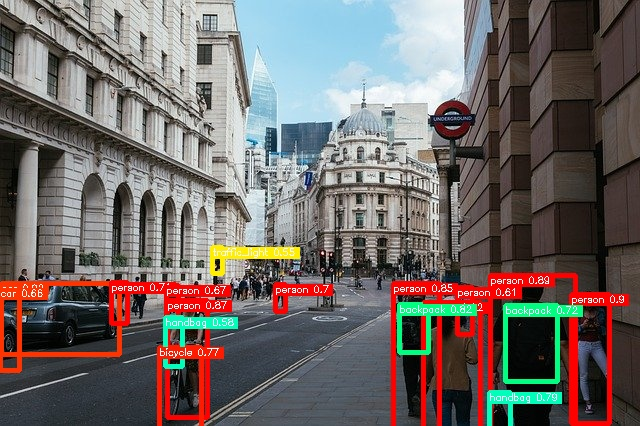
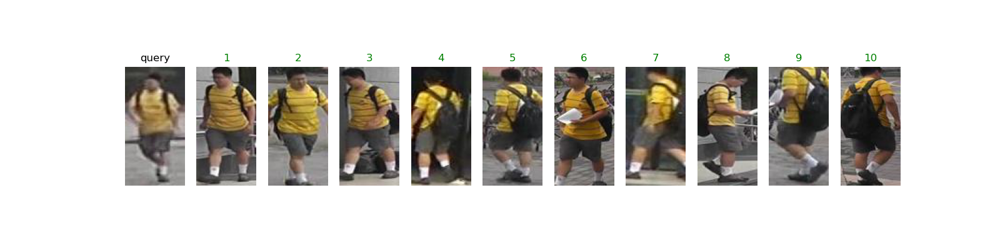

The collection of pre-trained, state-of-the-art AI models.

# About ailia SDK

[ailia SDK](https://ailia.jp/en/) is a cross-platform high speed inference SDK. The ailia SDK provides a consistent C++ API on Windows, Mac, Linux, iOS, Android, Jetson and Raspberry Pi. It supports Unity, Python and JNI for efficient AI implementation. The ailia SDK makes great use of the GPU via Vulkan and Metal to serve accelerated computing.

# How to use

[ailia MODELS tutorial](TUTORIAL.md)

# Supported models

## Action recognition

| | Model | Reference | Exported From | Supported Ailia Version |
|:-----------|------------:|:------------:|:------------:|:------------:|
|  | [mars](/action_recognition/mars/) | [MARS: Motion-Augmented RGB Stream for Action Recognition](https://github.com/craston/MARS) | Pytorch | 1.2.4 and later |
|  | [st-gcn](/action_recognition/st_gcn/) | [ST-GCN](https://github.com/yysijie/st-gcn) | Pytorch | 1.2.5 and later |
|  | [ax_action_recognition](/action_recognition/ax_action_recognition/) | [Realtime-Action-Recognition](https://github.com/felixchenfy/Realtime-Action-Recognition) | Pytorch | 1.2.7 and later |
|  | [va-cnn](/action_recognition/va-cnn/) | [View Adaptive Neural Networks (VA) for Skeleton-based Human Action Recognition](https://github.com/microsoft/View-Adaptive-Neural-Networks-for-Skeleton-based-Human-Action-Recognition) | Pytorch | 1.2.7 and later |

## Anomaly detection

| | Model | Reference | Exported From | Supported Ailia Version |
|:-----------|------------:|:------------:|:------------:|:------------:|
|  | [padim](/anomaly_detection/padim/) | [PaDiM-Anomaly-Detection-Localization-master](https://github.com/xiahaifeng1995/PaDiM-Anomaly-Detection-Localization-master) | Pytorch | 1.2.6 and later |

## Audio processing

| Model | Reference | Exported From | Supported Ailia Version |
|------------:|:------------:|:------------:|:------------:|
| [crnn_audio_classification](/audio_processing/crnn_audio_classification/) | [crnn-audio-classification](https://github.com/ksanjeevan/crnn-audio-classification) | Pytorch | 1.2.5 and later |
| [deepspeech2](/audio_processing/deepspeech2/) | [deepspeech.pytorch](https://github.com/SeanNaren/deepspeech.pytorch) | Pytorch | 1.2.2 and later |
| [pytorch-dc-tts](/audio_processing/pytorch-dc-tts/) | [Efficiently Trainable Text-to-Speech System Based on Deep Convolutional Networks with Guided Attention](https://github.com/tugstugi/pytorch-dc-tts)   | Pytorch | 1.2.6 and later |
| [unet_source_separation](/audio_processing/unet_source_separation/) | [source_separation](https://github.com/AppleHolic/source_separation)  | Pytorch | 1.2.6 and later |
| [transformer-cnn-emotion-recognition](/audio_processing/transformer-cnn-emotion-recognition/) | [Combining Spatial and Temporal Feature Representions of Speech Emotion by Parallelizing CNNs and Transformer-Encoders](https://github.com/IliaZenkov/transformer-cnn-emotion-recognition)  | Pytorch | 1.2.5 and later |
| [auto_speech](/audio_processing/auto_speech/) | [AutoSpeech: Neural Architecture Search for Speaker Recognition](https://github.com/VITA-Group/AutoSpeech)  | Pytorch | 1.2.8 and later |

## Background removal

| | Model | Reference | Exported From | Supported Ailia Version |
|:-----------|------------:|:------------:|:------------:|:------------:|
|  | [U-2-Net](/background_removal/u2net/) | [U^2-Net: Going Deeper with Nested U-Structure for Salient Object Detection](https://github.com/NathanUA/U-2-Net) | Pytorch | 1.2.2 and later |
|  | [u2net-portrait-matting](/background_removal/u2net-portrait-matting/) | [U^2-Net - Portrait matting](https://github.com/dennisbappert/u-2-net-portrait) | Pytorch | 1.2.7 and later |
|  | [u2net-human-seg](/background_removal/u2net-human-seg/) | [U^2-Net - human segmentation](https://github.com/xuebinqin/U-2-Net) | Pytorch | 1.2.4 and later |
|  | [deep-image-matting](/background_removal/deep-image-matting/) | [Deep Image Matting](https://github.com/foamliu/Deep-Image-Matting)| Keras | 1.2.3 and later |
|  | [indexnet](/background_removal/indexnet/) | [Indices Matter: Learning to Index for Deep Image Matting](https://github.com/open-mmlab/mmediting/tree/master/configs/mattors/indexnet) | Pytorch | 1.2.7 and later |
|  | [modnet](/background_removal/modnet/) | [MODNet: Trimap-Free Portrait Matting in Real Time](https://github.com/ZHKKKe/MODNet) | Pytorch | 1.2.7 and later |

## Crowd counting

| | Model | Reference | Exported From | Supported Ailia Version |
|:-----------|------------:|:------------:|:------------:|:------------:|
|  | [crowdcount-cascaded-mtl](/crowd_counting/crowdcount-cascaded-mtl) | [CNN-based Cascaded Multi-task Learning of  High-level Prior and Density Estimation for Crowd Counting  (Single Image Crowd Counting)](https://github.com/svishwa/crowdcount-cascaded-mtl) | Pytorch | 1.2.1 and later | 
|  | [c-3-framework](/crowd_counting/c-3-framework) | [Crowd Counting Code Framework(C^3-Framework)](https://github.com/gjy3035/C-3-Framework) | Pytorch | 1.2.5 and later | 

## Deep fashion

| | Model | Reference | Exported From | Supported Ailia Version |
|:-----------|------------:|:------------:|:------------:|:------------:|
| | [clothing-detection](/deep_fashion/clothing-detection/) | [Clothing-Detection](https://github.com/simaiden/Clothing-Detection) | Pytorch | 1.2.1 and later |
| | [mmfashion](/deep_fashion/mmfashion/) | [MMFashion](https://github.com/open-mmlab/mmfashion) | Pytorch | 1.2.5 and later |
| | [mmfashion_tryon](/deep_fashion/mmfashion_tryon/) | [MMFashion virtual try-on](https://github.com/open-mmlab/mmfashion) | Pytorch | 1.2.8 and later |
| | [fashionai-key-points-detection](/deep_fashion/fashionai-key-points-detection/) | [A Pytorch Implementation of Cascaded Pyramid Network for FashionAI Key Points Detection](https://github.com/gathierry/FashionAI-KeyPointsDetectionOfApparel) | Pytorch | 1.2.5 and later |

## Depth estimation

| | Model | Reference | Exported From | Supported Ailia Version |
|:-----------|------------:|:------------:|:------------:|:------------:|
|  | [monodepth2](depth_estimation/monodepth2)| [Monocular depth estimation from a single image](https://github.com/nianticlabs/monodepth2) | Pytorch | 1.2.2 and later |
|  |[midas](depth_estimation/midas)| [Towards Robust Monocular Depth Estimation:  Mixing Datasets for Zero-shot Cross-dataset Transfer](https://github.com/intel-isl/MiDaS) | Pytorch | 1.2.4 and later |
|  |[fcrn-depthprediction](depth_estimation/fcrn-depthprediction)| [Deeper Depth Prediction with Fully Convolutional Residual Networks](https://github.com/iro-cp/FCRN-DepthPrediction) | TensorFlow | 1.2.6 and later |
|  |[fast-depth](depth_estimation/fast-depth)| [ICRA 2019 "FastDepth: Fast Monocular Depth Estimation on Embedded Systems"](https://github.com/dwofk/fast-depth) | Pytorch | 1.2.5 and later |

## Face detection

| | Model | Reference | Exported From | Supported Ailia Version |
|:-----------|------------:|:------------:|:------------:|:------------:|
|  | [yolov1-face](/face_detection/yolov1-face/) | [YOLO-Face-detection](https://github.com/dannyblueliu/YOLO-Face-detection/) | Darknet | 1.1.0 and later |
|  | [yolov3-face](/face_detection/yolov3-face/) | [Face detection using keras-yolov3](https://github.com/axinc-ai/yolov3-face) | Keras | 1.2.1 and later |
|  |[blazeface](/face_detection/blazeface/)| [BlazeFace-PyTorch](https://github.com/hollance/BlazeFace-PyTorch) | Pytorch | 1.2.1 and later |
| | [face-mask-detection](/face_detection/face-mask-detection/) | [Face detection using keras-yolov3](https://github.com/axinc-ai/yolov3-face) | Keras | 1.2.1 and later | 
| | [dbface](face_detection/dbface/) | [DBFace : real-time, single-stage detector for face detection,  with faster speed and higher accuracy](https://github.com/dlunion/DBFace) | Pytorch | 1.2.2 and later | 
| | [retinaface](face_detection/retinaface/) | [RetinaFace: Single-stage Dense Face Localisation in the Wild.](https://github.com/biubug6/Pytorch_Retinaface) | Pytorch | 1.2.5 and later | 

## Face identification

| | Model | Reference | Exported From | Supported Ailia Version |
|:-----------|------------:|:------------:|:------------:|:------------:|
|  |[vggface2](/face_identification/vggface2) | [VGGFace2 Dataset for Face Recognition](https://github.com/ox-vgg/vgg_face2) | Caffe | 1.1.0 and later |
| |[arcface](/face_identification/arcface) | [pytorch implement of arcface](https://github.com/ronghuaiyang/arcface-pytorch) | Pytorch | 1.2.1 and later |
| |[insightface](/face_identification/insightface) | [InsightFace: 2D and 3D Face Analysis Project](https://github.com/deepinsight/insightface) | Pytorch | 1.2.5 and later |

## Face recognition

| | Model | Reference | Exported From | Supported Ailia Version |
|:-----------|------------:|:------------:|:------------:|:------------:|
|  |[face_classification](/face_recognition/face_classification) | [Real-time face detection and emotion/gender classification](https://github.com/oarriaga/face_classification) | Keras | 1.1.0 and later |
|  |[facial_feature](/face_recognition/facial_feature/)|[kaggle-facial-keypoints](https://github.com/axinc-ai/kaggle-facial-keypoints)|Pytorch| 1.2.0 and later |
|  |[face_alignment](/face_recognition/face_alignment/)| [2D and 3D Face alignment library build using pytorch](https://github.com/1adrianb/face-alignment) | Pytorch | 1.2.1 and later |
|  |[prnet](/face_recognition/prnet)| [Joint 3D Face Reconstruction and Dense Alignment  with Position Map Regression Network](https://github.com/YadiraF/PRNet) | TensorFlow | 1.2.2 and later |
|  | [gazeml](/face_recognition/gazeml/) | [A deep learning framework based on Tensorflow  for the training of high performance gaze estimation](https://github.com/swook/GazeML) | TensorFlow | 1.2.0 and later |
|  | [facemesh](/face_recognition/facemesh/) | [facemesh.pytorch](https://github.com/thepowerfuldeez/facemesh.pytorch) | Pytorch | 1.2.2 and later |
|  | [mediapipe_iris](/face_recognition/mediapipe_iris/) | [irislandmarks.pytorch](https://github.com/cedriclmenard/irislandmarks.pytorch) | Pytorch | 1.2.2 and later |
|  | [hopenet](/face_recognition/hopenet/) | [deep-head-pose](https://github.com/natanielruiz/deep-head-pose) | Pytorch | 1.2.2 and later |
|  | [ax_gaze_estimation](/face_recognition/ax_gaze_estimation/) | ax Gaze Estimation | Pytorch | 1.2.2 and later |
|  | [age-gender-recognition-retail](/face_recognition/age-gender-recognition-retail/) | [age-gender-recognition-retail-0013](https://github.com/openvinotoolkit/open_model_zoo/tree/master/models/intel/age-gender-recognition-retail-0013) | OpenVINO | 1.2.5 and later |

## Frame Interpolation

| | Model | Reference | Exported From | Supported Ailia Version |
|:-----------|------------:|:------------:|:------------:|:------------:|
|  | [flavr](/frame_interpolation/flavr/) | [FLAVR: Flow-Agnostic Video Representations for Fast Frame Interpolation](https://github.com/tarun005/FLAVR) | Pytorch | 1.2.7 and later |

## Generative adversarial networks

| | Model | Reference | Exported From | Supported Ailia Version |
|:-----------|------------:|:------------:|:------------:|:------------:|
|  |[pytorch-gan](/generative_adversarial_networks/pytorch-gan) | [Code repo for the Pytorch GAN Zoo project (used to train this model)](https://github.com/facebookresearch/pytorch_GAN_zoo)| Pytorch | 1.2.4 and later |
|  | [council-GAN](/generative_adversarial_networks/council-GAN)| [Council-GAN](https://github.com/Onr/Council-GAN)| Pytorch | 1.2.4 and later |

## Hand detection

| | Model | Reference | Exported From | Supported Ailia Version |
|:-----------|------------:|:------------:|:------------:|:------------:|
|  | [yolov3-hand](/hand_detection/yolov3-hand/) | [Hand detection branch of Face detection using keras-yolov3](https://github.com/axinc-ai/yolov3-face/tree/hand_detection) | Keras | 1.2.1 and later |
|  | [hand_detection_pytorch](/hand_detection/hand_detection_pytorch/) | [hand-detection.PyTorch](https://github.com/zllrunning/hand-detection.PyTorch) | Pytorch | 1.2.2 and later |
|  |[blazepalm](/hand_detection/blazepalm/) | [MediaPipePyTorch](https://github.com/zmurez/MediaPipePyTorch) | Pytorch | 1.2.5 and later |

## Hand recognition

| | Model | Reference | Exported From | Supported Ailia Version |
|:-----------|------------:|:------------:|:------------:|:------------:|
|  |[blazehand](/hand_recognition/blazehand/) | [MediaPipePyTorch](https://github.com/zmurez/MediaPipePyTorch) | Pytorch | 1.2.5 and later |
|  |[hand3d](/hand_recognition/hand3d/) | [ColorHandPose3D network](https://github.com/lmb-freiburg/hand3d) | TensorFlow | 1.2.5 and later |
|  |[minimal-hand](/hand_recognition/minimal-hand/) | [Minimal Hand](https://github.com/CalciferZh/minimal-hand) | TensorFlow | 1.2.8 and later |

## Image captioning

| | Model | Reference | Exported From | Supported Ailia Version |
|:-----------|------------:|:------------:|:------------:|:------------:|
|  | [illustration2vec](/image_captioning/illustration2vec/)|[Illustration2Vec](https://github.com/rezoo/illustration2vec) | Caffe | 1.2.2 and later |
|  | [image_captioning_pytorch](/image_captioning/image_captioning_pytorch/)|[Image Captioning pytorch](https://github.com/ruotianluo/ImageCaptioning.pytorch) | Pytorch | 1.2.5 and later |

## Image classification

| | Model | Reference | Exported From | Supported Ailia Version |
|:-----------|------------:|:------------:|:------------:|:------------:|
|  | [vgg16](/image_classification/vgg16/) |[Very Deep Convolutional Networks for Large-Scale Image Recognition]( https://arxiv.org/abs/1409.1556 )|Keras| 1.1.0 and later|
|  | [googlenet](/image_classification/googlenet/) |[Going Deeper with Convolutions]( https://arxiv.org/abs/1409.4842 )|Pytorch| 1.2.0 and later|
|  | [resnet50](/image_classification/resnet50/) | [Deep Residual Learning for Image Recognition]( https://github.com/KaimingHe/deep-residual-networks) | Chainer | 1.2.0 and later |
|  | [inceptionv3](/image_classification/inceptionv3/)|[Rethinking the Inception Architecture for Computer Vision](http://arxiv.org/abs/1512.00567)|Pytorch| 1.2.0 and later |
|  | [inceptionv4](/image_classification/inceptionv4/)|[Keras Inception-V4](https://github.com/kentsommer/keras-inceptionV4)|Keras| 1.2.5 and later |
|  | [mobilenetv2](/image_classification/mobilenetv2/)|[PyTorch Implemention of MobileNet V2](https://github.com/d-li14/mobilenetv2.pytorch)|Pytorch| 1.2.0 and later |
|  | [mobilenetv3](/image_classification/mobilenetv3/)|[PyTorch Implemention of MobileNet V3](https://github.com/d-li14/mobilenetv3.pytorch)|Pytorch| 1.2.1 and later |
|  | [partialconv](/image_classification/partialconv/)|[Partial Convolution Layer for Padding and Image Inpainting](https://github.com/NVIDIA/partialconv)|Pytorch| 1.2.0 and later |
| | [efficientnet](/image_classification/efficientnet/)|[A PyTorch implementation of EfficientNet]( https://github.com/lukemelas/EfficientNet-PyTorch)|Pytorch| 1.2.3 and later |
| | [efficientnetv2](/image_classification/efficientnetv2/)|[EfficientNetV2]( https://github.com/google/automl/tree/master/efficientnetv2 )|Pytorch| 1.2.4 and later |
| | [vit](/image_classification/vit/)|[Pytorch reimplementation of the Vision Transformer (An Image is Worth 16x16 Words: Transformers for Image Recognition at Scale)](https://github.com/jeonsworld/ViT-pytorch)|Pytorch| 1.2.7 and later |

## Image inpainting

| | Model | Reference | Exported From | Supported Ailia Version |
|:-----------|------------:|:------------:|:------------:|:------------:|
|  | [inpainting-with-partial-conv](/image_inpainting/pytorch-inpainting-with-partial-conv/) | [pytorch-inpainting-with-partial-conv](https://github.com/naoto0804/pytorch-inpainting-with-partial-conv) | PyTorch | 1.2.6 and later |
|  | [inpainting_gmcnn](/image_inpainting/inpainting_gmcnn/) | [Image Inpainting via Generative Multi-column Convolutional Neural Networks](https://github.com/shepnerd/inpainting_gmcnn) | TensorFlow | 1.2.6 and later |
|  | [3d-photo-inpainting](/image_inpainting/3d-photo-inpainting/) | [3D Photography using Context-aware Layered Depth Inpainting](https://github.com/vt-vl-lab/3d-photo-inpainting) | Pytorch | 1.2.7 and later |

## Image manipulation

| | Model | Reference | Exported From | Supported Ailia Version |
|:-----------|------------:|:------------:|:------------:|:------------:|
|  | [noise2noise](/image_manipulation/noise2noise/) | [Learning Image Restoration without Clean Data](https://github.com/joeylitalien/noise2noise-pytorch) | Pytorch | 1.2.0 and later |
|  | [dewarpnet](/image_manipulation/dewarpnet) | [DewarpNet: Single-Image Document Unwarping With Stacked 3D and 2D Regression Networks](https://github.com/cvlab-stonybrook/DewarpNet) | Pytorch | 1.2.1 and later |
|  | [illnet](/image_manipulation/illnet/) | [Document Rectification and Illumination Correction using a Patch-based CNN](https://github.com/xiaoyu258/DocProj) | Pytorch | 1.2.2 and later |
|  | [colorization](/image_manipulation/colorization/) | [Colorful Image Colorization](https://github.com/richzhang/colorization) | Pytorch | 1.2.2 and later |
|  | [u2net_portrait](/image_manipulation/u2net_portrait/) | [U^2-Net: Going Deeper with Nested U-Structure for Salient Object Detection](https://github.com/NathanUA/U-2-Net) | Pytorch | 1.2.2 and later |
|  | [style2paints](/image_manipulation/style2paints/) | [Style2Paints](https://github.com/lllyasviel/style2paints) | TensorFlow | 1.2.6 and later |
|  | [deep_white_balance](/image_manipulation/deep_white_balance/) | [Deep White-Balance Editing, CVPR 2020 (Oral)](https://github.com/mahmoudnafifi/Deep_White_Balance) | PyTorch | 1.2.6 and later |
|  | [deblur_gan](/image_manipulation/deblur_gan/) | [DeblurGAN](https://github.com/KupynOrest/DeblurGAN) | Pytorch | 1.2.6 and later |

## Image segmentation

| | Model | Reference | Exported From | Supported Ailia Version |
|:-----------|------------:|:------------:|:------------:|:------------:|
|  | [deeplabv3](/image_segmentation/deeplabv3/) | [Xception65 for backbone network of DeepLab v3+](https://github.com/tensorflow/models/tree/master/research/deeplab) | Chainer | 1.2.0 and later |
|  | [hrnet_segmentation](/image_segmentation/hrnet_segmentation/) | [High-resolution networks (HRNets) for Semantic Segmentation](https://github.com/HRNet/HRNet-Semantic-Segmentation) | Pytorch | 1.2.1 and later |
|  | [hair_segmentation](/image_segmentation/hair_segmentation/) | [hair segmentation in mobile device](https://github.com/thangtran480/hair-segmentation) | Keras | 1.2.1 and later |
|  | [pspnet-hair-segmentation](/image_segmentation/pspnet-hair-segmentation/) | [pytorch-hair-segmentation](https://github.com/YBIGTA/pytorch-hair-segmentation) | Pytorch | 1.2.2 and later |
|  | [human_part_segmentation](/image_segmentation/human_part_segmentation/) | [Self Correction for Human Parsing](https://github.com/PeikeLi/Self-Correction-Human-Parsing) | Pytorch | 1.2.4 and later |
|  | [semantic-segmentation-mobilenet-v3](/image_segmentation/semantic-segmentation-mobilenet-v3) | [Semantic segmentation with MobileNetV3](https://github.com/OniroAI/Semantic-segmentation-with-MobileNetV3) | TensorFlow | 1.2.5 and later |
|  | [pytorch-unet](/image_segmentation/pytorch-unet/) | [Pytorch-Unet](https://github.com/milesial/Pytorch-UNet) | Pytorch | 1.2.5 and later |
|  | [pytorch-enet](/image_segmentation/pytorch-enet/) | [PyTorch-ENet](https://github.com/davidtvs/PyTorch-ENet) | Pytorch | 1.2.8 and later |
|  | [yet-another-anime-segmenter](/image_segmentation/yet-another-anime-segmenter/) | [Yet-Another-Anime-Segmenter](https://github.com/zymk9/Yet-Another-Anime-Segmenter) | Pytorch | 1.2.6 and later |
|  | [swiftnet](/image_segmentation/swiftnet/) | [SwiftNet](https://github.com/orsic/swiftnet) | Pytorch | 1.2.6 and later |
|  | [dense_prediction_transformers](/image_segmentation/dense_prediction_transformers/) | [dense_prediction_transformers](https://github.com/intel-isl/DPT)   | Pytorch | 1.2.7 and later |

## Line segment detection

| | Model | Reference | Exported From | Supported Ailia Version |
|:-----------|------------:|:------------:|:------------:|:------------:|
|  | [mlsd](/line_segment_detection/mlsd/) | [M-LSD: Towards Light-weight and Real-time Line Segment Detection](https://github.com/navervision/mlsd) | TensorFlow | 1.2.8 and later |

## Natural language processing

| Model | Reference | Exported From | Supported Ailia Version |
|------------:|:------------:|:------------:|:------------:|
|[bert](/neural_language_processing/bert) | [pytorch-pretrained-bert](https://pypi.org/project/pytorch-pretrained-bert/) | Pytorch | 1.2.2 and later |
|[bert_maskedlm](/neural_language_processing/bert_maskedlm) | [huggingface/transformers](https://github.com/huggingface/transformers) | Pytorch | 1.2.5 and later |
|[bert_ner](/neural_language_processing/bert_ner) | [huggingface/transformers](https://github.com/huggingface/transformers) | Pytorch | 1.2.5 and later |
|[bert_question_answering](/neural_language_processing/bert_question_answering) | [huggingface/transformers](https://github.com/huggingface/transformers) | Pytorch | 1.2.5 and later |
|[bert_sentiment_analysis](/neural_language_processing/bert_sentiment_analysis) | [huggingface/transformers](https://github.com/huggingface/transformers) | Pytorch | 1.2.5 and later |
|[bert_zero_shot_classification](/neural_language_processing/bert_zero_shot_classification) | [huggingface/transformers](https://github.com/huggingface/transformers) | Pytorch | 1.2.5 and later |
|[bert_tweets_sentiment](/neural_language_processing/bert_tweets_sentiment) | [huggingface/transformers](https://github.com/huggingface/transformers) | Pytorch | 1.2.5 and later |

## Object detection

| | Model | Reference | Exported From | Supported Ailia Version |
|:-----------|------------:|:------------:|:------------:|:------------:|
|  | [yolov1-tiny](/object_detection/yolov1-tiny/) | [YOLO: Real-Time Object Detection](https://pjreddie.com/darknet/yolov1/) | Darknet | 1.1.0 and later |
|  | [yolov2](/object_detection/yolov2/) | [YOLO: Real-Time Object Detection](https://pjreddie.com/darknet/yolo/) | Pytorch | 1.2.0 and later |
|  | [yolov3](/object_detection/yolov3/) | [YOLO: Real-Time Object Detection](https://pjreddie.com/darknet/yolo/) | ONNX Runtime | 1.2.1 and later |
|  | [yolov3-tiny](/object_detection/yolov3-tiny/) | [YOLO: Real-Time Object Detection](https://pjreddie.com/darknet/yolo/) | ONNX Runtime | 1.2.1 and later |
|  | [yolov4](/object_detection/yolov4/) | [Pytorch-YOLOv4](https://github.com/Tianxiaomo/pytorch-YOLOv4) | Pytorch | 1.2.4 and later |
|  | [yolov4-tiny](/object_detection/yolov4-tiny/) | [Pytorch-YOLOv4](https://github.com/Tianxiaomo/pytorch-YOLOv4) | Pytorch | 1.2.5 and later |
|  | [yolov5](/object_detection/yolov5/) | [yolov5](https://github.com/ultralytics/yolov5) | Pytorch | 1.2.5 and later |
|  | [mobilenet_ssd](/object_detection/mobilenet_ssd/) | [MobileNetV1, MobileNetV2, VGG based SSD/SSD-lite implementation in Pytorch](https://github.com/qfgaohao/pytorch-ssd) | Pytorch | 1.2.1 and later |
|  | [maskrcnn](/object_detection/maskrcnn/) | [Mask R-CNN: real-time neural network for object instance segmentation](https://github.com/onnx/models/tree/master/vision/object_detection_segmentation/mask-rcnn) | Pytorch | 1.2.3 and later |
|  | [m2det](/object_detection/m2det/) | [M2Det: A Single-Shot Object Detector based on Multi-Level Feature Pyramid Network](https://github.com/qijiezhao/M2Det) | Pytorch | 1.2.3 and later |
|  | [centernet](/object_detection/centernet/) | [CenterNet : Objects as Points](https://github.com/xingyizhou/CenterNet) | Pytorch | 1.2.1 and later |
|  | [pedestrian_detection](/object_detection/pedestrian_detection/) | [Pedestrian-Detection-on-YOLOv3_Research-and-APP](https://github.com/Zyjacya-In-love/Pedestrian-Detection-on-YOLOv3_Research-and-APP) | Keras | 1.2.1 and later |
|  | [efficientdet](/object_detection/efficientdet/) | [EfficientDet: Scalable and Efficient Object Detection, in PyTorch](https://github.com/toandaominh1997/EfficientDet.Pytorch) | Pytorch | 1.2.6 and later |
|  | [nanodet](/object_detection/nanodet/) | [NanoDet](https://github.com/RangiLyu/nanodet) | Pytorch | 1.2.6 and later |
|  | [yolor](/object_detection/yolor/) | [yolor](https://github.com/WongKinYiu/yolor/tree/paper) | Pytorch | 1.2.5 and later |

## Object detection 3d

| | Model | Reference | Exported From | Supported Ailia Version |
|:-----------|------------:|:------------:|:------------:|:------------:|
|  | [3d_bbox](/object_detection_3d/3d_bbox/) | [3D Bounding Box Estimation Using Deep Learning and Geometry](https://github.com/skhadem/3D-BoundingBox) | Pytorch | 1.2.6 and later |
|  | [3d-object-detection.pytorch](/object_detection_3d/3d-object-detection.pytorch/) | [3d-object-detection.pytorch](https://github.com/sovrasov/3d-object-detection.pytorch) | Pytorch | 1.2.8 and later |
|  | [mediapipe_objectron](/object_detection_3d/mediapipe_objectron/) | [MediaPipe Objectron](https://github.com/google/mediapipe) | TensorFlow Lite | 1.2.5 and later |

## Object tracking

| | Model | Reference | Exported From | Supported Ailia Version |
|:-----------|------------:|:------------:|:------------:|:------------:|
|  | [deepsort](/object_tracking/deepsort/) | [Deep Sort with PyTorch](https://github.com/ZQPei/deep_sort_pytorch) | Pytorch | 1.2.3 and later |
|  | [person_reid_baseline_pytorch](/object_tracking/person_reid_baseline_pytorch/) | [UTS-Person-reID-Practical](https://github.com/layumi/Person_reID_baseline_pytorch) | Pytorch | 1.2.6 and later |
|  | [abd_net](/object_tracking/abd_net/) | [Attentive but Diverse Person Re-Identification](https://github.com/VITA-Group/ABD-Net) | Pytorch | 1.2.7 and later |

## Point segmentation

| | Model | Reference | Exported From | Supported Ailia Version |
|:-----------|------------:|:------------:|:------------:|:------------:|
|  | [pointnet_pytorch](/point_segmentation/pointnet_pytorch/) | [PointNet.pytorch](https://github.com/fxia22/pointnet.pytorch) | Pytorch | 1.2.6 and later |

## Pose estimation

| | Model | Reference | Exported From | Supported Ailia Version |
|:-----------|------------:|:------------:|:------------:|:------------:|
|  |[openpose](/pose_estimation/openpose/) | [Code repo for realtime multi-person pose estimation in CVPR'17 (Oral)](https://github.com/ZheC/Realtime_Multi-Person_Pose_Estimation) | Caffe | 1.2.1 and later |
|   |[lightweight-human-pose-estimation](/pose_estimation/lightweight-human-pose-estimation/) | [Fast and accurate human pose estimation in PyTorch. Contains implementation of  "Real-time 2D Multi-Person Pose Estimation on CPU: Lightweight OpenPose" paper.](https://github.com/Daniil-Osokin/lightweight-human-pose-estimation.pytorch) | Pytorch | 1.2.1 and later |
|  |[pose_resnet](/pose_estimation/pose_resnet/) | [Simple Baselines for Human Pose Estimation and Tracking](https://github.com/microsoft/human-pose-estimation.pytorch) | Pytorch | 1.2.1 and later |
|  |[blazepose](/pose_estimation/blazepose/) | [MediaPipePyTorch](https://github.com/zmurez/MediaPipePyTorch) | Pytorch | 1.2.5 and later |
|  |[efficientpose](/pose_estimation/efficientpose/) | [Code repo for EfficientPose](https://github.com/daniegr/EfficientPose) | TensorFlow | 1.2.6 and later |
|  |[movenet](/pose_estimation/movenet/) | [Code repo for movenet](https://www.tensorflow.org/hub/tutorials/movenet) | TensorFlow | 1.2.8 and later |
|  |[animalpose](/pose_estimation/animalpose/) | [MMPose - 2D animal pose estimation](https://github.com/open-mmlab/mmpose) | Pytorch | 1.2.7 and later |

## Pose estimation 3d

| | Model | Reference | Exported From | Supported Ailia Version |
|:-----------|------------:|:------------:|:------------:|:------------:|
|  |[lightweight-human-pose-estimation-3d](/pose_estimation_3d/lightweight-human-pose-estimation-3d/) | [Real-time 3D multi-person pose estimation demo in PyTorch. OpenVINO backend can be used for fast inference on CPU.](https://github.com/Daniil-Osokin/lightweight-human-pose-estimation-3d-demo.pytorch) | Pytorch | 1.2.1 and later |
|  |[3d-pose-baseline](/pose_estimation_3d/3d-pose-baseline/) | [A simple baseline for 3d human pose estimation in tensorflow. Presented at ICCV 17.](https://github.com/una-dinosauria/3d-pose-baseline) | TensorFlow | 1.2.3 and later |
|  |[pose-hg-3d](/pose_estimation_3d/pose-hg-3d/) | [Towards 3D Human Pose Estimation in the Wild: a Weakly-supervised Approach](https://github.com/xingyizhou/pytorch-pose-hg-3d) | Pytorch | 1.2.6 and later |
|  |[blazepose-fullbody](/pose_estimation_3d/blazepose-fullbody/) | [MediaPipe](https://google.github.io/mediapipe/solutions/models.html#pose) | TensorFlow Lite | 1.2.5 and later |
|  |[3dmppe_posenet](/pose_estimation_3d/3dmppe_posenet/) | [PoseNet of "Camera Distance-aware Top-down Approach for 3D Multi-person Pose Estimation from a Single RGB Image"](https://github.com/mks0601/3DMPPE_POSENET_RELEASE) | Pytorch | 1.2.6 and later |
|  |[gast](/pose_estimation_3d/gast/) | [A Graph Attention Spatio-temporal Convolutional Networks for 3D Human Pose Estimation in Video (GAST-Net)](https://github.com/fabro66/GAST-Net-3DPoseEstimation) | Pytorch | 1.2.7 and later |

## Road detection

| | Model | Reference | Exported From | Supported Ailia Version |
|:-----------|------------:|:------------:|:------------:|:------------:|
|  | [codes-for-lane-detection](/road_detection/codes-for-lane-detection/) | [Codes-for-Lane-Detection](https://github.com/cardwing/Codes-for-Lane-Detection) | Pytorch | 1.2.6 and later |
|  | [roneld](/road_detection/roneld/) | [RONELD-Lane-Detection](https://github.com/czming/RONELD-Lane-Detection) | Pytorch | 1.2.6 and later |
|  | [road-segmentation-adas](/road_detection/road-segmentation-adas/) | [road-segmentation-adas-0001](https://github.com/openvinotoolkit/open_model_zoo/tree/master/models/intel/road-segmentation-adas-0001) | OpenVINO | 1.2.5 and later |

## Rotation prediction

| | Model | Reference | Exported From | Supported Ailia Version |
|:-----------|------------:|:------------:|:------------:|:------------:|
|  |[rotnet](/rotation_prediction/rotnet) | [CNNs for predicting the rotation angle of an image to correct its orientation](https://github.com/d4nst/RotNet) | Keras | 1.2.1 and later |

## Style transfer

| | Model | Reference | Exported From | Supported Ailia Version |
|:-----------|------------:|:------------:|:------------:|:------------:|
|  | [adain](/style_transfer/adain/) | [Arbitrary Style Transfer in Real-time with Adaptive Instance Normalization](https://github.com/naoto0804/pytorch-AdaIN)| Pytorch | 1.2.1 and later |
|  | [psgan](/style_transfer/psgan/) | [PSGAN: Pose and Expression Robust Spatial-Aware GAN for Customizable Makeup Transfer](https://github.com/wtjiang98/PSGAN)| Pytorch | 1.2.7 and later |
|  | [beauty_gan](/style_transfer/beauty_gan/) | [BeautyGAN](https://github.com/wtjiang98/BeautyGAN_pytorch) | Pytorch | 1.2.7 and later |

## Super resolution

| | Model | Reference | Exported From | Supported Ailia Version |
|:-----------|------------:|:------------:|:------------:|:------------:|
|  | [srresnet](/super_resolution/srresnet/) | [Photo-Realistic Single Image Super-Resolution Using a Generative Adversarial Network](https://github.com/twtygqyy/pytorch-SRResNet) | Pytorch | 1.2.0 and later |
|  | [edsr](/super_resolution/edsr/) | [Enhanced Deep Residual Networks for Single Image Super-Resolution](https://github.com/sanghyun-son/EDSR-PyTorch.git) | Pytorch | 1.2.6 and later |
|  | [han](/super_resolution/han/) | [Single Image Super-Resolution via a Holistic Attention Network](https://github.com/wwlCape/HAN) | Pytorch | 1.2.6 and later |

## Text detection

| | Model | Reference | Exported From | Supported Ailia Version |
|:-----------|------------:|:------------:|:------------:|:------------:|
|  |[craft_pytorch](/text_detection/craft_pytorch) | [CRAFT: Character-Region Awareness For Text detection](https://github.com/clovaai/CRAFT-pytorch) | Pytorch | 1.2.2 and later |
|  |[pixel_link](/text_detection/pixel_link) | [Pixel-Link](https://github.com/ZJULearning/pixel_link) | TensorFlow | 1.2.6 and later |
|  |[east](/text_detection/east) | [EAST: An Efficient and Accurate Scene Text Detector](https://github.com/argman/EAST) | TensorFlow | 1.2.6 and later |

## Text recognition

| | Model | Reference | Exported From | Supported Ailia Version |
|:-----------|------------:|:------------:|:------------:|:------------:|
|  |[etl](/text_recognition/etl) | Japanese Character Classification | Keras | 1.1.0 and later |
|  |[deep-text-recognition-benchmark](/text_recognition/deep-text-recognition-benchmark/) | [deep-text-recognition-benchmark](https://github.com/clovaai/deep-text-recognition-benchmark) | Pytorch | 1.2.6 and later |
|  |[crnn.pytorch](/text_recognition/crnn.pytorch/) | [Convolutional Recurrent Neural Network](https://github.com/meijieru/crnn.pytorch) | Pytorch | 1.2.6 and later |
|  |[paddleocr](/text_recognition/paddleocr/) | [PaddleOCR : Awesome multilingual OCR toolkits based on PaddlePaddle](https://github.com/PaddlePaddle/PaddleOCR) | Pytorch | 1.2.6 and later |

## Vehicle recognition

| | Model | Reference | Exported From | Supported Ailia Version |
|:-----------|------------:|:------------:|:------------:|:------------:|
|  |[vehicle-attributes-recognition-barrier](/vehicle_recognition/vehicle-attributes-recognition-barrier) | [vehicle-attributes-recognition-barrier-0042](https://github.com/openvinotoolkit/open_model_zoo/tree/master/models/intel/vehicle-attributes-recognition-barrier-0042) | OpenVINO | 1.2.5 and later |
|  | [vehicle-license-plate-detection-barrier](/vehicle_recognition/vehicle-license-plate-detection-barrier/) | [vehicle-license-plate-detection-barrier-0106](https://github.com/openvinotoolkit/open_model_zoo/tree/master/models/intel/vehicle-license-plate-detection-barrier-0106) | OpenVINO | 1.2.5 and later |

## Commercial model

| Model | Reference | Exported From | Supported Ailia Version |
|------------:|:------------:|:------------:|:------------:|
|[acculus-pose](/commercial_model/acculus-pose) | [Acculus, Inc.](https://acculus.jp/) | Caffe | 1.2.3 and later |

# Other languages

[unity version](https://github.com/axinc-ai/ailia-models-unity)

[c++ version](https://github.com/axinc-ai/ailia-models-cpp)
