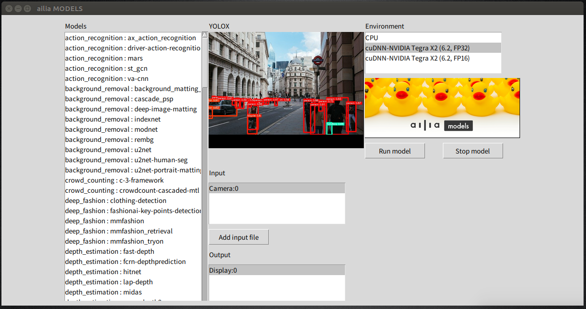

# ailia MODELS tutorial

In this tutorial we will explain how to use ailia from python language.
If you want to use ailia from other languages(C++/C#(Unity)/JNI/Kotlin) see the link at the bottom of this tutorial.

## Requirements

- Python 3.6 and later

## Install ailia SDK

- [Download a free evaluation version of ailia SDK](https://ailia.jp/en/trial)
- Unzip ailia SDK
- Run the following command

```
cd ailia_sdk/python
python3 bootstrap.py
pip3 install .
```

- In the evaluation version, place the license file in the same folder as libailia.dll ([python_path]/site_packages/ailia) on Windows and in ~/Library/SHALO/ on Mac.

- You can find the location of Python site-packages directory using the following command.

```
pip3 show ailia
```

## Install required libraries for Python

### For Windows, Mac and Linux

```
pip install -r requirements.txt
```

### For Jetson

```
sudo apt install python3-pip
sudo apt install python3-matplotlib
sudo apt install python3-scipy
pip3 install cython
pip3 install numpy
```

[OpenCV for python3 is pre-installed on Jetson.](https://forums.developer.nvidia.com/t/install-opencv-for-python3-in-jetson-nano/74042/3) You only need to run this command if you get a cv2 import error.

```
sudo apt install nvidia-jetpack
```

### For Raspberry Pi

```
pip3 install numpy
pip3 install opencv-python
pip3 install matplotlib
pip3 install scikit-image
sudo apt-get install libatlas-base-dev
```

## Options

The following options can be specified for each model.

```
optional arguments:
  -h, --help            show this help message and exit
  -i IMAGE/VIDEO, --input IMAGE/VIDEO
                        The default (model-dependent) input data (image /
                        video) path. If a directory name is specified, the
                        model will be run for the files inside. File type is
                        specified by --ftype argument (default: lenna.png)
  -v VIDEO, --video VIDEO
                        Run the inference against live camera image.
                        If an integer value is given, corresponding
                        webcam input will be used. (default: None)
  -s SAVE_PATH, --savepath SAVE_PATH
                        Save path for the output (image / video / text).
                        (default: output.png)
  -b, --benchmark       Running the inference on the same input 5 times to
                        measure execution performance. (Cannot be used in
                        video mode) (default: False)
  -e ENV_ID, --env_id ENV_ID
                        A specific environment id can be specified. By
                        default, the return value of
                        ailia.get_gpu_environment_id will be used (default: 2)
  --env_list            display environment list (default: False)
  --ftype FILE_TYPE     file type list: image | video | audio (default: image)
  --debug               set default logger level to DEBUG (enable to show
                        DEBUG logs) (default: False)
  --profile             set profile mode (enable to show PROFILE logs)
                        (default: False)
  -bc BENCHMARK_COUNT, --benchmark_count BENCHMARK_COUNT
                        set iteration count of benchmark (default: 5)
```                        

Input an image file, perform AI processing, and save the output to a file.

```
python3 yolov3-tiny.py -i input.png -s output.png
```

Input an video file, perform AI processing, and save the output to a video.

```
python3 yolov3-tiny.py -i input.mp4 -s output.mp4
```

Measure the execution time of the AI model.

```
python3 yolov3-tiny.py -b
```

Run AI model on CPU instead of GPU.

```
python3 yolov3-tiny.py -e 0
```

Get a list of executable environments.

```
python3 yolov3-tiny.py --env_list
```

Run the inference against live video stream.
(Press 'Q' to quit)

```
python3 yolov3-tiny.py -v 0
```

## Launcher

You can display a list of models and select them with the mouse by using the command below.

```
python3 launcher.py
```




## Demo application for iOS/Android
- [ailia AI showcase for iOS](https://apps.apple.com/jp/app/ailia-ai-showcase/id1522828798)
- [ailia AI showcase for Android](https://play.google.com/store/apps/details?id=jp.axinc.ailia_ai_showcase)
- Contact [us](<mailto:contact@axinc.jp>) for other platforms (Windows/macOS/Linux)

## API Documentations and Tutorial BLOG

### Python

- [ailia SDK python Tutorial (EN)](https://medium.com/axinc-ai/ailia-sdk-tutorial-python-ea29ae990cf6) [(JP)](https://medium.com/axinc/ailia-sdk-%E3%83%81%E3%83%A5%E3%83%BC%E3%83%88%E3%83%AA%E3%82%A2%E3%83%AB-python-28379dbc9649)
- [API reference (EN)](https://axinc-ai.github.io/ailia-sdk/api/python/en/)
- [ailia Models](https://github.com/axinc-ai/ailia-models) (* This site)

* Note: All python models will also work with C++/Unity(C#)/Java(JNI)/Kotlin but you may need to write the pre/post processing code.

### C++

- [ailia SDK C++ Tutorial (EN)](https://medium.com/axinc-ai/ailia-sdk-tutorial-c-75e59bbefffe) [(JP)](https://medium.com/axinc/ailia-sdk-%E3%83%81%E3%83%A5%E3%83%BC%E3%83%88%E3%83%AA%E3%82%A2%E3%83%AB-c-dc949d9dcd28)
- [API reference (EN)](https://axinc-ai.github.io/ailia-sdk/api/cpp/en/) [(JP)](https://axinc-ai.github.io/ailia-sdk/api/cpp/jp/)
- [ailia Models for C++](https://github.com/axinc-ai/ailia-models-cpp)
- [iOS Xcode Sample Project](https://github.com/axinc-ai/ailia-xcode)
- [Android NDK Sample Project](https://github.com/axinc-ai/ailia-android-ndk)

### Unity

- [ailia SDK Unity(C#) Tutorial (EN)](https://medium.com/axinc-ai/ailia-sdk-tutorial-unity-54f2a8155b8f) [(JP)](https://medium.com/axinc/ailia-sdk-%E3%83%81%E3%83%A5%E3%83%BC%E3%83%88%E3%83%AA%E3%82%A2%E3%83%AB-unity-257fa1e98777)
- [API reference (EN)](https://axinc-ai.github.io/ailia-sdk/api/unity/en/) [(JP)](https://axinc-ai.github.io/ailia-sdk/api/unity/jp/)
- [ailia Models for C#(Unity)](https://github.com/axinc-ai/ailia-models-unity)

### Java

- [ailia SDK Java(JNI) Tutorial (EN)](https://medium.com/axinc-ai/ailia-sdk-tutorial-jni-92b797725e08) [(JP)](https://medium.com/axinc/ailia-sdk-%E3%83%81%E3%83%A5%E3%83%BC%E3%83%88%E3%83%AA%E3%82%A2%E3%83%AB-jni-7a11c1da08dc)
- [API reference (EN)](https://axinc-ai.github.io/ailia-sdk/api/java/en/)
- [Android Studio Sample Project](https://github.com/axinc-ai/ailia-android-studio)

### Kotlin
-  [Android Studio Sample Project](https://github.com/axinc-ai/ailia-android-studio-kotlin)
