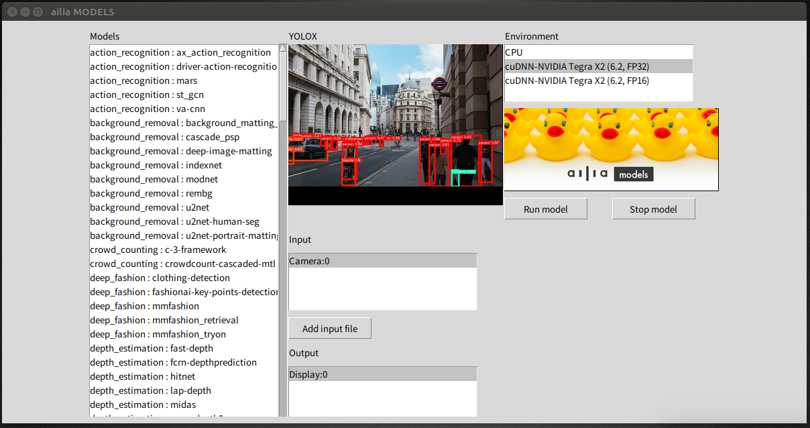

# ailia MODELS チュートリアル

このチュートリアルでは、python言語からailiaを使用する方法について解説します。
他の言語（C++/C#(Unity)/JNI/Kotlin/Rust/Flutter）からailiaを使用したい場合は、このチュートリアルの一番下にあるリンクを参照してください。

## 動作条件

- Python 3.6 以降

## ailia SDKのインストール

- 以下のコマンドを実行する（Windowsの場合はコマンドプロンプトやWindows PowerShell、macやLinuxではターミナルで実行）

```
pip3 install ailia
```

ailia SDKは商用ライブラリです。特定の条件下では、無償使用いただけますが、原則として有償ソフトウェアです。詳細は https://ailia.ai/license/ を参照してください。

## 必要なpythonライブラリのインストール

### Windows, Mac と Linux 共通

```
pip install -r requirements.txt
```

## Jetson では以下のコマンドを実行

```
sudo apt install python3-pip
sudo apt install python3-matplotlib
sudo apt install python3-scipy
pip3 install cython
pip3 install numpy
pip3 install pillow
```

[JetsonではOpenCV for python3がプリインストールされています](https://forums.developer.nvidia.com/t/install-opencv-for-python3-in-jetson-nano/74042/3) もしcv2 import errorが発生した場合には以下のコマンドを実行してください

```
sudo apt install nvidia-jetpack
```

* Jetson Orinにて使用される場合はailia 1.2.13以降が必要です。

### Raspberry Pi では以下のコマンドを実行

```
pip3 install numpy
pip3 install opencv-python
pip3 install matplotlib
pip3 install scikit-image
sudo apt-get install libatlas-base-dev
```

## コマンドラインオプション

各モデル実行時に以下のオプションを追加することが出来ます。

```
オプション引数:
  -h, --help            このヘルプメッセージを表示して終了
  -i IMAGE/VIDEO, --input IMAGE/VIDEO
                        デフォルトの (モデルよって入力ファイル形式が違う)
                        入力データ（画像やビデオ)へのパスの指定。
                        ディレクトリが指定された場合は、中にあるそれぞれのファイルに
                        対して推論が実行される。ファイルの種類の指定は
                        --ftype引数で指定できる。（デフォルトは画像）
  -v VIDEO, --video VIDEO
                        カメラ入力に対して推論を実行。int型の引数を指定した
                        場合は、その番号に対応したwebカメラの入力が使われる。
                        （デフォルトは未指定）
  -s SAVE_PATH, --savepath SAVE_PATH
                        出力ファイルの保存先パス。（画像・動画・テキスト）
                        （デフォルトは output.png）
  -b, --benchmark       ベンチマークモード：パフォーマンスを計測するために
                        同じ入力ファイルに対して5回推論を実行する。ビデオモードでは
                        使用できない。（デフォルトはオフ）
  -e ENV_ID, --env_id ENV_ID
                        実行環境をenvironment idで指定する。デフォルトでは
                        ailia.get_gpu_environment_idの返り値が使われる。
                        （デフォルトは2）
  --env_list            environment idの一覧を出力する（デフォルトはオフ）
  --ftype FILE_TYPE     ファイル種類の指定: image | video | audio （デフォルトはimage）
  --debug               デバック用にログを有効にする。
                        有効にすることでデバッグログが出力される。
                        （デフォルトはオフ）
  --profile             プロファイルモードを有効にする。
                        有効にすることでパフォーマンスのプロファイルログが
                        出力される。（デフォルトはオフ）
  -bc BENCHMARK_COUNT, --benchmark_count BENCHMARK_COUNT
                        ベンチマークモードの実行回数を指定。（デフォルトは5回）
```                        


# 実行例

画像ファイルを入力し、AIで推論、結果を画像ファイルに保存

```
python3 yolov3-tiny.py -i input.png -s output.png
```

動画ファイルを入力し、AIで推論、結果を動画ファイルに保存

```
python3 yolov3-tiny.py -i input.mp4 -s output.mp4
```

AIの実行時間を計測

```
python3 yolov3-tiny.py -b
```

AIモデルをGPUではなくCPUで実行
（environment ID 0は常にCPU）

```
python3 yolov3-tiny.py -e 0
```

選択できる実行環境の一覧を表示

```
python3 yolov3-tiny.py --env_list
```

カメラからの入力に対してAI推論を実行
（終了する際はキーボードの「Q」キーを押す）

```
python3 yolov3-tiny.py -v 0
```

## GUI ラウンチャー

以下のコマンドでGUIラウンチャーを表示してマウスで実行することも可能。
（一部のモデルは未対応）

```
python3 launcher.py
```




## iOS/Android 向けデモアプリ（ストアからダウンロード）
- [ailia AI showcase for iOS](https://apps.apple.com/jp/app/ailia-ai-showcase/id1522828798)
- [ailia AI showcase for Android](https://play.google.com/store/apps/details?id=jp.axinc.ailia_ai_showcase)
- Windows/macOS/Linuxなどのプラットフォーム用は[こちら](<mailto:contact@axinc.jp>)に問い合わせてください

## API マニュアルとチュートリアル解説ブログ

### Python

- [ailia SDK python Tutorial (EN)](https://medium.com/axinc-ai/ailia-sdk-tutorial-python-ea29ae990cf6) [(日本語)](https://medium.com/axinc/ailia-sdk-%E3%83%81%E3%83%A5%E3%83%BC%E3%83%88%E3%83%AA%E3%82%A2%E3%83%AB-python-28379dbc9649)
- [API reference (EN)](https://axinc-ai.github.io/ailia-sdk/api/python/en/)
- [ailia Models](https://github.com/axinc-ai/ailia-models) (* This site)

* (*) 全てのpython用AIモデルは他の言語(C++/Unity(C#)/Java(JNI)/Kotlin)でも使用することは可能ですが、適切な前処理・後処理のコードをpythonを参考に追加する必要があります。（一部の良く使われるモデルに関してはailiaのdetector API, classifier API, pose APIが提供されています）

### C++

- [ailia SDK C++ Tutorial (EN)](https://medium.com/axinc-ai/ailia-sdk-tutorial-c-75e59bbefffe) [(日本語)](https://medium.com/axinc/ailia-sdk-%E3%83%81%E3%83%A5%E3%83%BC%E3%83%88%E3%83%AA%E3%82%A2%E3%83%AB-c-dc949d9dcd28)
- [API reference (EN)](https://axinc-ai.github.io/ailia-sdk/api/cpp/en/) [(日本語)](https://axinc-ai.github.io/ailia-sdk/api/cpp/jp/)
- [ailia Models for C++](https://github.com/axinc-ai/ailia-models-cpp)
- [iOS Xcode Sample Project](https://github.com/axinc-ai/ailia-xcode)
- [Android NDK Sample Project](https://github.com/axinc-ai/ailia-android-ndk)

### Unity

- [ailia SDK Unity(C#) Tutorial (EN)](https://medium.com/axinc-ai/ailia-sdk-tutorial-unity-54f2a8155b8f) [(日本語)](https://medium.com/axinc/ailia-sdk-%E3%83%81%E3%83%A5%E3%83%BC%E3%83%88%E3%83%AA%E3%82%A2%E3%83%AB-unity-257fa1e98777)
- [API reference (EN)](https://axinc-ai.github.io/ailia-sdk/api/unity/en/) [(日本語)](https://axinc-ai.github.io/ailia-sdk/api/unity/jp/)
- [ailia Models for Unity](https://github.com/axinc-ai/ailia-models-unity)

### Java

- [ailia SDK Java(JNI) Tutorial (EN)](https://medium.com/axinc-ai/ailia-sdk-tutorial-jni-92b797725e08) [(日本語)](https://medium.com/axinc/ailia-sdk-%E3%83%81%E3%83%A5%E3%83%BC%E3%83%88%E3%83%AA%E3%82%A2%E3%83%AB-jni-7a11c1da08dc)
- [API reference (EN)](https://axinc-ai.github.io/ailia-sdk/api/java/en/)
- [Android Studio Sample Project](https://github.com/axinc-ai/ailia-android-studio)
- 
### Kotlin
-  [Android Studio Sample Project](https://github.com/axinc-ai/ailia-android-studio-kotlin)

### Rust
- [ailiaをRustから使用する](https://medium.com/axinc/ailia-%E3%82%92rust%E3%81%8B%E3%82%89%E4%BD%BF%E7%94%A8%E3%81%99%E3%82%8B-9ff51677a469)
- [ailia models Rust](https://github.com/axinc-ai/ailia-models-rust)

### Flutter
- [ailia SDKを使用してFlutterでONNX形式のAIモデルを推論する](https://medium.com/axinc/ailia-sdk%E3%82%92%E4%BD%BF%E7%94%A8%E3%81%97%E3%81%A6flutter%E3%81%A7onnx%E5%BD%A2%E5%BC%8F%E3%81%AEai%E3%83%A2%E3%83%87%E3%83%AB%E6%8E%A8%E8%AB%96%E3%81%99%E3%82%8B-7c68509b296)
- [ailia models Flutter](https://github.com/axinc-ai/ailia-flutter)

