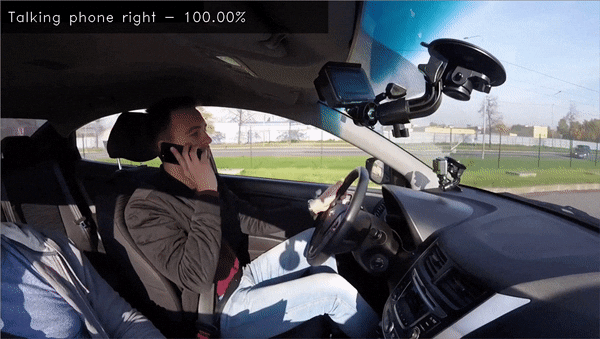

# driver-action-recognition-adas-0002

## Input



(Image from https://github.com/openvinotoolkit/open_model_zoo/blob/master/demos/action_recognition_demo/python/action_recognition.gif)

- Encoder input shape: (1, 224, 224, 3) in the format B, H, W, C
  - B - batch size
  - H - image height
  - W - image width
  - C - number of channels. Expected color order is BGR.

- Decoder input shape: (1, 16, 512) in the format B, T, C
  - B - batch size
  - T - duration of input clip
  - C - dimension of embedding

## Output


- Encoder output shape: (1, 1, 1, 512)  
  representing embedding of processed frame

- Decoder output shape: (1, 9)  
  each row is a logits vector of performed actions.

The list of recognized actions is
```
LABELS = [
    'Safe driving',
    'Texting left',
    'Texting right',
    'Talking phone left',
    'Talking phone right',
    'Operating radio',
    'Drinking eating',
    'Reaching behind',
    'Hair and makeup',
]
```

## Usage
Automatically downloads the onnx and prototxt files on the first run.
It is necessary to be connected to the Internet while downloading.

For the sample image,
```bash
$ python3 driver-action-recognition-adas.py
```

If you want to specify the input video, put the file path after the `--input` option.  
You can use `--savepath` option to save the resulting video file.
```bash
$ python3 driver-action-recognition-adas.py --input VIDEO_PATH --savepath SAVE_VIDEO_PATH
```

## Reference

- [OpenVINO - Open Model Zoo repository - driver-action-recognition-adas-0002](https://github.com/openvinotoolkit/open_model_zoo/tree/master/models/intel/driver-action-recognition-adas-0002)
- [OpenVINO - driver-action-recognition-adas-0002](https://docs.openvinotoolkit.org/latest/omz_models_model_driver_action_recognition_adas_0002.html)

## Framework

OpenVINO

## Model Format

ONNX opset=11

## Netron

[driver-action-recognition-adas-0002-encoder.onnx.prototxt](https://netron.app/?url=https://storage.googleapis.com/ailia-models/driver-action-recognition-adas/driver-action-recognition-adas-0002-encoder.onnx.prototxt)  
[driver-action-recognition-adas-0002-decoder.onnx.prototxt](https://netron.app/?url=https://storage.googleapis.com/ailia-models/driver-action-recognition-adas/driver-action-recognition-adas-0002-decoder.onnx.prototxt)
