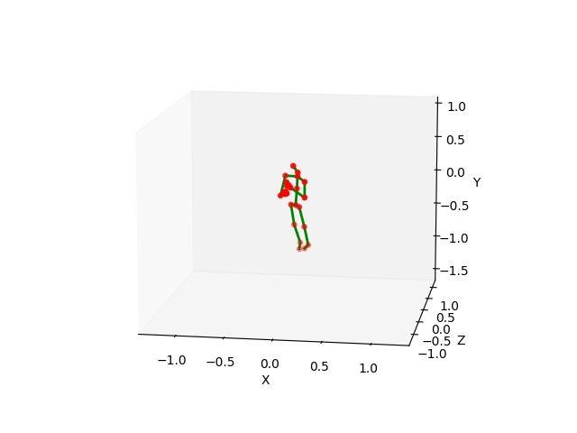

# View Adaptive Neural Networks (VA) for Skeleton-based Human Action Recognition

## Input



(Skeleton data from NTU-RGB+D dataset https://github.com/shahroudy/NTURGB-D/)

## Output

Action estimate
```
Action estimate -> drink water
```

## Usage
For this model use the skeleton data of [NTU-RGB+D dataset](https://github.com/shahroudy/NTURGB-D).  
Download the [NTU-RGB+D dataset](https://github.com/shahroudy/NTURGB-D) to try out the sample code.

Automatically downloads the onnx and prototxt files on the first run.
It is necessary to be connected to the Internet while downloading.

For the sample data,
```bash
$ python3 va-cnn.py
```

If you want to specify the input skeleton file, put the file path after the `--input` option.
```bash
$ python3 va-cnn.py --input FILE_PATH
```

You can use `--save_video` option to output a video of the input skeleton data.
```bash
$ python3 va-cnn.py --save_video
```

## Reference

[View Adaptive Neural Networks (VA) for Skeleton-based Human Action Recognition](https://github.com/microsoft/View-Adaptive-Neural-Networks-for-Skeleton-based-Human-Action-Recognition)

## Framework

Pytorch

## Model Format

ONNX opset=11

## Netron

[va-cnn.onnx.prototxt](https://netron.app/?url=https://storage.googleapis.com/ailia-models/va-cnn/va-cnn.onnx.prototxt)
