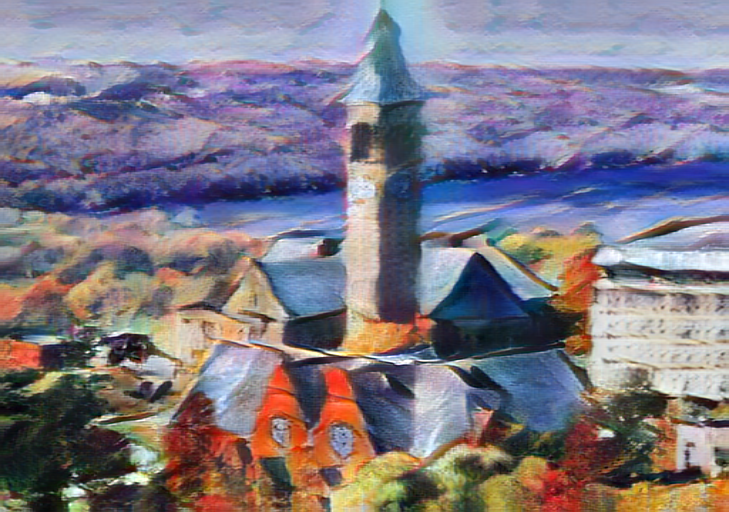

# Arbitrary Style Transfer in Real-time with Adaptive Instance Normalization

### input
- input image  


- style image  


(These images from https://github.com/naoto0804/pytorch-AdaIN/tree/master/input)
Ailia input shape: (1, 3, 512, 512)  
Range: [0, 1]


### output


### usage
Automatically downloads the onnx and prototxt files on the first run.
It is necessary to be connected to the Internet while downloading.

For the sample image,
``` bash
$ python3 adain.py
```

If you want to specify the input image, put the image path after the `--input` option.  
Style image can be specified with the `--style` option.  
Currently, only one style image can be specified, but in the future,  
it will be improved to be able to import multiple styles at the same time. Stay tuned!  
You can use `--savepath` option to change the name of the output file to save.
```bash
$ python3 adain.py --input IMAGE_PATH --style STYLE_IMAGE_PATH --savepath SAVE_IMAGE_PATH
```

By adding the `--video` option, you can input the video and convert it by the style image.
If you pass `0` as an argument to VIDEO_PATH, you can use the webcam input instead of the video file.
```bash
$ python3 adain.py --video VIDEO_PATH --style STYLE_IMAGE_PATH
```

### Reference
[pytorch-AdaIN](https://github.com/naoto0804/pytorch-AdaIN)


### Framework
PyTorch 0.4+


### Model Format
ONNX opset = 10


### Netron

- [adain-vgg.onnx.prototxt](https://lutzroeder.github.io/netron/?url=https://storage.googleapis.com/ailia-models/adain/adain-vgg.onnx.prototxt)
- [adain-decoder.onnx.prototxt](https://lutzroeder.github.io/netron/?url=https://storage.googleapis.com/ailia-models/adain/adain-decoder.onnx.prototxt)
