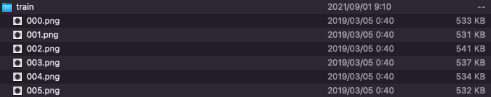
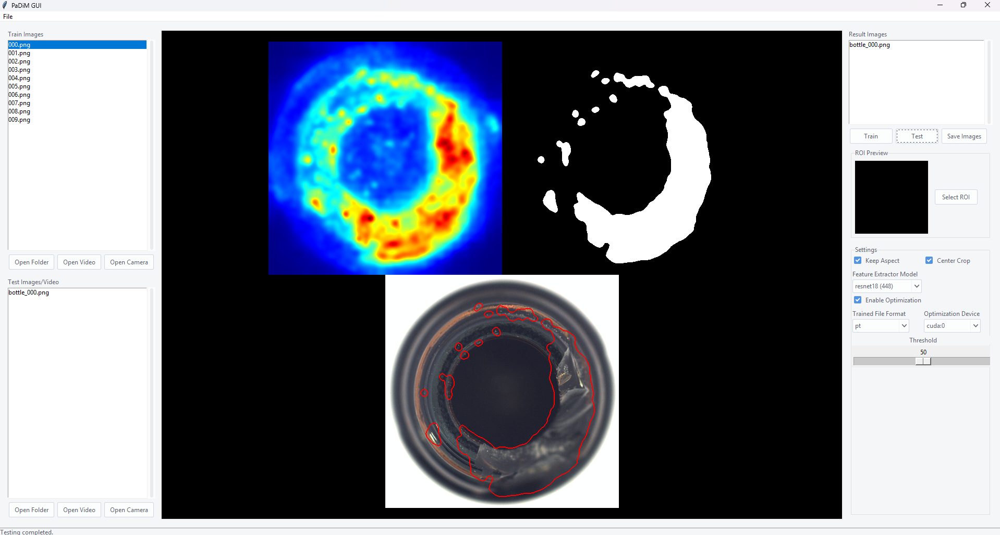

Below is the modified README file with the new command-line argument details integrated. The new sections follow the original style and formatting.

---

# PaDiM-Anomaly-Detection-Localization-master

## Input

Normal images


(Image from MVTec AD datasets https://www.mvtec.com/company/research/datasets/mvtec-ad/)

- Original image shape : (n, 3, 900, 900)
- Input shape : (n, 3, 224, 224)

## Output

Anomaly maps

Left to right: input, ground truth, predicted head map, predicted mask, segmentation result


## Usage with MVTec AD datasets

In order to get the feature vector of the normal product, it is necessary to prepare the file of the normal product.  

By default, normal files are got from the `train` directory.  
For the sample image, first download [MVTec AD datasets](https://www.mvtec.com/company/research/datasets/mvtec-ad/) and place `bottle/train/good/*.png` files to the `train` directory.



For the sample image, train with `train` directory and test with `bottle_000.png`:
```bash
$ python3 padim.py
```

For train and test directly from a particular category in MVTec AD datasets:
```bash
$ python3 padim.py -i bottle/test/broken_large --train_dir bottle/train/good --gt_dir bottle/test/ground_truth/broken_large
```

Automatically downloads the onnx and prototxt files on the first run.  
It is necessary to be connected to the Internet while downloading.

## Usage with your datasets

By default, mask image required to calculate the optimal threshold. By specifying the `threshold` option, it is not necessary to prepare the mask image.

With the following command, learn using train folder and verify with test folder.
```bash
$ python3 padim.py --train_dir train --input test --threshold 0.5
```

Use the following command to perform only the test.
```bash
$ python3 padim.py --feat train.pkl --input test --threshold 0.5
```

Now you can give videos to `train_dir` and `video` option. If a video is given, the first 200 frames of the video will be used for training.
```bash
$ python3 padim.py --train_dir train.mp4 --video test.mp4 --threshold 0.5
```

## Options

You can specify the directory of normal product files with the `--train_dir` option.
```bash
$ python3 padim.py --train_dir train
```

The feature vectors created from files in the train directory are saved to the pickle file.  
From the second time, by specifying the pickle file by `--feat` option,  
it can omit the calculation of the feature vector of the normal product.  
The name of the pickle file created is the same as the name of a normal product file directory.
```bash
$ python3 padim.py --feat train.pkl
```

The ground truth files are got from the `gt_masks` directory by default.  
The name of the ground truth file corresponds to the file with `__mask` after the name of the input file.  
You can specify the directory of ground truth files with the `--gt_dir` option.
```bash
$ python3 padim.py --gt_dir gt_masks
```

If you want to specify the input test image, put the image path after the `--input` option.  
You can use the `--savepath` option to change the name of the output file to save.
```bash
$ python3 padim.py --input IMAGE_PATH --savepath SAVE_IMAGE_PATH
```

By adding the `--arch` option, you can specify model type which is selected from "resnet18", "wide_resnet50_2".  
(default is resnet18)
```bash
$ python3 padim.py --arch wide_resnet50_2
```

By adding the `--aug` option, you can process with augmentation.  
(default is processing without augmentation)
```bash
$ python3 padim.py --aug
```

### -eon, --enable_optimization

Enabling optimization instructs the program to apply various optimization techniques that improve the code's execution. When this flag is set, the code may use optimized algorithms and hardware acceleration routines to reduce computation time. This often results in performance improvements; however, it may also introduce potential trade-offs such as slightly increased memory usage or minor differences in computational precision.

**Example Usage:**
```bash
$ python3 padim.py --enable_optimization
```
or
```bash
$ python3 padim.py -eon
```

**Impact:**
- **Performance improvements:** Faster execution due to optimized routines.
- **Potential trade-offs:** May result in increased memory usage or subtle precision variations.

### --save_format

The `--save_format` argument specifies the file format used to save the feature vectors or model data. This option allows you to choose the most appropriate format based on your compatibility and performance needs.

**Available Options:**
- **pkl:** Saves data as a pickle file, which is suitable for Python-specific serialization.
- **npy:** Saves data in NumPy's native binary format, ideal for numerical data manipulation.
- **pt:** Saves data as a PyTorch file, which is useful when working with PyTorch models and tensors.

**Example Usage:**
```bash
$ python3 padim.py --save_format pkl
```
```bash
$ python3 padim.py --save_format npy
```
```bash
$ python3 padim.py --save_format pt
```

**Files Being Saved:**
This argument controls the format of the saved files containing feature vectors or model weights, ensuring efficient loading and compatibility with various data processing pipelines.

### --optimization_device

The `--optimization_device` argument determines which hardware device will be used for running optimized computations. This allows the program to offload intensive operations to the most suitable device available on your system.

**Available Options:**
- **cpu:** Uses the CPU for all computations. This option is universally available.
- **cuda:** Utilizes NVIDIA GPUs with CUDA support for accelerated computation. Requires an NVIDIA GPU with the appropriate drivers.
- **mps:** Leverages Apple's Metal Performance Shaders (MPS) for acceleration on supported Apple devices.

**Example Usage:**
```bash
$ python3 padim.py --optimization_device cuda
```
```bash
$ python3 padim.py --optimization_device mps
```

**Operations Sent to the Device:**
When specified, computationally intensive operations (such as feature extraction and optimization routines) are offloaded to the selected device. Ensure that the chosen device is properly configured and supported by your system for optimal performance.

## PaDiM GUI

You can also use the GUI to train and test.



Start the GUI with the following command.
```bash
$ python3 padim_gui.py
```

Specify the folder from the `Select train folder` button and press the `Train button`.

Specify the folder from the `Select test folder` button and press the `Test button`.  
Inference results are listed in Result images.

Change the Threshold and press the `Test button` again

## Reference

[PaDiM-Anomaly-Detection-Localization-master](https://github.com/xiahaifeng1995/PaDiM-Anomaly-Detection-Localization-master)

## Framework

Pytorch

## Model Format

ONNX opset=11

## Netron

[resnet18.onnx.prototxt](https://netron.app/?url=https://storage.googleapis.com/ailia-models/padim/resnet18.onnx.prototxt)

[wide_resnet50_2.onnx.prototxt](https://netron.app/?url=https://storage.googleapis.com/ailia-models/padim/wide_resnet50_2.onnx.prototxt)
