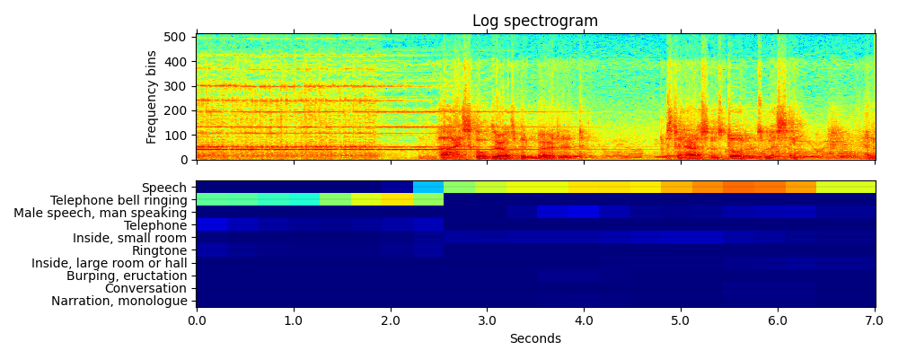

 
# audioset tagging cnn

The Model have been used for audio tagging and sound event detection. 

## audio tagging

### Input

Audio file
```
R9_ZSCveAHg_7s.wav
https://github.com/qiuqiangkong/audioset_tagging_cnn/tree/master/resources
```

### Output

```
Speech: 0.893
Telephone bell ringing: 0.754
Inside, small room: 0.235
Telephone: 0.183
Music: 0.092
Ringtone: 0.047
Inside, large room or hall: 0.028
Alarm: 0.014
Animal: 0.009
Vehicle: 0.008
```

## sound event detection

### Input

Audio file
```
R9_ZSCveAHg_7s.wav
https://github.com/qiuqiangkong/audioset_tagging_cnn/tree/master/resources
```

### Output




## Usage
Automatically downloads the onnx and prototxt files on the first run.
It is necessary to be connected to the Internet while downloading.

You can run with other wav file by adding `--input` option.

```bash
$ python3 audioset_tagging_cnn.py --input [wav_file]
```

### audio tagging

For the sample wav,
```bash
$ python3 audioset_tagging_cnn.py --mode audio_tagging
```

### sound event detection

For the sample wav,
```bash
$ python3 audioset_tagging_cnn.py --mode sound_event_detection 

```

You can use --savepath option to change the name of the output file to save.
```bash
$ python audioset_tagging_cnn.py --savepath output.png

```


## Reference

[audioset_tagging_cnn](https://github.com/qiuqiangkong/audioset_tagging_cnn)

## Framework

Pytorch

## Model Format

ONNX opset=9

## Netron

[sound_event_detection.onnx.prototxt](https://netron.app/?url=https://storage.googleapis.com/ailia-models/audio_processing/audioset_tagging_cnn/sound_event_detection.onnx.prototxt)  

[audio_tagging.onnx.prototxt](https://netron.app/?url=https://storage.googleapis.com/ailia-models/audio_processing/audioset_tagging_cnn/audio_tagging.onnx.prototxt)  