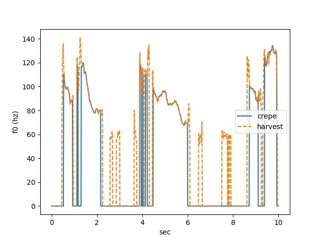
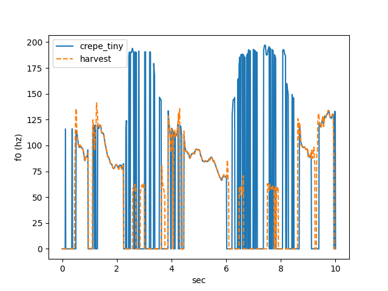

# CREPE Pitch Tracker

## Input

Audio file

(Audio from https://github.com/maxrmorrison/torchcrepe/blob/master/tests/assets/test.wav)

## Output

Pitch (F0) per 10ms

full model



tiny model



## Requirements

This model requires additional module.
```
pip3 install librosa
pip3 install soundfile
```

## Usage
Automatically downloads the onnx and prototxt files on the first run.
It is necessary to be connected to the Internet while downloading.

For the sample wav,
```bash
$ python3 crepe.py
```

If you want to specify the audio, put the file path after the `--input` option.
```bash
$ python3 crepe.py --input AUDIO_FILE
```

Specify the f0 option to infer a model that uses f0. You can choice `crepe` or `crepe_tiny` for f0_method.

```bash $ 
python3 crepe.py --f0_method crepe_tiny
```

Specify the `--evaluate` option, you can be compared with the f0 using pyworld.

```bash $ 
python3 crepe.py --f0_method crepe_tiny --evaluate
```

## Reference

- [crepe](https://github.com/marl/crepe/)
- [torchcrepe](https://github.com/maxrmorrison/torchcrepe)

## Framework

Pytorch

## Model Format

ONNX opset=11

## Netron

- [crepe.onnx.prototxt](https://netron.app/?url=https://storage.googleapis.com/ailia-models/rvc/crepe.onnx.prototxt)
- [crepe_tiny.onnx.prototxt](https://netron.app/?url=https://storage.googleapis.com/ailia-models/rvc/crepe_tiny.onnx.prototxt)
