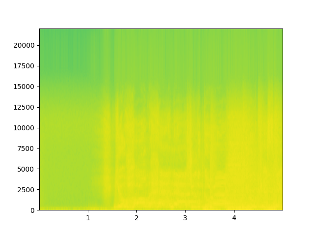

# On Filter Generalization for Music Bandwidth Extension Using Deep Neural Networks

## Input

Audio file (.wav file)

input.wav is `(/Test/003 - Actions - One Minute Smile/mixture.wav)` in DSD100 dataset. (can be donwloaded from http://liutkus.net/DSD100.zip)   
To reduce calculation cost, input.wav is clipped from original.


## Output

Bandwidth extented audio file (.wav file)


## Usage
Automatically downloads the onnx and prototxt files on the first run.
It is necessary to be connected to the Internet while downloading.

For the sample wav,
```bash
$ python3 deep_music_enhancer.py
```

Supported model types are [`resnet`, `resnet_bn`, `resnet_da`, `resnet_do`, `unet`, `unet_bn`, `unet_da`, `unet_do`].     
bn means batch normlization, do means dropout, da means data augmentation.    
Model type can be specified as below.
```
$ python3 deep_music_enhancer.py --model [MODEL TYPE]
```


You can specify input audio files by adding `--input` option.

```
$ python3 deep_music_enhancer.py --input [INPUT WAV FILE]
```

If you save audio output with specified name, you have to add `--savefile` option.

```
$ python3 deep_music_enhancer.py --savepath [OUTPUT NAME]
```

Additionaly, you can use `--vis` option in order to visualize spectrogram of input and output audio.

Spectrogram of input audio    


Spectrogram of output audio (butter filter)    
")

Spectrogram of output audio (cheby1 filter)    
")


## Reference

[deep-music-enhancer](https://github.com/serkansulun/deep-music-enhancer)


## Framework

Pytorch

## Model Format

ONNX opset=11

## Netron
[resnet.onnx.prototxt](https://netron.app/?url=https://storage.googleapis.com/ailia-models/deep-music-enhancer/resnet.onnx.prototxt)

[resnetbn.onnx.prototxt](https://netron.app/?url=https://storage.googleapis.com/ailia-models/deep-music-enhancer/resnetbn.onnx.prototxt)

[resnetda.onnx.prototxt](https://netron.app/?url=https://storage.googleapis.com/ailia-models/deep-music-enhancer/resnetda.onnx.prototxt)

[resnetdo.onnx.prototxt](https://netron.app/?url=https://storage.googleapis.com/ailia-models/deep-music-enhancer/resnetdo.onnx.prototxt)

[unet.onnx.prototxt](https://netron.app/?url=https://storage.googleapis.com/ailia-models/deep-music-enhancer/unet.onnx.prototxt)

[unetbn.onnx.prototxt](https://netron.app/?url=https://storage.googleapis.com/ailia-models/deep-music-enhancer/unetbn.onnx.prototxt)

[unetda.onnx.prototxt](https://netron.app/?url=https://storage.googleapis.com/ailia-models/deep-music-enhancer/unetda.onnx.prototxt)

[unetdo.onnx.prototxt](https://netron.app/?url=https://storage.googleapis.com/ailia-models/deep-music-enhancer/unetdo.onnx.prototxt)