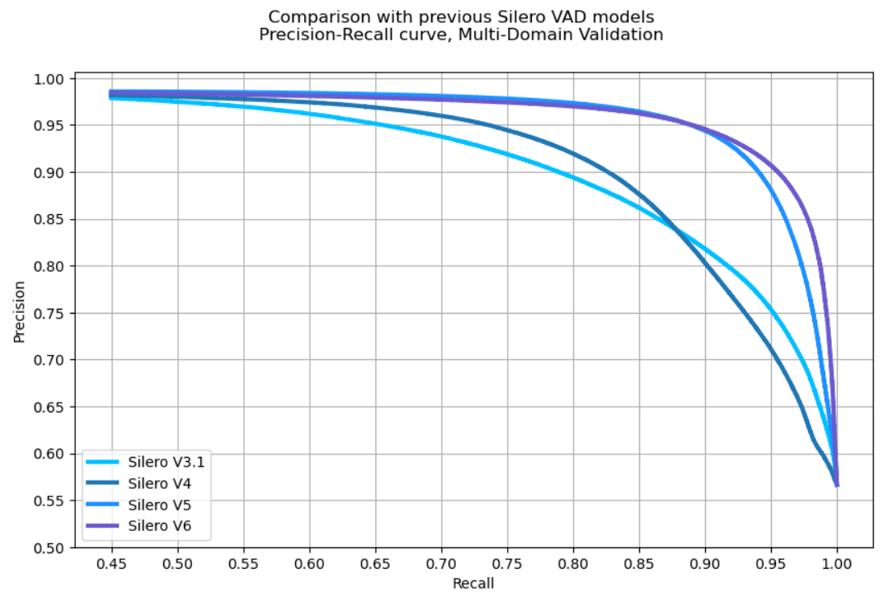

# Silero VAD : pre-trained enterprise-grade Voice Activity Detecto

## Input

Audio file
(https://models.silero.ai/vad_models/en.wav)

## Output

Audio file with silence removed

## Usage
Automatically downloads the onnx and prototxt files on the first run.
It is necessary to be connected to the Internet while downloading.

For the sample wav,
```bash
$ python3 sileo-vad.py --input ex_example.wav --output only_speech.wav
```

You can specify the version by using the --version option. You can specify versions 4, 5, 6, or 6_2. The default is 4 for test compatibility.

```bash
$ python3 sileo-vad.py --input ex_example.wav --output only_speech.wav --version 5
```

## Accuracy between versions

Compared to the v4 model from 2023, the v5 and v6 models from 2024 and 2025 have higher accuracy.



(Image from https://github.com/snakers4/silero-vad/wiki/Quality-Metrics#vs-other-available-solutions)

## Reference

- [Silero VAD](https://github.com/snakers4/silero-vad)

## Framework

Pytorch

## Model Format

ONNX opset=11

## Netron

- [silero_vad.onnx.prototxt](https://netron.app/?url=https://storage.googleapis.com/ailia-models/silero-vad/silero_vad.onnx.prototxt) (v4)
- [silero_vad_v5.onnx.prototxt](https://netron.app/?url=https://storage.googleapis.com/ailia-models/silero-vad/silero_vad_v5.onnx.prototxt)
- [silero_vad_v6.onnx.prototxt](https://netron.app/?url=https://storage.googleapis.com/ailia-models/silero-vad/silero_vad_v6.onnx.prototxt)
- [silero_vad_v6_2.onnx.prototxt](https://netron.app/?url=https://storage.googleapis.com/ailia-models/silero-vad/silero_vad_v6_2.onnx.prototxt)
