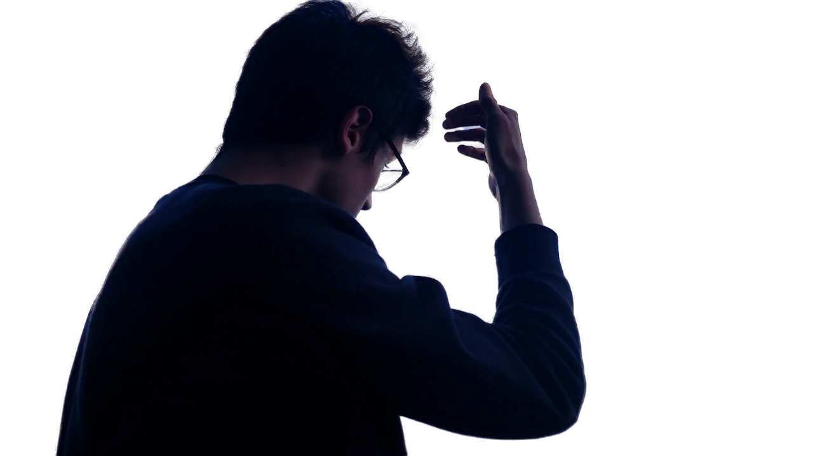

# Real-Time High-Resolution Background Matting

## Input

### Source image


### Background image


(Image from https://drive.google.com/drive/folders/16H6Vz3294J-DEzauw06j4IUARRqYGgRD)

## Output



## Usage
Automatically downloads the onnx and prototxt files on the first run.
It is necessary to be connected to the Internet while downloading.

For the sample image,
```bash
$ python3 background_matting_v2.py
```

If you want to specify the input image, put the image path after the `--input` option.  
You can use `--savepath` option to change the name of the output file to save.
```bash
$ python3 background_matting_v2.py --input IMAGE_PATH --savepath SAVE_IMAGE_PATH
```

This model requires a background image.  
You can specify the background image by put the file path after the `--bgr_image` option.
```bash
$ python3 background_matting_v2.py --input IMAGE_PATH --bgr_image BGR_IMAGE_PATH
```

By adding the `--video` option, you can input the video.   
If you pass `0` as an argument to VIDEO_PATH, you can use the webcam input instead of the video file.
```bash
$ python3 background_matting_v2.py --video VIDEO_PATH
```

You can specify the "model type" by specifying after the `--model_type` option.
The model type is selected from "mobilenetv2", "resnet50".  
```bash
$ python3 background_matting_v2.py --model_type mobilenetv2
```

## Reference

- [Real-Time High-Resolution Background Matting](https://github.com/PeterL1n/BackgroundMattingV2)

## Framework

Pytorch

## Model Format

ONNX opset=11

## Netron

[mobilenetv2.onnx.prototxt](https://netron.app/?url=https://storage.googleapis.com/ailia-models/background_matting_v2/mobilenetv2.onnx.prototxt)  
[resnet50.onnx.prototxt](https://netron.app/?url=https://storage.googleapis.com/ailia-models/background_matting_v2/resnet50.onnx.prototxt)  
