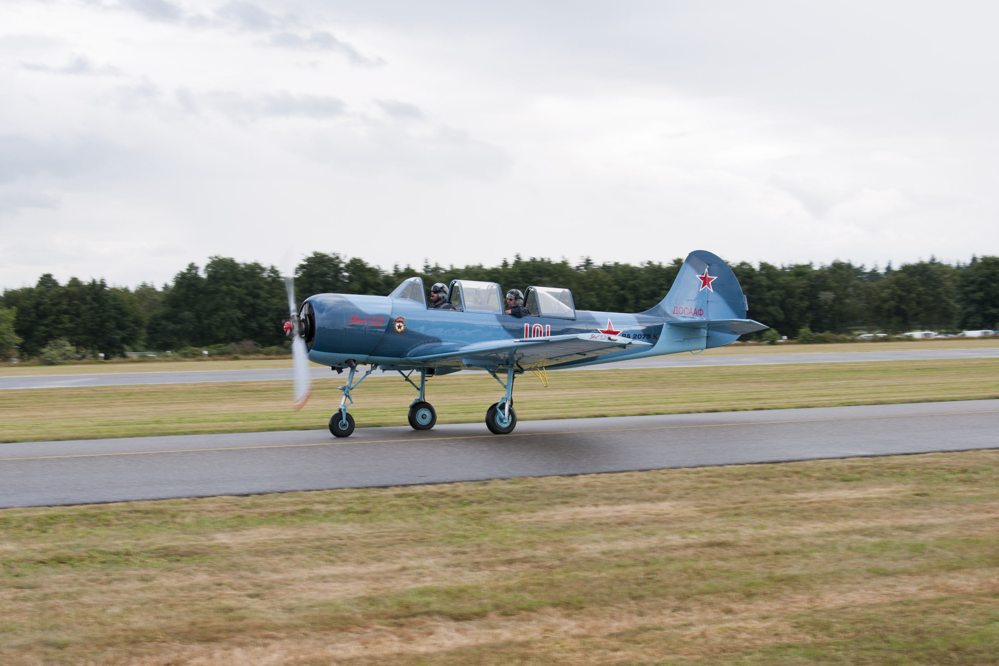
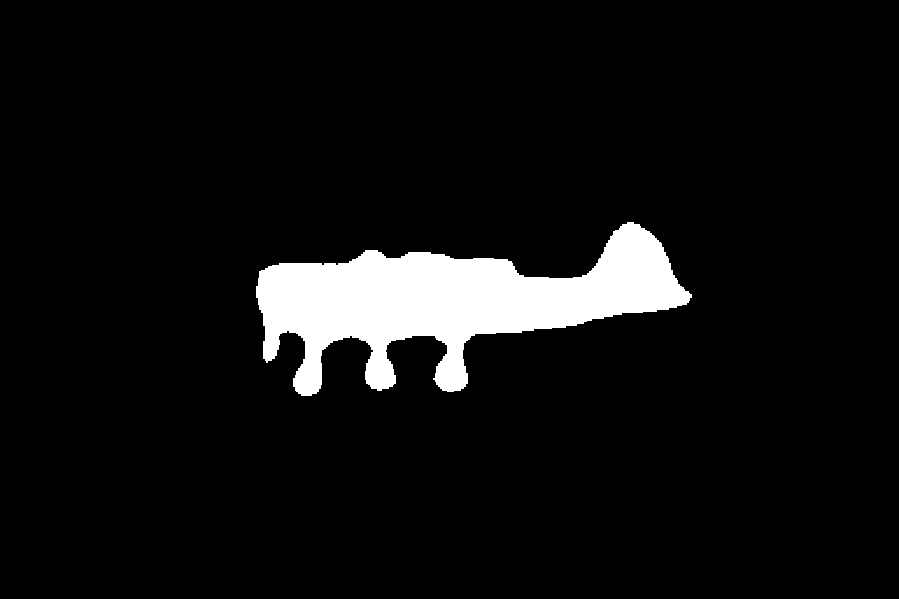

# CascadePSP

## Input

### Image



(Image from https://github.com/hkchengrex/CascadePSP/blob/master/segmentation-refinement/test/aeroplane.jpg)

### Mask



(Image from https://github.com/hkchengrex/CascadePSP/blob/master/segmentation-refinement/test/aeroplane.png)

## Output


## Usage
Automatically downloads the onnx and prototxt files on the first run.
It is necessary to be connected to the Internet while downloading.

For the sample image,
```bash
$ python3 cascade_psp.py
```

If you want to specify the input image, put the image path after the `--input` option.  
You can use `--savepath` option to change the name of the output file to save.
```bash
$ python3 cascade_psp.py --input IMAGE_PATH --savepath SAVE_IMAGE_PATH
```

This model requires a mask image.  
You can specify the mask image by put the file path after the `--mask_image` option.
```bash
$ python3 cascade_psp.py --input IMAGE_PATH --mask_image MASK_IMAGE_PATH
```

Use the ｀--generate_mask｀ option to automatically generate a mask image using u2net.

```bash
python3 cascade_psp.py --generate_mask -i input.jpg
```

## Reference

- [CascadePSP](https://github.com/hkchengrex/CascadePSP)

## Framework

Pytorch

## Model Format

ONNX opset=11

## Netron

[refinement.onnx.prototxt](https://netron.app/?url=https://storage.googleapis.com/ailia-models/cascade_psp/refinement.onnx.prototxt)  
[inter_s8.onnx.prototxt](https://netron.app/?url=https://storage.googleapis.com/ailia-models/cascade_psp/inter_s8.onnx.prototxt)  
