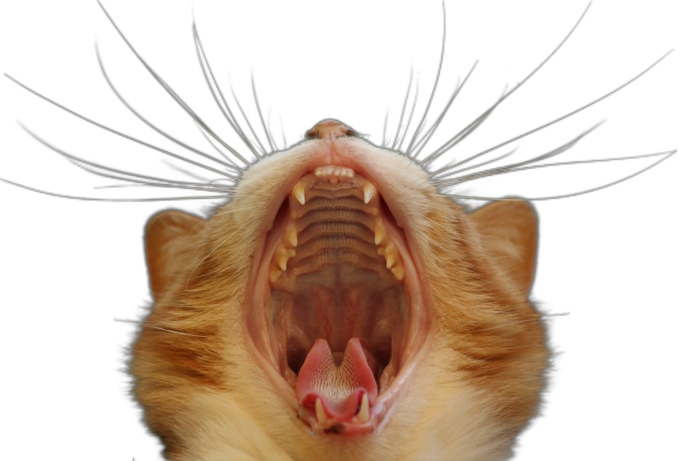

# Bridging Composite and Real: Towards End-to-end Deep Image Matting

## Input

### Source image


(Image from https://github.com/JizhiziLi/GFM/tree/master/samples/original)

## Output



## Usage
Automatically downloads the onnx and prototxt files on the first run.
It is necessary to be connected to the Internet while downloading.

For the sample image,
```bash
$ python3 gfm.py
```

If you want to specify the input image, put the image path after the `--input` option.  
You can use `--savepath` option to change the name of the output file to save.
```bash
$ python3 gfm.py --input IMAGE_PATH --savepath SAVE_IMAGE_PATH
```

By adding the `--video` option, you can input the video.   
If you pass `0` as an argument to VIDEO_PATH, you can use the webcam input instead of the video file.
```bash
$ python3 gfm.py --video VIDEO_PATH
```

You can specify the "model type" by specifying after the `--model_type` option.
The model type is selected from "r34_2b_tt", "d121_tt", "d121_rim".  
```bash
$ python3 gfm.py --model_type r34_2b_tt
```

## Reference

- [Bridging Composite and Real: Towards End-to-end Deep Image Matting](https://github.com/JizhiziLi/GFM)

## Framework

Pytorch

## Model Format

ONNX opset=11

## Netron

[gfm_d121_tt.onnx.prototxt](https://netron.app/?url=https://storage.googleapis.com/ailia-models/gfm/gfm_d121_tt.onnx.prototxt)  
[gfm_d121_rim.onnx.prototxt](https://netron.app/?url=https://storage.googleapis.com/ailia-models/gfm/gfm_d121_rim.onnx.prototxt)  
[gfm_r34_2b_tt.onnx.prototxt](https://netron.app/?url=https://storage.googleapis.com/ailia-models/gfm/gfm_r34_2b_tt.onnx.prototxt)  
