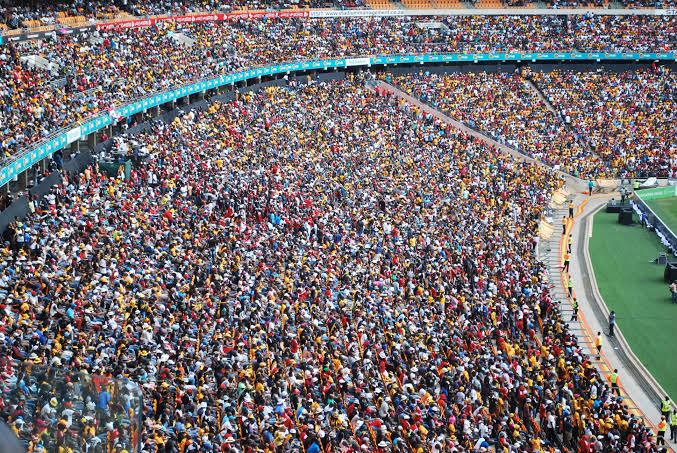

# CrowdCount-Cascaded-mtl

### input


Ailia input shape: (1, 1, 480, 640)  

### output


### usage
Automatically downloads the onnx and prototxt files on the first run. It is necessary to be connected to the Internet while downloading.

For the sample image, 
```bash
python3 crowdcount-cascaded-mtl.py
```

If you want to specify the input image, put the image path after the `--input` option.  
You can use `--savepath` option to change the name of the output file to save.
```bash
$ python3 crowdcount-cascaded-mtl.py --input IMAGE_PATH --savepath SAVE_IMAGE_PATH
```

By adding the `--video` option, you can input the video.
If you pass `0` as an argument to VIDEO_PATH, you can use the webcam input instead of the video file.
```bash
$ python3 crowdcount-cascaded-mtl.py --video VIDEO_PATH --savepath SAVE_VIDEO_PATH
```

### Reference
[CNN-based Cascaded Multi-task Learning of High-level Prior and Density Estimation for Crowd Counting (Single Image Crowd Counting)](https://github.com/svishwa/crowdcount-cascaded-mtl)


### Framework
PyTorch 1.3


### Model Format
ONNX opset = 10


### Netron

[crowdcount.onnx.prototxt](https://netron.app/?url=https://storage.googleapis.com/ailia-models/crowd_count/crowdcount.onnx.prototxt)
