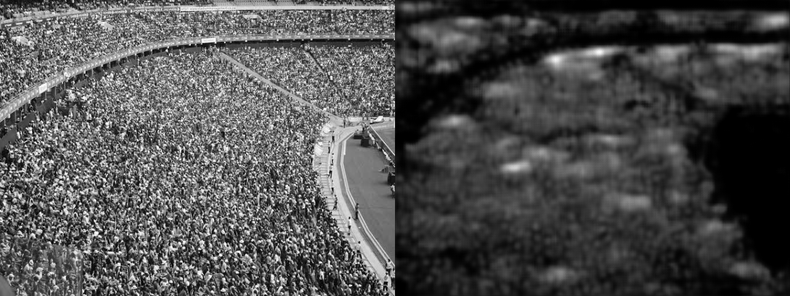

# CrowdCount-Cascaded-mtl

### input


The image shape will be resized automatically


### output



### usage

```bash
python3 crowdcount.py
```
You can change input image path and save image path in `crowdcount.py`


### Reference
[CNN-based Cascaded Multi-task Learning of High-level Prior and Density Estimation for Crowd Counting (Single Image Crowd Counting)](https://github.com/svishwa/crowdcount-cascaded-mtl)


### Framework
PyTorch 1.3


### Model Format
ONNX opset = 10


### Netron

[crowdcount.onnx.prototxt](https://lutzroeder.github.io/netron/?url=https://storage.googleapis.com/ailia-models/crowd_count/crowdcount.onnx.prototxt)
