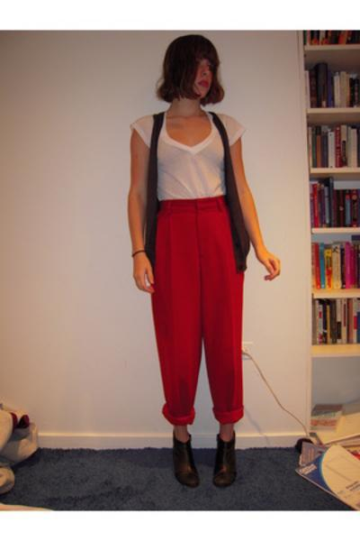
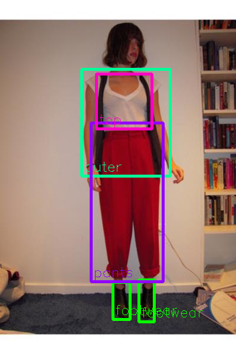
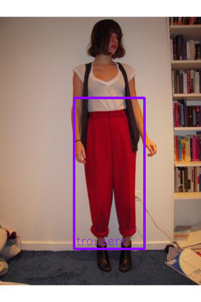

# clothing-detection

## Input



(Image from https://github.com/simaiden/Clothing-Detection/blob/master/tests/0000003.jpg)

Shape : (1, 3, 416, 416)  
Range : [0.0, 1.0]

## Output

modanet



df2



## Category

```
DATASETS_CATEGORY = {
    'modanet': [
        "bag", "belt", "boots", "footwear", "outer", "dress", "sunglasses",
        "pants", "top", "shorts", "skirt", "headwear", "scarf/tie"
    ],
    'df2': [
        "short sleeve top", "long sleeve top", "short sleeve outwear", "long sleeve outwear",
        "vest", "sling", "shorts", "trousers", "skirt", "short sleeve dress",
        "long sleeve dress", "vest dress", "sling dress"
    ]
}
```

### usage
Automatically downloads the onnx and prototxt files on the first run.
It is necessary to be connected to the Internet while downloading.

For the sample image,
``` bash
$ python3 clothing-detection.py
```

If you want to specify the input image, put the image path after the `--input` option.  
You can use `--savepath` option to change the name of the output file to save.
```bash
$ python3 clothing-detection.py --input IMAGE_PATH --savepath SAVE_IMAGE_PATH
```

By adding the `--video` option, you can input the video.   
If you pass `0` as an argument to VIDEO_PATH, you can use the webcam input instead of the video file.
```bash
$ python3 clothing-detection.py --video VIDEO_PATH
```

By adding the `-d df2` option, you can use df2 model.

## Reference

- [Clothing-Detection](https://github.com/simaiden/Clothing-Detection)

## Framework

ONNX Runtime

## Model Format

ONNX opset=10

## Netron

[yolov3-modanet.opt.onnx.prototxt](https://netron.app/?url=https://storage.googleapis.com/ailia-models/clothing-detection/yolov3-modanet.opt.onnx.prototxt)

[yolov3-df2.opt.onnx.prototxt](https://netron.app/?url=https://storage.googleapis.com/ailia-models/clothing-detection/yolov3-df2.opt.onnx.prototxt)
