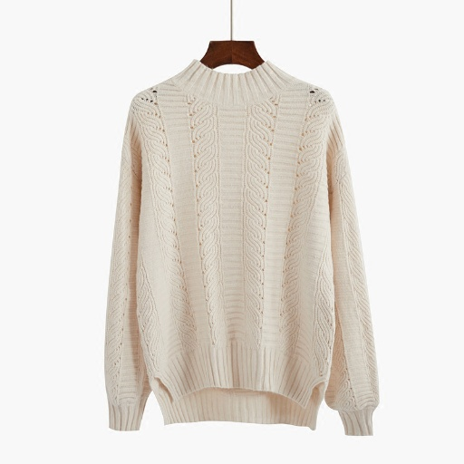
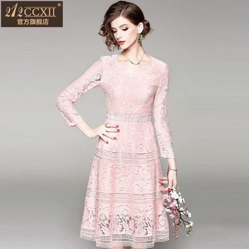
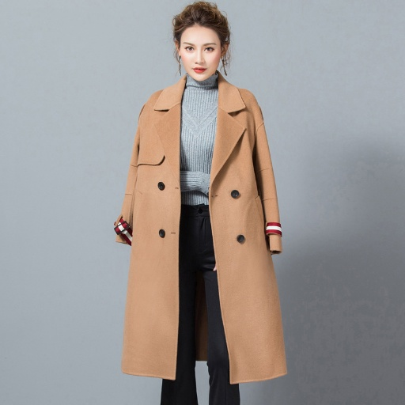
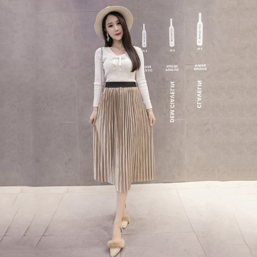
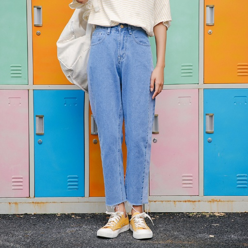
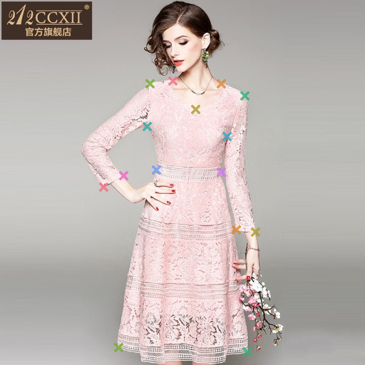
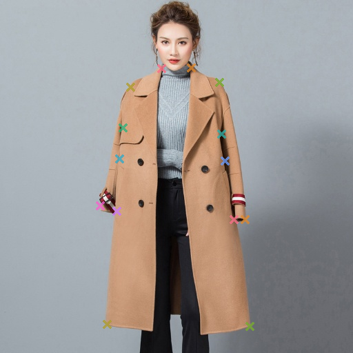
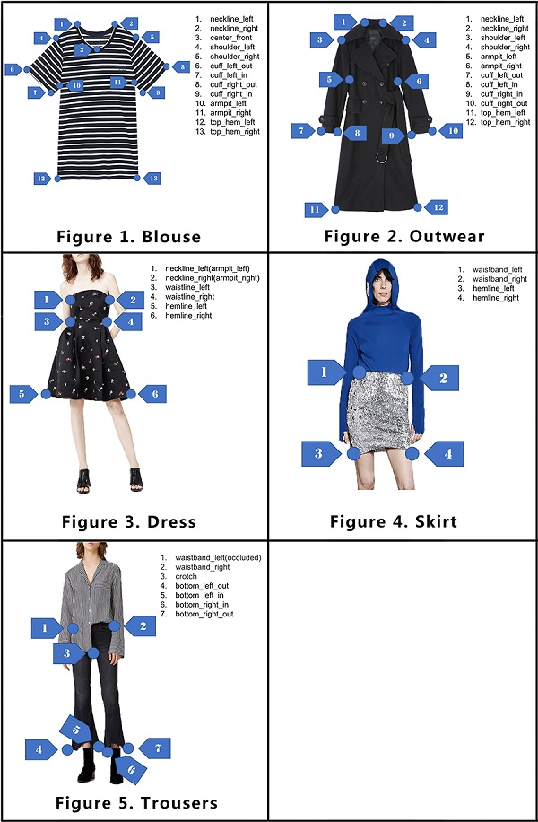

# Cascaded Pyramid Network for FashionAI Key Points Detection

## Input

### blouse

### dress

### outwear

### skirt

### trousers


(Image from https://tianchi.aliyun.com/museum7/?spm=5176.14046517.J_9711814210.23.2bd17c0aFQzXFg#/newprodetail?productId=7)

## Output

### blouse

### dress

### outwear

### skirt

### trousers


## Example keypoints

Example keypoints of the five clothing categories are as follows.



(Image from https://github.com/HiKapok/tf.fashionAI/blob/master/demos/outline.jpg)

## Usage
Automatically downloads the onnx and prototxt files on the first run.
It is necessary to be connected to the Internet while downloading.

For the sample image,
``` bash
$ python3 fashionai.py
```

You can specify the "clothing type" by specifying after the `--clothing-type` option.
The clothing type is selected from blouse, dress, outwear.  
```bash
$ python3 fashionai.py --clothing-type blouse
```

If you want to specify the input image, put the image path after the `--input` option.  
```bash
$ python3 fashionai.py --input IMAGE_PATH
```

By adding the `--video` option, you can input the video.   
If you pass `0` as an argument to VIDEO_PATH, you can use the webcam input instead of the video file.
```bash
$ python3 fashionai.py --video VIDEO_PATH
```

## Reference

- [A Pytorch Implementation of Cascaded Pyramid Network for FashionAI Key Points Detection](https://github.com/gathierry/FashionAI-KeyPointsDetectionOfApparel)

## Framework

Pytorch

## Model Format

ONNX opset = 11

## Netron

- [blouse_100.onnx.prototxt](https://netron.app/?url=https://storage.googleapis.com/ailia-models/fashionai-key-points-detection/blouse_100.onnx.prototxt)
- [dress_100.onnx.prototxt](https://netron.app/?url=https://storage.googleapis.com/ailia-models/fashionai-key-points-detection/dress_100.onnx.prototxt)
- [outwear_100.onnx.prototxt](https://netron.app/?url=https://storage.googleapis.com/ailia-models/fashionai-key-points-detection/outwear_100.onnx.prototxt)
- [skirt_100.onnx.prototxt](https://netron.app/?url=https://storage.googleapis.com/ailia-models/fashionai-key-points-detection/skirt_100.onnx.prototxt)
- [trousers_100.onnx.prototxt](https://netron.app/?url=https://storage.googleapis.com/ailia-models/fashionai-key-points-detection/trousers_100.onnx.prototxt)
