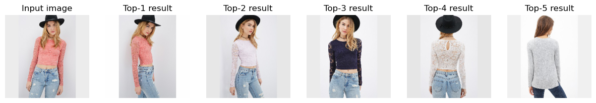

# MMFashion -- In-Shop Clothes Retrieval

## Input


(Image from https://github.com/open-mmlab/mmfashion/blob/master/demo/imgs/06_1_front.jpg)

Shape : (1, 3, height, width)

Reshaped to : (1, 3, 224, 224)  

## Output



- Top-k results

## Usage
Automatically downloads the onnx and prototxt files on the first run.
It is necessary to be connected to the Internet while downloading.

For the sample image,
```bash
$ python3 mmfashion_retrieval.py
```

By specifying the path to the root folder of the dataset of images with the `--gallery` option,
you can use your own gallery of images for the retrieval task. 
```bash
$ python3 mmfashion_retrieval.py --gallery PATH_TO_THE_ROOT_FOLDER_OF_YOUR_GALLERY 
```

If you want to specify the input image, put the image path after the `--input` option.  
You can use `--savepath` option to change the name of the output file to save.
```bash
$ python3 mmfashion_retrieval.py --input IMAGE_PATH --savepath SAVE_IMAGE_PATH --gallery PATH_TO_THE_ROOT_FOLDER_OF_YOUR_GALLERY
```

By adding the `--video` option, you can input the video.   
If you pass `0` as an argument to VIDEO_PATH, you can use the webcam input instead of the video file.
```bash
$ python3 mmfashion_retrieval.py --video VIDEO_PATH --gallery PATH_TO_THE_ROOT_FOLDER_OF_YOUR_GALLERY
```

By specifying the `-k` option, you can choose how many images you want to retrieve from the gallery.
```bash
$ python3 mmfashion_retrieval.py -k 2 --gallery PATH_TO_THE_ROOT_FOLDER_OF_YOUR_GALLERY
```

## Reference

- [MMFashion](https://github.com/open-mmlab/mmfashion)

## Framework

Pytorch 1.9.1

Python 3.7+

## Model Format

ONNX opset=11

## Netron

[in-shop_retriever.onnx.prototxt](https://lutzroeder.github.io/netron/?url=https://storage.googleapis.com/ailia-models/mmfashion_retrieval/in-shop_retriever.onnx.prototxt)
