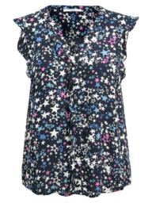
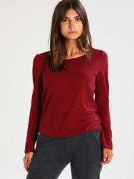
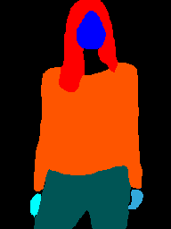
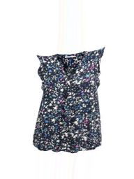

# MMFashion Virtual Try-on

## Input





- cloth image
- person image
- parson-parse png image file created in palette mode that indexes 1, 2, 4, and 13 indicate the position of the head.
- pose keypoints json file

(Image from VITON dataset https://drive.google.com/file/d/1MxCUvKxejnwWnoZ-KoCyMCXo3TLhRuTo/view)

## Output




## Usage
Automatically downloads the onnx and prototxt files on the first run.
It is necessary to be connected to the Internet while downloading.

For the sample image,
``` bash
$ python3 mmfashion_tryon.py
```

If you want to specify a cloth image, put the image path after the `--input` option.  
You can use `--savepath` option to change the name of the output file to save.
```bash
$ python3 mmfashion.py --input IMAGE_PATH --savepath SAVE_IMAGE_PATH
```

If you want to specify a person image, put the image path after the `-p` option. 
Also, to specify a person-parse image, put the image path after the `-pp` option, 
and to specify the keypoint file, put the json file path after the` -k` option.
```bash
$ python3 mmfashion.py -p IMAGE_PATH -pp IMAGE_PATH -k JSON_FILE_PATH
```

## Reference

- [MMFashion](https://github.com/open-mmlab/mmfashion)

## Framework

Pytorch

## Model Format

ONNX opset=11

## Netron

[GMM_epoch_40.onnx.prototxt](https://lutzroeder.github.io/netron/?url=https://storage.googleapis.com/ailia-models/mmfashion_tryon/GMM_epoch_40.onnx.prototxt)  
[TOM_epoch_40.onnx.prototxt](https://lutzroeder.github.io/netron/?url=https://storage.googleapis.com/ailia-models/mmfashion_tryon/TOM_epoch_40.onnx.prototxt)  
