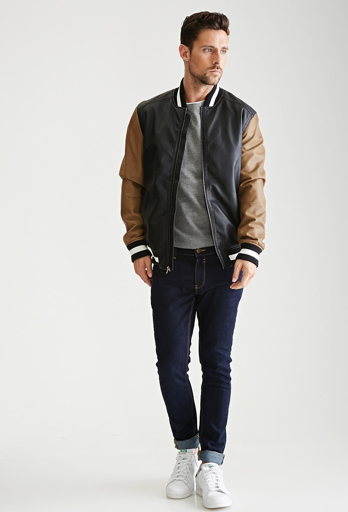

# person-attributes-recognition-crossroad

## Input



(Image from https://github.com/open-mmlab/mmfashion/blob/master/demo/imgs/01_4_full.jpg)

Ailia input shape: (1, 160, 80, 3)

## Output

```
==============================================================
class_count=7
+ idx=0
  category=[0][is_male ]
  prob=0.9970703125
+ idx=1
  category=[1][has_bag ]
  prob=0.003719329833984375
+ idx=2
  category=[2][has_backpack ]
  prob=0.0207366943359375
+ idx=3
  category=[3][has_hat ]
  prob=0.031463623046875
+ idx=4
  category=[4][has_longsleeves ]
  prob=0.7890625
+ idx=5
  category=[5][has_longpants ]
  prob=0.9990234375
+ idx=6
  category=[6][has_longhair ]
  prob=0.0003502368927001953
```

## Usage
Automatically downloads the onnx and prototxt files on the first run.
It is necessary to be connected to the Internet while downloading.

For the sample image,
``` bash
$ python3 person-attributes-recognition-crossroad.py
```

If you want to specify the input image, put the image path after the `--input` option.  
You can use `--savepath` option to change the name of the output file to save.
```bash
$ python3 person-attributes-recognition-crossroad.py --input IMAGE_PATH --savepath SAVE_IMAGE_PATH
```

By adding the `--video` option, you can input the video.   
If you pass `0` as an argument to VIDEO_PATH, you can use the webcam input instead of the video file.
```bash
$ python3 person-attributes-recognition-crossroad.py --video VIDEO_PATH
```

By adding the --model option, you can specify model type which is selected from "0230", "0234".

```bash
$ python3 person-attributes-recognition-crossroad.py --model 0234
```

## Reference

[person-attributes-recognition-crossroad-0230](https://github.com/openvinotoolkit/open_model_zoo/tree/master/models/intel/person-attributes-recognition-crossroad-0230)

[person-attributes-recognition-crossroad-0234](https://github.com/openvinotoolkit/open_model_zoo/tree/master/models/intel/person-attributes-recognition-crossroad-0234)

## Framework

openvino

## Model Format

ONNX opset=13

## Netron

[person-attributes-recognition-crossroad-0230.onnx.prototxt](https://lutzroeder.github.io/netron/?url=https://storage.googleapis.com/ailia-models/person-attributes-recognition-crossroad/person-attributes-recognition-crossroad-0230.onnx.prototxt) 

[person-attributes-recognition-crossroad-0234.onnx.prototxt](https://lutzroeder.github.io/netron/?url=https://storage.googleapis.com/ailia-models/person-attributes-recognition-crossroad/person-attributes-recognition-crossroad-0234.onnx.prototxt) 
