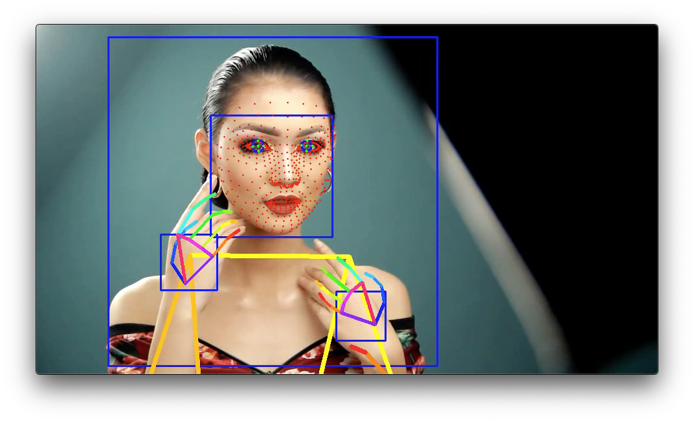

# DMS demo

Hybrid detection demo of Human Pose, Hand, FaceMesh and Iris for Driver Monitoring System

## Output



(Image from https://pixabay.com/ja/videos/%E5%A5%B3%E6%80%A7-%E3%83%A4%E3%83%B3%E3%82%B0-%E8%B1%AA%E8%8F%AF%E3%81%A7%E3%81%99-%E8%A1%A8%E7%8F%BE-32387/)

## Usage

By adding the `--video` option, you can input the video.   
If you pass `0` as an argument to VIDEO_PATH, you can use the webcam input instead of the video file.
```bash
$ python3 dms.py --video VIDEO_PATH --savepath SAVE_VIDEO_PATH
```

## Reference

- [facemesh](https://github.com/axinc-ai/ailia-models/tree/master/face_recognition/facemesh)
- [mediapipe_iris](https://github.com/axinc-ai/ailia-models/tree/master/face_recognition/mediapipe_iris)
- [blazepose](https://github.com/axinc-ai/ailia-models/tree/master/pose_estimation/blazepose)
- [blazepalm](https://github.com/axinc-ai/ailia-models/tree/master/hand_detection/blazepalm)
- [blazehand](https://github.com/axinc-ai/ailia-models/tree/master/hand_recognition/blazehand)
