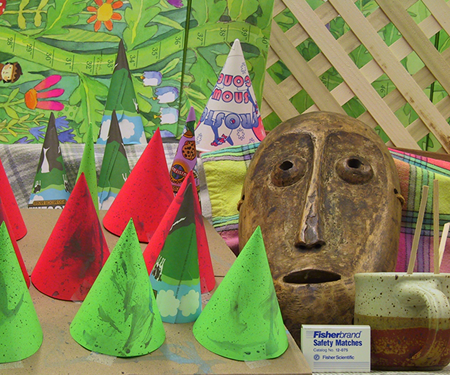

# CREStereo

### input

Ailia input shape(1, 3, 360, 640)

(Image from https://vision.middlebury.edu/stereo/data/scenes2003/)

#### rigth image input



#### left image input


### output


### usage
Automatically downloads the onnx and prototxt files on the first run.
It is necessary to be connected to the Internet while downloading.

For the sample image,
``` bash
$ python3 crestereo.py
```

If you want to specify the input image, put stereo images path after the `--left`, `--right` option, respectively.

``` bash
$ python3 crestereo.py --left LEFT_IMAGE_PATH --right RIGTH_IMAGE_PATH
```

If you want to specify the input image, put the image path after the `--left`, `--right` option.  
You can use `--savepath` option to change the name of the output file to save.

```bash
$ python3 crestereo.py --left LEFT_IMAGE_PATH --right RIGTH_IMAGE_PATH --savepath SAVE_IMAGE_PATH
```

By adding the `--video_left`, `--video_rigth` option, you can input the video.
If you pass `0` as an argument to RIGTH_VIDEO_PATH,`1` as an argument to LEFT_VIDEO_PATH  , you can use the webcam input instead of the video file.
```bash
$ python3 monodepth2.py --video_rigth RIGTH_VIDEO_PATH --video_left LEFT_VIDEO_PATH
```

### Reference

[crestereo](https://github.com/ibaiGorordo/ONNX-CREStereo-Depth-Estimation)

### Framework
PyTorch 1.11.0

### Model Format
ONNX opset = 12

### Netron

[crestereo.onnx.prototxt](https://netron.app/?url=https://storage.googleapis.com/ailia-models/crestereo/crestereo.onnx.prototxt)


