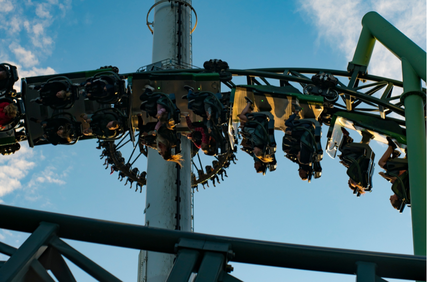
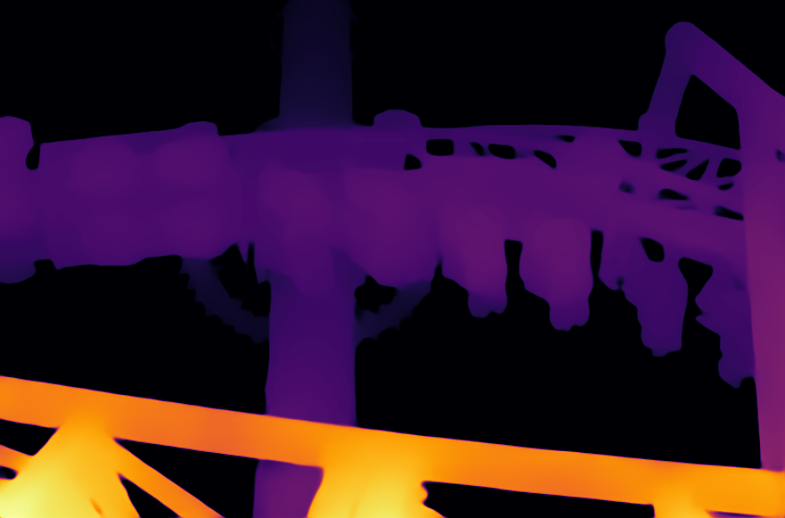

# Depth Anything: Unleashing the Power of Large-Scale Unlabeled Data

## Input

* **Image or Video**



The script will perform a monocular depth estimation on the input media.

## Output

* **Depth image**



Estimated relative depth, scaled to fit in the 0~255 range.

Saves to ```./output.png``` by default but it can be specified with the ```-s``` option 

## Usage
Internet connection is required when running the script for the first time,
as it will download the necessary model files.

Running this script will estimate the relative depth of the input image/video.
The results will be shown in a separate window(when inferencing on image and video), 
or saved as a single channel image(when inferencing on image).

#### Example 1: Inference on prepared demo image.
```bash
$ python3 depth_anything.py
```
The result will be saved to ```output.png``` by default.

#### Example 2: Specify input path, save path, and encoder type.
```bash
$ python3 depth_anything.py -i input.png -s output.png -ec vitl
```
```-i```, ```-s```, ```-ec``` options can be used to specify the
input path, save path, and encoder type separately.

#### Example 3: Inference on Video.
```bash
$ python3 depth_anything.py -v 0
```
argument after the ```-v``` option can be the device id of the webcam,
or the path to the input video.

## Reference

* [DepthAnythig](https://github.com/LiheYoung/Depth-Anything)

## Framework

Pytorch


## Model Format

ONNX opset=11

## Netron

