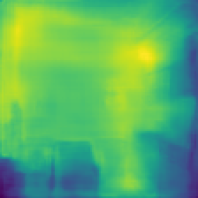

FastDepth: Fast Monocular Depth Estimation on Embedded Systems
============================

### input
- input image (1x3x250x250)


(Extracted from [NYU Depth V2](http://cs.nyu.edu/~silberman/datasets/nyu_depth_v2.html) dataset in HDF5 format.)

### output
- output image (1x1x224x224)



### usage
Automatically downloads the onnx and prototxt files on the first run.
It is necessary to be connected to the Internet while downloading.

For the sample image,
``` bash
$ python3 fast-depth.py
```

If you want to specify the input image, put the image path after the `--input` option.  
You can use `--savepath` option to change the directory of the output file to be saved.
```bash
$ python3 fast-depth.py --input IMAGE_PATH --savepath SAVE_IMAGE_PATH
```

By adding the `--video` option, you can input the video and convert it by the style image.
If you pass `0` as an argument to VIDEO_PATH, you can use the webcam input instead of the video file.
```bash
$ python3 fast-depth.py --video VIDEO_PATH
```

### Reference

[ICRA 2019 "FastDepth: Fast Monocular Depth Estimation on Embedded Systems"](https://github.com/dwofk/fast-depth)


### Framework
PyTorch


### Model Format
ONNX opset = 11


### Netron

- [fast-depth.onnx.prototxt](https://netron.app/?url=https://storage.googleapis.com/ailia-models/fast-depth/fast-depth.onnx.prototxt)
