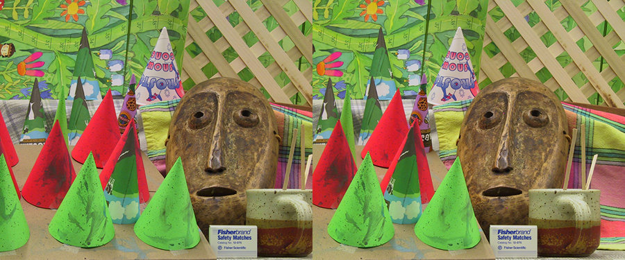

# HITNET-Stereo-Depth-estimation

## Input



(Image from https://vision.middlebury.edu/stereo/data/scenes2003/)

Shape : (1, 6, 640, 480)  

## Output


Shape : (640, 480, 1)

### usage
Automatically downloads the onnx and prototxt files on the first run.
It is necessary to be connected to the Internet while downloading.

For the sample image,
``` bash
$ python3 hitnet.py
```

If you want to specify the input image, put stereo images path after the `--left`, `--right` option, respectively.  
You can use `--savepath` option to change the name of the output file to save.
```bash
$ python3 hitnet.py --left LEFT_IMAGE_PATH --right RIGHT_IMAGE_PATH --savepath SAVE_IMAGE_PATH
```

By adding the `--video` option, you can input the directory of stereo video frames.   
```bash
$ python3 hitnet.py --video STEREO_DATA_DIR
```

## Reference

[ONNX-HITNET-Stereo-Depth-estimation](https://github.com/ibaiGorordo/ONNX-HITNET-Stereo-Depth-estimation)

## Framework

TensorFlow

## Model Format

ONNX opset=12

## Netron

[hitnet.onnx.prototxt](https://netron.app/?url=https://storage.googleapis.com/ailia-models/hitnet/hitnet.onnx.prototxt)