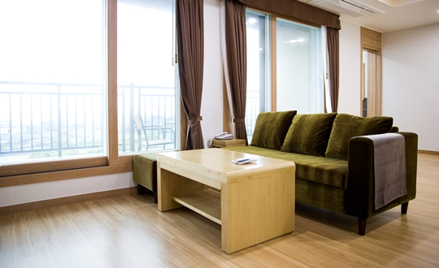
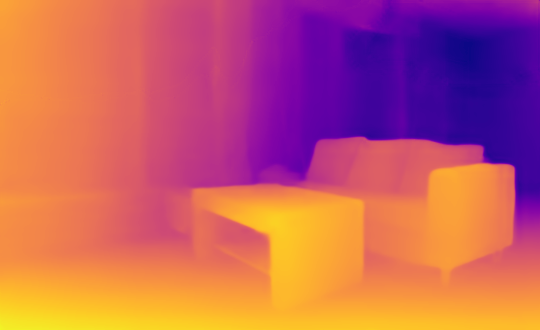

# LapDepth

## Input

### KITTI dataset image


(Image from https://github.com/tjqansthd/LapDepth-release/blob/master/example/kitti_demo.jpg)

### NYU dataset image



(Image from https://github.com/tjqansthd/LapDepth-release/blob/master/example/nyu_demo.jpg)

## Output

### KITTI dataset image (by model_type kitti)


### NYU dataset image (by model_type nyu)



## Usage

Automatically downloads the onnx and prototxt files on the first run. It is necessary to be connected to the Internet
while downloading.

For the sample image,
``` bash
$ python3 lap-depth.py
```

If you want to specify the input image, put the image path after the `--input` option.  
You can use `--savepath` option to change the directory of the output file to be saved.
```bash
$ python3 lap-depth.py --input IMAGE_PATH --savepath SAVE_IMAGE_PATH
```

By adding the `--video` option, you can input the video and convert it by the style image. If you pass `0` as an
argument to VIDEO_PATH, you can use the webcam input instead of the video file.
```bash
$ python3 lap-depth.py --video VIDEO_PATH
```

You can specify the "model type" by specifying after the `--model_type` option.
The model type is selected from "kitti", "kitti-grad", "nyu".  
```bash
$ python3 lap-depth.py --model_type kitti
```

## Reference

[LapDepth-release](https://github.com/tjqansthd/LapDepth-release)

## Framework

PyTorch

## Model Format

ONNX opset = 11

## Netron

- [LDRN_KITTI_ResNext101_data.onnx.prototxt](https://netron.app/?url=https://storage.googleapis.com/ailia-models/lap-depth/LDRN_KITTI_ResNext101_data.onnx.prototxt)
- [LDRN_KITTI_ResNext101_data_grad.onnx.prototxt](https://netron.app/?url=https://storage.googleapis.com/ailia-models/lap-depth/LDRN_KITTI_ResNext101_data_grad.onnx.prototxt)
- [LDRN_NYU_ResNext101_data.onnx.prototxt](https://netron.app/?url=https://storage.googleapis.com/ailia-models/lap-depth/LDRN_NYU_ResNext101_data.onnx.prototxt)  
