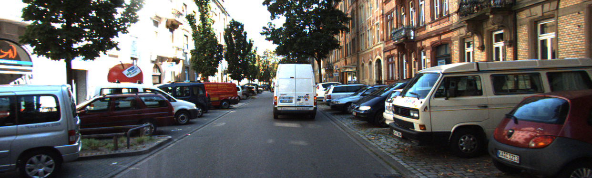
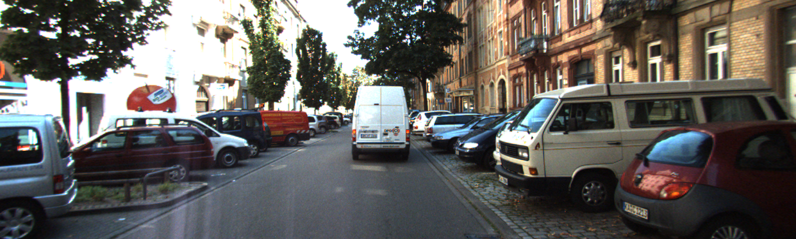

# MobileStereoNet

## Input




(Image from http://www.cvlibs.net/datasets/kitti/eval_scene_flow.php)

## Output


## Usage
Automatically downloads the onnx and prototxt files on the first run.
It is necessary to be connected to the Internet while downloading.

For the sample image,
```bash
$ python3 mobilestereonet.py
```

If you want to specify the input image, put the left sight image path after the `--input` option, and the right sight image path after the `--input2` option.  
You can use `--savepath` option to change the name of the output file to save.
```bash
$ python3 mobilestereonet.py --input LEFT_IMAGE_PATH --input2 RIGHT_IMAGE_PATH --savepath SAVE_IMAGE_PATH
```

The `--input` option can also specify the directory path where the left and rigth sight images are stored.
```bash
$ python3 mobilestereonet.py --input DIR_PATH
```

## Reference

- [MobileStereoNet](https://github.com/cogsys-tuebingen/mobilestereonet)

## Framework

Pytorch

## Model Format

ONNX opset=11

## Netron

[MSNet3D_SF_DS_KITTI2015.onnx.prototxt](https://netron.app/?url=https://storage.googleapis.com/ailia-models/mobilestereonet/MSNet3D_SF_DS_KITTI2015.onnx.prototxt)
