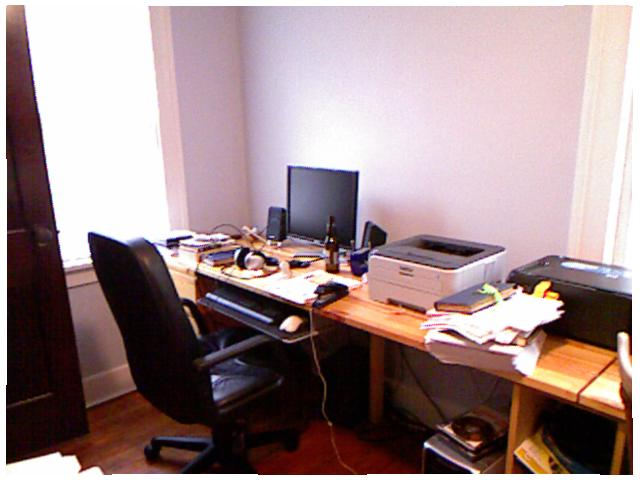
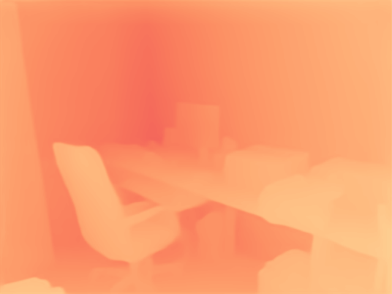
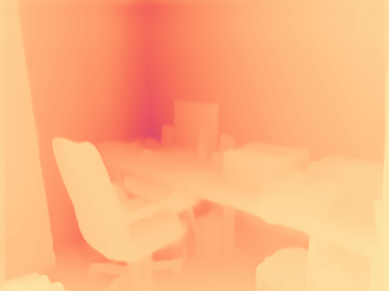

# Zoe Depth

## Input


## Output
- ZoeD_M12_N


- ZoeD_M12_NK


- ZoeD_M12_K



## Usage
To get the depth image from sample image, run the following comand

```bash
$ python3 zoe_depth.py
````

To specify ZoeDepth model, please use -a/--arch option. You can choose arch from ZoeD_M12_N, ZoeD_M12_NK and ZoeD_M12_K. The default arch is ZoeD_M12_K.

```bash
$ python3 zoe_depth.py -a <arch>
```

To use onnxruntime, set --onnx option

```bash
$ python3 zoe_depth.py --onnx
```

## Reference
[ZoeDepth](https://github.com/isl-org/ZoeDepth)

## Framework
Pytorch

## Model Format
ONNX opset = 17

## Netron
[ZoeD_M12_N.onnx.prototxt](https://netron.app/?url=https://storage.googleapis.com/ailia-models/zoe_depth/ZoeD_M12_N.onnx.prototxt)
[ZoeD_M12_NK.onnx.prototxt](https://netron.app/?url=https://storage.googleapis.com/ailia-models/zoe_depth/ZoeD_M12_NK.onnx.prototxt)
[ZoeD_M12_K.onnx.prototxt](https://netron.app/?url=https://storage.googleapis.com/ailia-models/zoe_depth/ZoeD_M12_K.onnx.prototxt)
