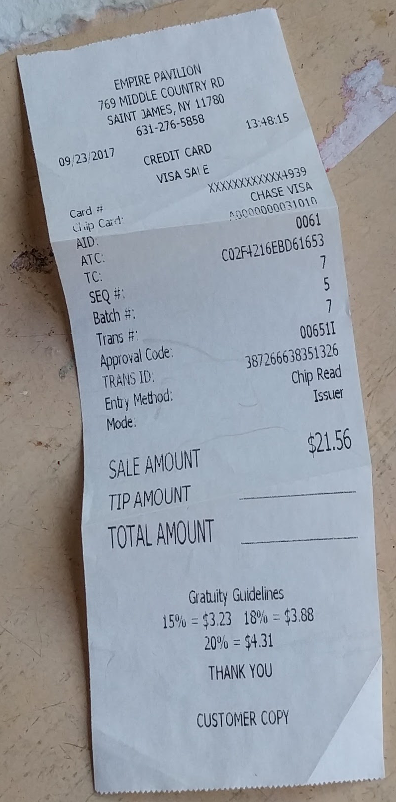
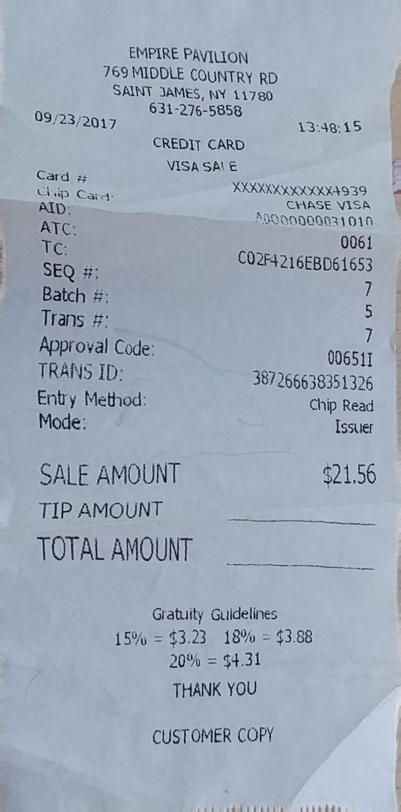

# DewarpNet

## Input


(from https://github.com/cvlab-stonybrook/DewarpNet/tree/master/eval/inp)

## Output
  
Shape: same with input image

## Usage
```bash
python3 dewarpnet.py
```

## Reference
[DewarpNet: Single-Image Document Unwarping With Stacked 3D and 2D Regression Networks](https://github.com/cvlab-stonybrook/DewarpNet)

## Framework
PyTorch 1.3.1

## Model Format
ONNX opset = 10

