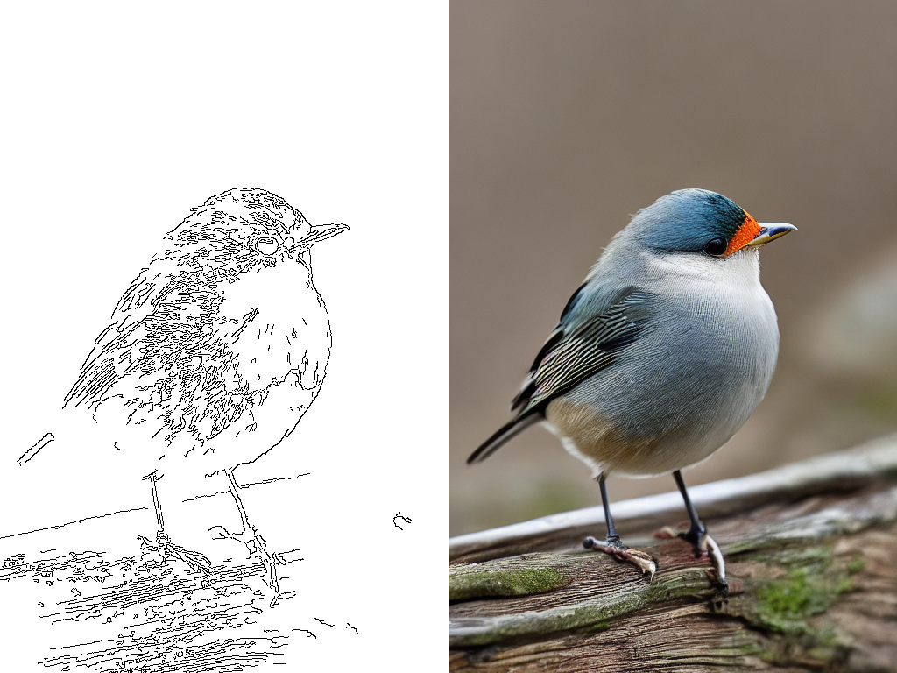
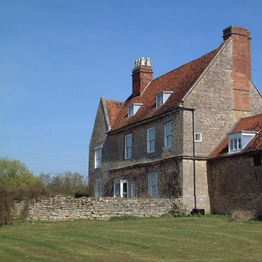
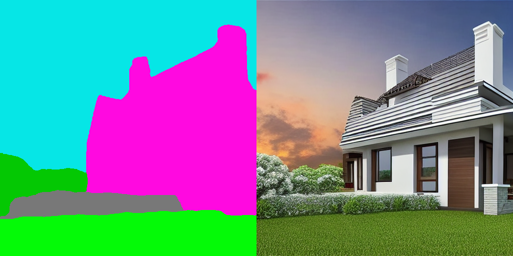

# ControlNet

## ControlNet with Canny Edge

### Input

- Prompt: "bird"


### Output



## ControlNet with Human Pose

### Input

- Prompt: "Chef in the kitchen"


### Output


## ControlNet with Semantic Segmentation

### Input

- Prompt: "house"



### Output



## Requirements
This model requires additional module.

```
pip3 install transformers
```

## Usage
Automatically downloads the onnx and prototxt files on the first run.
It is necessary to be connected to the Internet while downloading.

For the sample image,
```bash
$ python3 control_net.py
```

This will save each sample individually as well as a grid of size `--n_iter` x `--n_samples` option values.

If you want to specify the input image, put the image path after the --input option.
You can use `--savepath` option to change the name of the output file to save.
```bash
$ python3 control_net.py --input IMAGE_PATH --savepath SAVE_IMAGE_PATH
```

If you want to specify the prompt text, put the text after the `--prompt` option.
```bash
$ python3 control_net.py --prompt TEXT
```

By adding the `--model_type` option, you can specify model type which is selected from "canny", "pose", "seg". (default is canny)
```bash
$ python3 control_net.py --model_type canny
```

- For Canny Edge example.
    ```bash
    $ python3 control_net.py --model_type canny --input examples/bird.png --prompt bird
    ```

- For Human Pose example.
    ```bash
    $ python3 control_net.py --model_type pose --input examples/pose1.png --prompt "Chef in the kitchen"
    ```

- For Semantic Segmentation example.
    ```bash
    $ python3 control_net.py --model_type seg --input examples/house.png --prompt house
    ```

## Reference

- [ControlNet](https://github.com/lllyasviel/ControlNet)
- [Stable Diffusion](https://github.com/CompVis/stable-diffusion)

## Framework

Pytorch

## Model Format

ONNX opset=12

## Netron

[control_net_canny.onnx.prototxt](https://netron.app/?url=https://storage.googleapis.com/ailia-models/control_net/control_net_canny.onnx.prototxt)  
[control_net_pose.onnx.prototxt](https://netron.app/?url=https://storage.googleapis.com/ailia-models/control_net/control_net_pose.onnx.prototxt)  
[control_net_seg.onnx.prototxt](https://netron.app/?url=https://storage.googleapis.com/ailia-models/control_net/control_net_seg.onnx.prototxt)  
[pose_body.onnx.prototxt](https://netron.app/?url=https://storage.googleapis.com/ailia-models/control_net/pose_body.onnx.prototxt)
[pose_hand.onnx.prototxt](https://netron.app/?url=https://storage.googleapis.com/ailia-models/control_net/pose_hand.onnx.prototxt)
[upernet_global_small.onnx.prototxt](https://netron.app/?url=https://storage.googleapis.com/ailia-models/control_net/upernet_global_small.onnx.prototxt)

