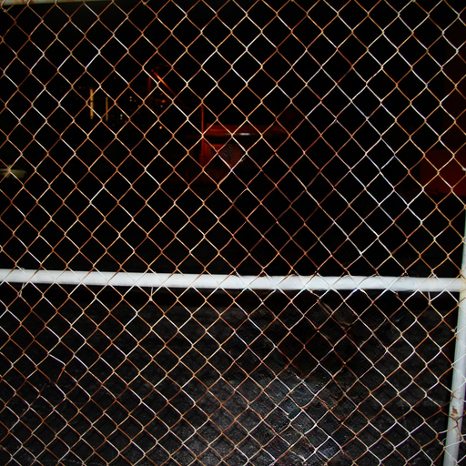

# Latent Diffusion - Inpainting

## Input

 

(Image from https://github.com/CompVis/latent-diffusion/tree/main/data/inpainting_examples)

## Output



## Usage
Automatically downloads the onnx and prototxt files on the first run.
It is necessary to be connected to the Internet while downloading.

For the sample image,
```bash
$ python3 latent-diffusion-inpainting.py
```

If you want to specify the input image, put the image path after the `--input` option.  
You can use `--savepath` option to change the name of the output file to save.
```bash
$ python3 latent-diffusion-inpainting.py --input IMAGE_PATH --savepath SAVE_IMAGE_PATH
```

The inpainting sample code requires two input files, image file `*.png` and mask file `<image_fname>_mask.png`.
The mask file is automatically selected depending on the filename of the image file.

## Reference

- [Latent Diffusion Models](https://github.com/CompVis/latent-diffusion)

## Framework

Pytorch

## Model Format

ONNX opset=12

## Netron

[cond_stage_model.onnx.prototxt](https://netron.app/?url=https://storage.googleapis.com/ailia-models/latent-diffusion-inpainting/cond_stage_model.onnx.prototxt)  
[diffusion_model.onnx.prototxt](https://netron.app/?url=https://storage.googleapis.com/ailia-models/latent-diffusion-inpainting/diffusion_model.onnx.prototxt)  
[autoencoder.onnx.prototxt](https://netron.app/?url=https://storage.googleapis.com/ailia-models/latent-diffusion-inpainting/autoencoder.onnx.prototxt)
