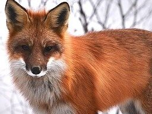

# Latent Diffusion - Super-resolution

## Input



(Image from https://colab.research.google.com/drive/1xqzUi2iXQXDqXBHQGP9Mqt2YrYW6cx-J?usp=sharing)

## Output


## Usage
Automatically downloads the onnx and prototxt files on the first run.
It is necessary to be connected to the Internet while downloading.

For the sample image,
```bash
$ python3 latent-diffusion-superresolution.py
```

If you want to specify the input image, put the image path after the `--input` option.  
You can use `--savepath` option to change the name of the output file to save.
```bash
$ python3 latent-diffusion-superresolution.py --input IMAGE_PATH --savepath SAVE_IMAGE_PATH
```

## Reference

- [Latent Diffusion Models](https://github.com/CompVis/latent-diffusion#model-zoo)

## Framework

Pytorch

## Model Format

ONNX opset=12

## Netron

[diffusion_model.onnx.prototxt](https://netron.app/?url=https://storage.googleapis.com/ailia-models/latent-diffusion-superresolution/diffusion_model.onnx.prototxt)  
[first_stage_decode.onnx.prototxt](https://netron.app/?url=https://storage.googleapis.com/ailia-models/latent-diffusion-superresolution/first_stage_decode.onnx.prototxt)
