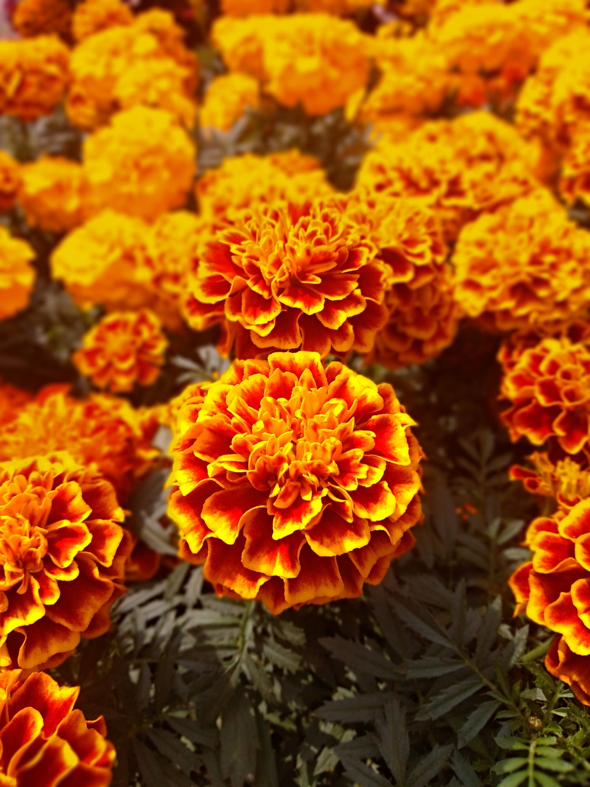
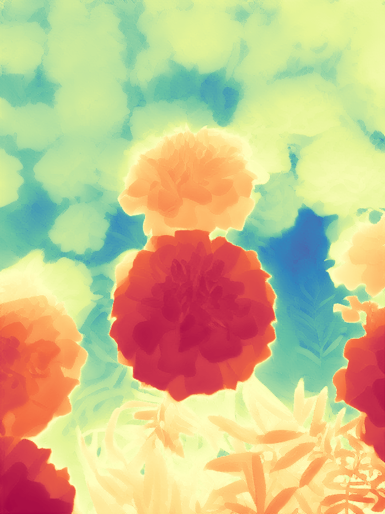

# Marigold: Repurposing Diffusion-Based Image Generators for Monocular Depth Estimation

## Input



(Image from https://share.phys.ethz.ch/~pf/bingkedata/marigold/in-the-wild_example.tar)

## Output

- depth_bw


- depth_colored


## Usage
Automatically downloads the onnx and prototxt files on the first run.
It is necessary to be connected to the Internet while downloading.

For the sample image,
```bash
$ python3 marigold.py
```

If you want to specify the input image, put the image path after the `--input` option.  
You can use `--savepath` option to change the name of the output file to save.
```bash
$ python3 marigold.py --input IMAGE_PATH --savepath SAVE_IMAGE_PATH
```

## Reference

- [Marigold](https://github.com/prs-eth/Marigold)

## Framework

Pytorch

## Model Format

ONNX opset=14

## Netron

[unet.onnx.prototxt](https://netron.app/?url=https://storage.googleapis.com/ailia-models/marigold/unet.onnx.prototxt)  
[text_encoder.onnx.prototxt](https://netron.app/?url=https://storage.googleapis.com/ailia-models/marigold/text_encoder.onnx.prototxt)  
[vae_encoder.onnx.prototxt](https://netron.app/?url=https://storage.googleapis.com/ailia-models/marigold/vae_encoder.onnx.prototxt)  
[vae_decoder.onnx.prototxt](https://netron.app/?url=https://storage.googleapis.com/ailia-models/marigold/vae_decoder.onnx.prototxt)
