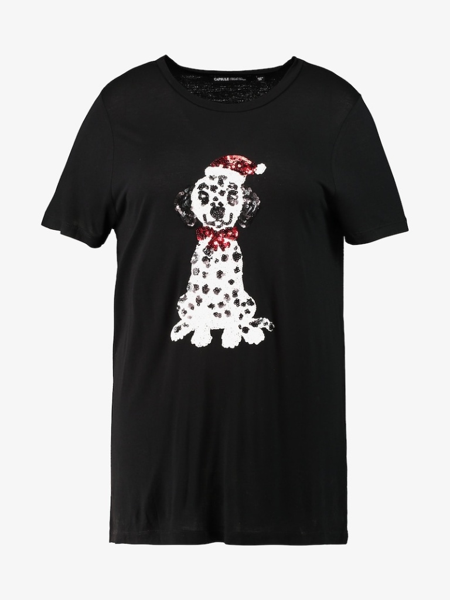

# OOTDiffusion

## Input


(Image from ...)



(Image from ...)

## Output

TBD

## Usage
Automatically downloads the onnx and prototxt files on the first run.
It is necessary to be connected to the Internet while downloading.

For the sample video,
``` bash
$ python3 ootdiffusion.py
```

By adding the `--onnx` option, you can run the inference using OnnxRuntime.
```bash
$ python3 ootdiffusion.py --onnx
```

## Reference

- [OOTDiffusion](https://github.com/levihsu/OOTDiffusion)

## Framework

Pytorch

## Model Format

ONNX opset = 14

Models can be downloaded from [ax Drive](https://drive.google.com/file/d/1gsdKNyILaNfVxI-8lb3fIoHHJh5KO3GW/view?usp=sharing).

## Problem

The model `unet_garm_hd.onnx` was successfully exported from PyTorch to ONNX and loaded by both ailia SDK and ONNXRuntime, but freezes on inference. <br>
Basic example:
```python
import numpy as np

WEIGHT_UNET_GARM_HD_PATH = 'unet_garm_hd.onnx'

garm_latents = np.random.rand(2, 4, 128, 96).astype(np.float16)
prompt_embeds = np.random.rand(2, 2, 768).astype(np.float16)
timestep = np.array([0], dtype=np.float16)

# Using ailia SDK
import ailia

unet_garm = ailia.Net(None, WEIGHT_UNET_GARM_HD_PATH)
unet_garm.run([garm_latents, timestep, prompt_embeds])  # Freeze

# Using ORT
import onnxruntime as ort

providers = ['CUDAExecutionProvider', 'CPUExecutionProvider']
unet_garm = ort.InferenceSession(WEIGHT_UNET_GARM_HD_PATH, providers=providers)
unet_garm.run(None, {unet_garm.get_inputs()[0].name: garm_latents,
                        unet_garm.get_inputs()[1].name: timestep,
                        unet_garm.get_inputs()[2].name: prompt_embeds})  # Freeze
```

## Netron
