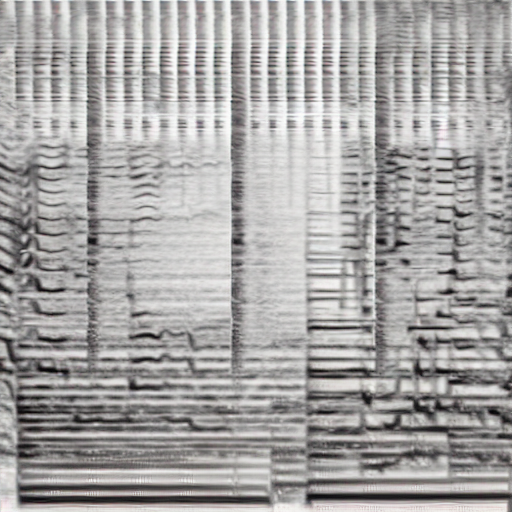

# Riffusion : Stable diffusion for real-time music generation

## Input

Prompt

- Example
```
jazzy rapping from paris
```

## Output

https://github.com/axinc-ai/ailia-models/assets/29946532/cedefebe-895e-4431-81ee-fa03fde09753



## Requirements
This model requires additional module.

```
pip3 install torch
pip3 install torchaudio
pip3 install transformers
pip3 install soundfile
```

This model can use optional modules.

```
pip3 install pydub
```

## Usage
Automatically downloads the onnx and prototxt files on the first run.
It is necessary to be connected to the Internet while downloading.

For the sample image,
```bash
$ python3 riffusion.py
```

If you want to specify the input text, put the text after the `--input` option.  
You can use `--savepath` option to change the name of the output file to save.
```bash
$ python3 riffusion.py --input TEXT --savepath SAVE_WAV_PATH
```

## Reference

- [Riffusion](https://github.com/riffusion/riffusion)
- [Hugging Face - Riffusion](https://huggingface.co/riffusion/riffusion-model-v1)

## Framework

Pytorch

## Model Format

ONNX opset=14

## Netron

[unet.onnx.prototxt](https://netron.app/?url=https://storage.googleapis.com/ailia-models/riffusion/unet.onnx.prototxt)  
[text_encoder.onnx.prototxt](https://netron.app/?url=https://storage.googleapis.com/ailia-models/riffusion/text_encoder.onnx.prototxt)  
[vae_decoder.onnx.prototxt](https://netron.app/?url=https://storage.googleapis.com/ailia-models/riffusion/vae_decoder.onnx.prototxt)  
