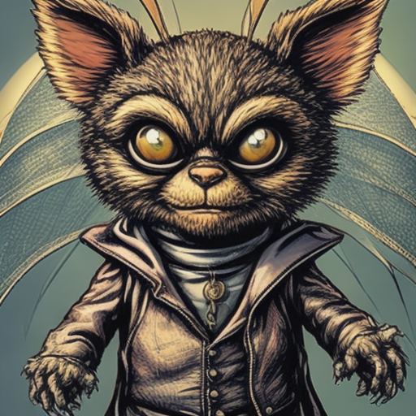
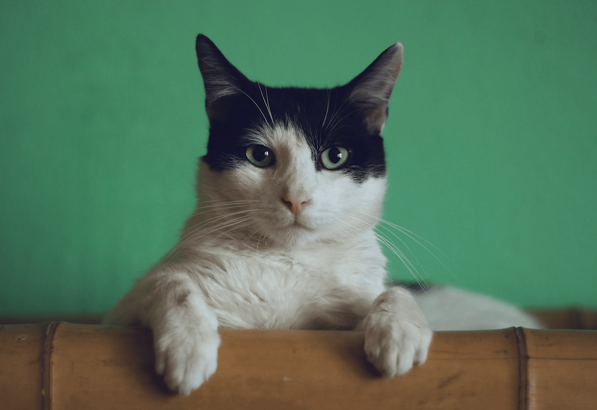

# SD-Turbo

## Text-to-image

### Input

Prompt:
```
little cute gremlin wearing a jacket, cinematic, vivid colors, intricate masterpiece, golden ratio, highly detailed
```

### Output



## Image-to-image

### Input

Image:



(Image from https://huggingface.co/datasets/huggingface/documentation-images/resolve/main/diffusers/cat.png)

Prompt:
```
cat wizard, gandalf, lord of the rings, detailed, fantasy, cute, adorable, Pixar, Disney, 8k
```

### Output

<!--  -->


## Requirements
This model requires additional module.

```
pip3 install transformers
```

## Usage
Automatically downloads the onnx and prototxt files on the first run.
It is necessary to be connected to the Internet while downloading.

For the sample image, (Text-to-image)
```bash
$ python3 sd-turbo.py
```

If you want to specify the input prompt, put the prompt after the `--input` option.  
You can use `--savepath` option to change the name of the output file to save.
```bash
$ python3 sd-turbo.py --input PROMPT --savepath SAVE_WAV_PATH
```

For Image-to-image, specify the input image file after the `--init_image` option.
```bash
$ python3 sd-turbo.py --input "cat wizard, gandalf, lord of the rings, detailed, fantasy, cute, adorable, Pixar, Disney, 8k" --init_image cat.png 
```


## Reference

- [Hugging Face - SD-Turbo](https://huggingface.co/stabilityai/sd-turbo)

## Framework

Pytorch

## Model Format

ONNX opset=14

## Netron

[unet.onnx.prototxt](https://netron.app/?url=https://storage.googleapis.com/ailia-models/sd-turbo/unet.onnx.prototxt)  
[text_encoder.onnx.prototxt](https://netron.app/?url=https://storage.googleapis.com/ailia-models/sd-turbo/text_encoder.onnx.prototxt)  
[vae_encoder.onnx.prototxt](https://netron.app/?url=https://storage.googleapis.com/ailia-models/sd-turbo/vae_encoder.onnx.prototxt)  
[vae_decoder.onnx.prototxt](https://netron.app/?url=https://storage.googleapis.com/ailia-models/sd-turbo/vae_decoder.onnx.prototxt)  
