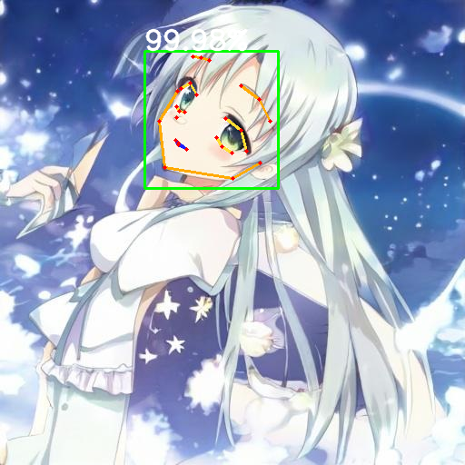

# Anime Face Detector

## Input


(Image from https://github.com/hysts/anime-face-detector/blob/main/assets/input.jpg)

- face_yolov3 input shape : (1, 3, 608, 608)
- face_faster-rcnn input shape : (1, 3, 800, 1333)
- face_hrnetv2 input shape : (n, 3, 256, 256)

## Output



- dets shape : (1, 100, 5)
- heatmap shape : (n, 28, 64, 64)

## Usage
Automatically downloads the onnx and prototxt files on the first run.
It is necessary to be connected to the Internet while downloading.

For the sample image,
``` bash
$ python3 anime-face-detector.py
```

If you want to specify the input image, put the image path after the `--input` option.  
You can use `--savepath` option to change the name of the output file to save.
```bash
$ python3 anime-face-detector.py --input IMAGE_PATH --savepath SAVE_IMAGE_PATH
```

By adding the `--video` option, you can input the video.   
If you pass `0` as an argument to VIDEO_PATH, you can use the webcam input instead of the video file.
```bash
$ python3 anime-face-detector.py --video VIDEO_PATH
```

By adding the `--detector` option, you can specify face detector model which is selected from "yolov3", "faster-rcnn". (default is yolov3)
```bash
$ python3 anime-face-detector.py --detector yolov3
```

## Reference

- [Anime Face Detector](https://github.com/hysts/anime-face-detector)
- [MMCV](https://github.com/open-mmlab/mmcv)
- [MMDetection](https://github.com/open-mmlab/mmdetection)
- [MMPose](https://github.com/open-mmlab/mmpose)

## Framework

Pytorch

## Model Format

ONNX opset=11

## Netron

[anime-face_yolov3.onnx.prototxt](https://netron.app/?url=https://storage.googleapis.com/ailia-models/anime-face-detector/anime-face_yolov3.onnx.prototxt)  
[anime-face_faster-rcnn.onnx.prototxt](https://netron.app/?url=https://storage.googleapis.com/ailia-models/anime-face-detector/anime-face_faster-rcnn.onnx.prototxt)  
[anime-face_hrnetv2.onnx.prototxt](https://netron.app/?url=https://storage.googleapis.com/ailia-models/anime-face-detector/anime-face_hrnetv2.onnx.prototxt)
