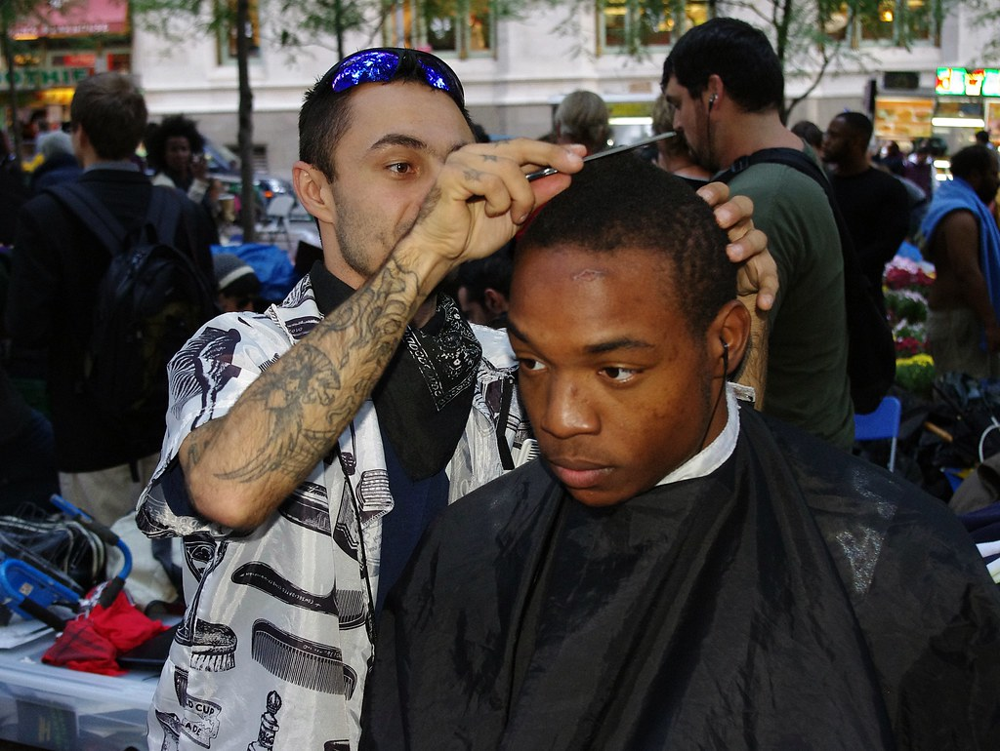

# mtcnn

## Input




(Image from https://search.creativecommons.org/photos/df3a19c2-47ca-4f58-8aed-0dc62e89e9e9)

Image credit: "Day 21 Occupy Wall Street October 6 2011 Shankbone 6" by david_shankbone is marked under CC PDM 1.0. To view the terms, visit https://creativecommons.org/publicdomain/mark/1.0/

Input shape: (1, 3, 384, 672) BGR channel order Range: [0, 255]

## Output


## Usage

Automatically downloads the onnx and prototxt files on the first run. It is necessary to be connected to the Internet
while downloading.

For the sample image,

``` bash
$ python3 mtcnn.py
```

If you want to specify the input image, put the image path after the `--input` option.  
You can use `--savepath` option to change the name of the output file to save.

```bash
$ python3 mtcnn.py --input IMAGE_PATH --savepath SAVE_IMAGE_PATH
```

By adding the `--video` option, you can input the video.   
If you pass `0` as an argument to VIDEO_PATH, you can use the webcam input instead of the video file.

```bash
$ python3 mtcnn.py --video VIDEO_PATH
```


## Reference

[mtcnn](https://github.com/ipazc/mtcnn)

## Framework

Tensorflow,Keras

## Model Format

ONNX opset = 13

## Netron

[pnet.onnx.prototxt](https://netron.app/?url=https://storage.googleapis.com/ailia-models/mtcnn/pnet.onnx.prototxt)

[rnet.onnx.prototxt](https://netron.app/?url=https://storage.googleapis.com/ailia-models/mtcnn/rnet.onnx.prototxt)

[onet.onnx.prototxt](https://netron.app/?url=https://storage.googleapis.com/ailia-models/mtcnn/onet.onnx.prototxt)
