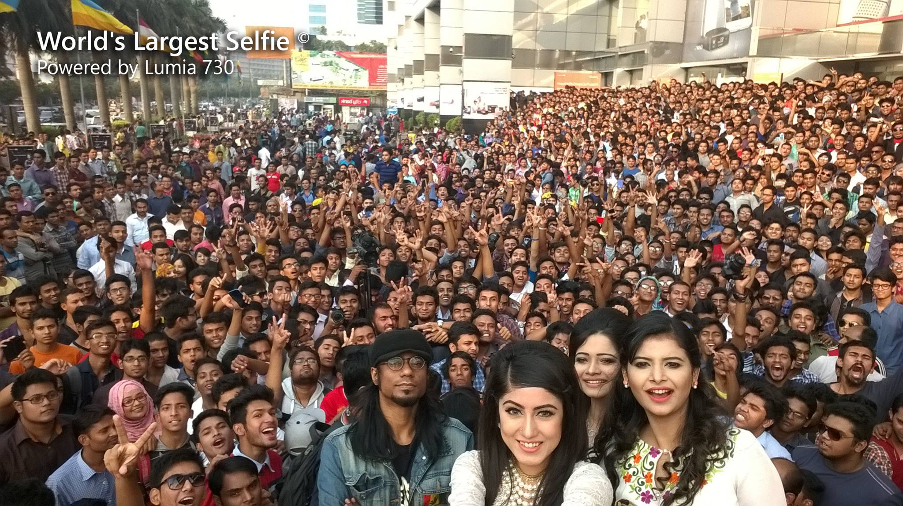

# RetinaFace

## Input


(Image from https://github.com/dlunion/DBFace/blob/master/datas/selfie.jpg)

## Output


## Usage
Automatically downloads the onnx and prototxt files on the first run.
It is necessary to be connected to the Internet while downloading.

For the sample image, the more powerful resnet50 is used as backbone by default, you can also choose mobilenet as backbone for a real-time inference.
``` bash
python3 retinaface.py --arch resnet50
python3 retinaface.py --arch mobile0.25
```

If you want to specify the input image, put the image path after the `--input` option.  
You can use `--savepath` option to change the name of the output file to save.  
You can alse use `--rescale` option to scale down the input image size to prevent memory overflow. By default the original image size is used as input.
```bash
$ python3 retinaface.py  --input IMAGE_PATH --savepath SAVE_IMAGE_PATH
```

By adding the `--video` option, you can input the video. 
If you pass `0` as an argument to VIDEO_PATH, you can use the webcam input instead of the video file.
```bash
$ python3 retinaface.py --video VIDEO_PATH
```

## Reference
[RetinaFace: Single-stage Dense Face Localisation in the Wild.](https://github.com/biubug6/Pytorch_Retinaface)

## Framework
PyTorch

## Model Format
ONNX opset = 11

## Netron

[retinaface_resnet50.onnx.prototxt](https://netron.app/?url=https://storage.googleapis.com/ailia-models/retinaface/retinaface_resnet50.onnx.prototxt)  
[retinaface_mobile0.25.onnx.prototxt](https://netron.app/?url=https://storage.googleapis.com/ailia-models/retinaface/retinaface_mobile0.25.onnx.prototxt)