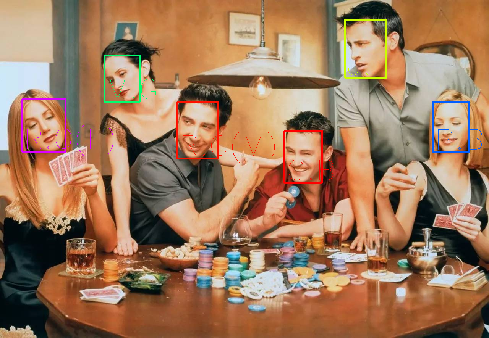

# InsightFace

## Input


(Image from https://github.com/deepinsight/insightface/blob/master/sample-images/t1.jpg)

## Output



## Usage
Automatically downloads the onnx and prototxt files on the first run.
It is necessary to be connected to the Internet while downloading.

For the sample image,
``` bash
$ python3 insightface.py
```

The sample code reads the face images under the identities directory and uses the file name as the label.

If you want to specify the input image, put the image path after the `--input` option.  
You can use `--savepath` option to change the name of the output file to save.
```bash
$ python3 insightface.py --input IMAGE_PATH --savepath SAVE_IMAGE_PATH
```

By adding the `--video` option, you can input the video.   
If you pass `0` as an argument to VIDEO_PATH, you can use the webcam input instead of the video file.
```bash
$ python3 insightface.py --video VIDEO_PATH
```

## Reference

- [RetinaFace in PyTorch](https://github.com/biubug6/Pytorch_Retinaface)
- [InsightFace: 2D and 3D Face Analysis Project](https://github.com/deepinsight/insightface)

## Framework

ONNX Runtime

## Model Format

ONNX opset=11

## Netron

[retinaface_resnet.onnx.prototxt](https://netron.app/?url=https://storage.googleapis.com/ailia-models/insightface/retinaface_resnet.onnx.prototxt)
[arcface_r100_v1.onnx.prototxt](https://netron.app/?url=https://storage.googleapis.com/ailia-models/insightface/arcface_r100_v1.onnx.prototxt)
