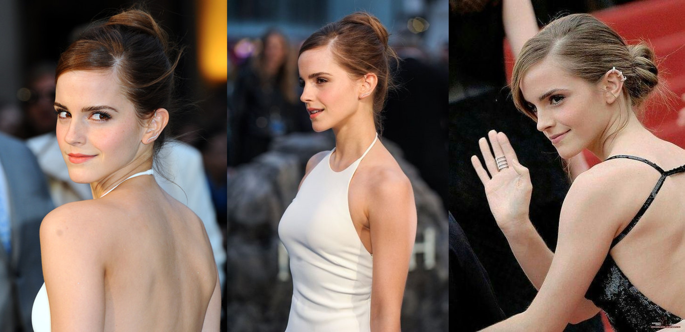

# Towards Fast, Accurate and Stable 3D Dense Face Alignment

## Input



(Image from https://github.com/cleardusk/3DDFA_V2/blob/master/examples/inputs/emma.jpg)

## Setup

Build the the faster mesh render. (for 3d drawing)
```bash
sh ./build.sh
```

## Output


## Usage
Automatically downloads the onnx and prototxt files on the first run.
It is necessary to be connected to the Internet while downloading.

For the sample image,
```bash
$ python3 3ddfa.py
```

If you want to specify the input image, put the image path after the `--input` option.  
You can use `--savepath` option to change the name of the output file to save.
```bash
$ python3 3ddfa.py --input IMAGE_PATH --savepath SAVE_IMAGE_PATH
```

By adding the `--video` option, you can input the video.   
If you pass `0` as an argument to VIDEO_PATH, you can use the webcam input instead of the video file.
```bash
$ python3 3ddfa.py --video VIDEO_PATH
```

By adding the `--mode` option, you can specify output option which is selected from "2d_sparse", "2d_dense", "3d", "pose". (default is 2d_sparse)
```bash
$ python3 3ddfa.py --mode 2d_sparse
```

## Reference

- [Towards Fast, Accurate and Stable 3D Dense Face Alignment](https://github.com/cleardusk/3DDFA_V2)

## Framework

Pytorch

## Model Format

ONNX opset=14

## Netron

[mb1_120x120.onnx.prototxt](https://netron.app/?url=https://storage.googleapis.com/ailia-models/3ddfa/mb1_120x120.onnx.prototxt)  
[FaceBoxesProd.onnx.prototxt](https://netron.app/?url=https://storage.googleapis.com/ailia-models/3ddfa/FaceBoxesProd.onnx.prototxt)  
[bfm_noneck_v3.onnx.prototxt](https://netron.app/?url=https://storage.googleapis.com/ailia-models/3ddfa/bfm_noneck_v3.onnx.prototxt)
