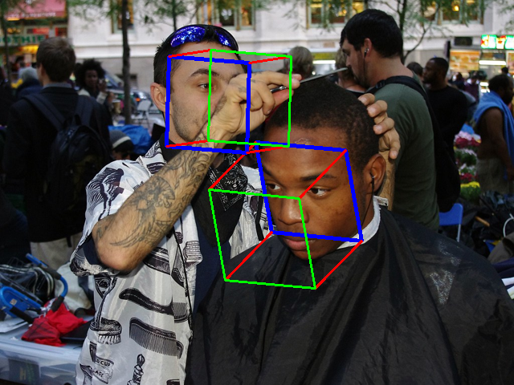

# 6D Rotation Representation for Unconstrained Head Pose Estimation 360 (Pytorch)

## Input


Image credit: "Day 21 Occupy Wall Street October 6 2011 Shankbone 6" by david_shankbone is marked under CC PDM 1.0. To view the terms, visit https://creativecommons.org/publicdomain/mark/1.0/

Ailia input shape: (1, 3, 224, 224)

## Output



## Usage

Automatically downloads the onnx and prototxt files on the first run.
It is necessary to be connected to the Internet while downloading.

For the sample image,
``` bash
$ python3 6d_repnet_360.py
```

If you want to specify the input image, put the image path after the `--input` option.  
You can use `--savepath` option to change the name of the output file to save.
```bash
$ python3 6d_repnet_360.py --input IMAGE_PATH --savepath SAVE_IMAGE_PATH
```

By adding the `--video` option, you can input the video.   
If you pass `0` as an argument to VIDEO_PATH, you can use the webcam input instead of the video file.
```bash
$ python3 6d_repnet_360.py --video VIDEO_PATH
```

The default setting is to use the optimized model and weights, but you can also switch to the normal model by using the --normal option.

## Reference

[6DRepNet360: Towards Robust and Unconstrained Full Range of Rotation Head Pose Estimation](https://github.com/thohemp/6DRepNet360)

## Framework

Pytorch

## Model Format

ONNX opset = 11

## Netron

[6DRepNet360.opt.onnx.prototxt](https://netron.app/?url=https://storage.googleapis.com/ailia-models/6d_repnet_360/6DRepNet360.opt.onnx.prototxt)

[RetinaFace.opt.onnx.prototxt](https://netron.app/?url=https://storage.googleapis.com/ailia-models/6d_repnet/RetinaFace.opt.onnx.prototxt)

## Model Description

6DRepNet360 is an enhanced version of 6DRepNet that provides robust head pose estimation for the full range of rotation (360 degrees). The model is fine-tuned on 300W-LP + Panoptic datasets to handle extreme head poses that the original 6DRepNet may struggle with.

Key improvements over the original 6DRepNet:
- Enhanced training on full rotation range datasets
- Better generalization to extreme head poses
- Same efficient 6D rotation representation
- Maintains real-time performance

The model outputs a 3x3 rotation matrix that is converted to Euler angles (yaw, pitch, roll) for visualization and analysis.

## Citation

```BibTeX
@ARTICLE{10477888,
  author={Hempel, Thorsten and Abdelrahman, Ahmed A. and Al-Hamadi, Ayoub},
  journal={IEEE Transactions on Image Processing}, 
  title={Toward Robust and Unconstrained Full Range of Rotation Head Pose Estimation}, 
  year={2024},
  volume={33},
  number={},
  pages={2377-2387},
  doi={10.1109/TIP.2024.3378180}}
```
