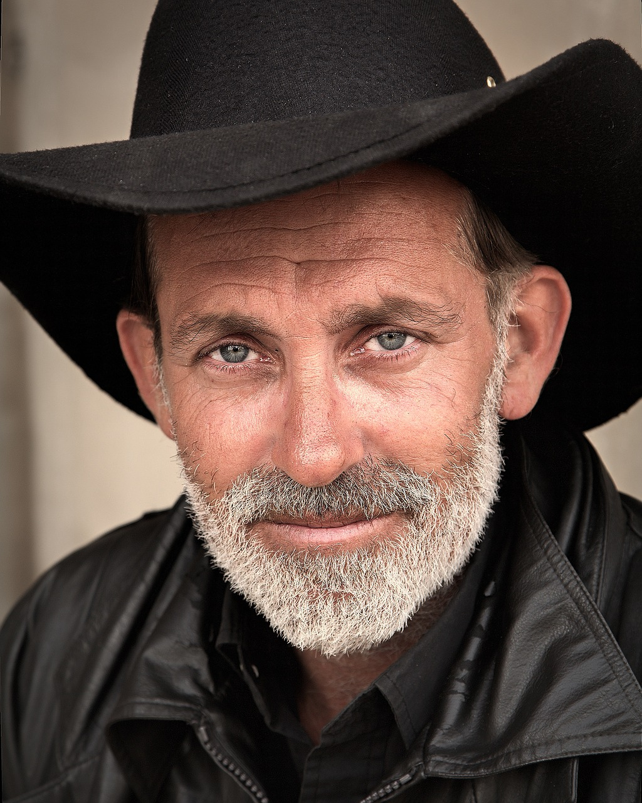

# Facial Features

## Input



(Image from https://pixabay.com/photos/people-cowboy-male-hat-person-875597/)

### Face Detector: BlazeFace

- ailia input shape: (1, 3, 128, 128) RGB channel order
- Pixel value range: [-1, 1]

### Face Landmarks Estimator: Face Mesh

- ailia input shape: (batch_size, 3, 192, 192) RGB channel order
- Pixel value range: [-1, 1]

### Eyelids Classifier: ax Eyelids

- ailia input shape: (batch_size, 3, 256, 256) RGB channel order
- Pixel value range: [0, 1] before normalization
- Preprocessing: normalization using ImageNet statistics

### Eyelashes Classifier: ax Eyelashes

- ailia input shape: (batch_size, 3, 256, 256) RGB channel order
- Pixel value range: [0, 1] before normalization
- Preprocessing: normalization using ImageNet statistics

### Facial Hair Classifier: ax Facial Hair

- ailia input shape: (batch_size, 3, 256, 256) RGB channel order
- Pixel value range: [0, 1] before normalization
- Preprocessing: normalization using ImageNet statistics

## Output

```
ROI
==============================================================
top_left = (-12.06, 139.10) (x, y)
top_right = (918.57, 50.24) (x, y)
bottom_left = (76.80, 1069.73) (x, y)
bottom_right = (1007.43, 980.87) (x, y)

Eyelids
==============================================================
class_count = 2
+ idx = 0
  category = 0 [double]
  prob = 0.998113751411438
+ idx = 1
  category = 1 [single]
  prob = 0.0018862121505662799

Eyelashes
==============================================================
class_count = 3
+ idx = 0
  category = 0 [dense]
  prob = 0.8559471368789673
+ idx = 1
  category = 1 [moderate]
  prob = 0.09105094522237778
+ idx = 2
  category = 2 [sparse]
  prob = 0.05300195515155792

Facial hair
==============================================================
label_count = 3
+ category = 0 [moustache]
  prob = 0.9992972612380981
+ category = 1 [beard]
  prob = 0.9995272755622864
+ category = 2 [mouth_side_hair]
  prob = 0.9998342990875244
```

### Face Detector: BlazeFace

- ailia Predict API output:
  - Bounding boxes and keypoints
    - Shape: (1, 896, 16)
  - Classification confidences
    - Shape: (1, 896, 1)
- With helper functions, filtered detections with keypoints can be obtained.

### Face Landmarks Estimator: Face Mesh

- ailia Predict API output:
  - `landmarks`: 468 face landmarks with (x, y, z) coordinates
    - Shape: (1, batch_size\*468\*3)
    - x and y are in the range [0, 192] (to normalize, divide by the image width
    and height, 192). z represents the landmark depth with the depth at center
    of the head being the origin, and the smaller the value the closer the
    landmark is to the camera. The magnitude of z uses roughly the same scale as
    x.
  - `confidences`: raw confidence values. Applying the sigmoid function yields
  scores in [0, 1]
    - Shape: (1, batch_size*1)
- With helper functions, image (original size) coordinates of eye centers, iris
landmarks and cropped eye region image can be obtained.

### Eyelids Classifier: ax Eyelids

- ailia Predict API output:
  - `eyelids`: raw prediction values for eyelids classification. Applying the
  sigmoid function yields scores in [0, 1]
    - Shape: (batch_size, 2) [double, single] order

### Eyelashes Classifier: ax Eyelashes

- ailia Predict API output:
  - `eyelashes`: raw prediction values for eyelashes classification. Applying
  the sigmoid function yields scores in [0, 1]
    - Shape: (batch_size, 3) [dense, moderate, sparse] order

### Facial Hair Classifier: ax Facial Hair

- ailia Predict API output:
  - `facial_hair`: probability values for facial hair multi-label classification
    - Shape: (batch_size, 3) [moustache, beard, mouth_side_hair] order

## Usage

Automatically downloads the onnx and prototxt files on the first run.
It is necessary to be connected to the Internet while downloading.

For the sample image,
``` bash
$ python3 ax_facial_features.py 
```

If you want to specify the input image, put the image path after the `--input` option.  
You can use `--savepath` option to change the name of the output file to save.
```bash
$ python3 ax_facial_features.py --input IMAGE_PATH --savepath SAVE_IMAGE_PATH
```

By adding the `--video` option, you can input the video.   
If you pass `0` as an argument to VIDEO_PATH, you can use the webcam input instead of the video file.
```bash
$ python3 ax_facial_features.py --video VIDEO_PATH --savepath SAVE_VIDEO_PATH
```

#### Additional options

- `-m` or `--mode`: Allow to choose which classification(s) among [eyelids,
eyelashes, facial_hair] to perform

## Model Format

ONNX opset = 11
