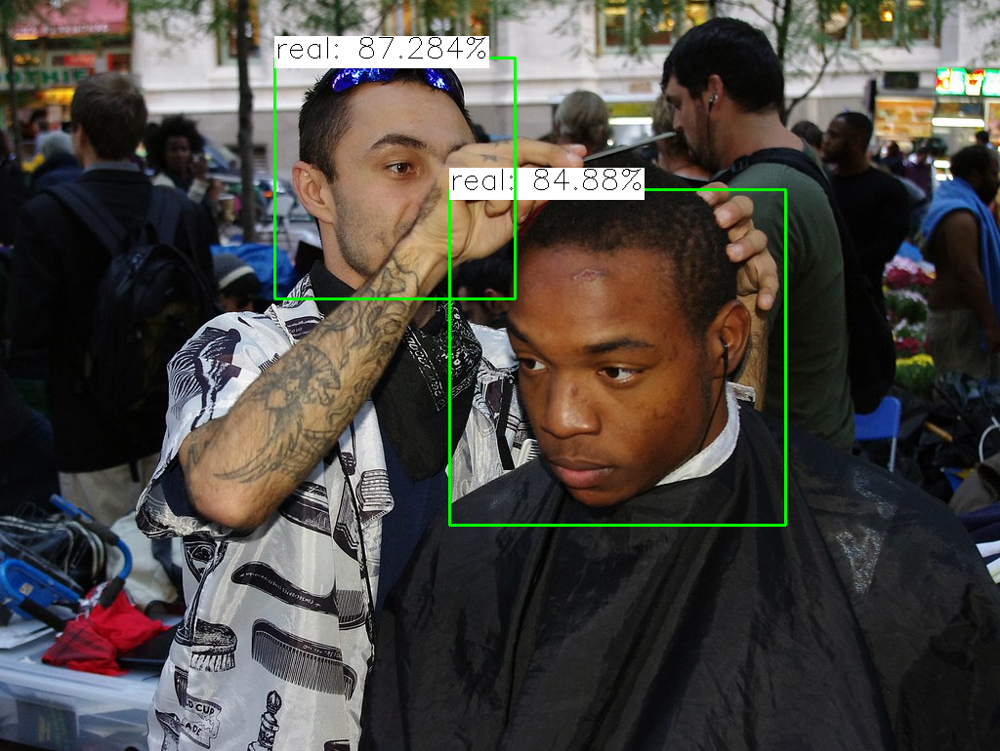

# Lightweight Face Anti Spoofing

## Input


(Image from https://search.creativecommons.org/photos/df3a19c2-47ca-4f58-8aed-0dc62e89e9e9)

Shape: (1, 3, 128, 128) RGB channel order

## Output

- Estimating spoofing
```bash
### Estimating spoofing ###
face is real: 98.432%
```

- Detected face estimation



## Usage

Automatically downloads the onnx and prototxt files on the first run. It is necessary to be connected to the Internet
while downloading.

For the sample image,
```bash
$ python3 face-anti-spoofing.py 
```

If you want to specify the input image, put the image path after the `--input` option.
```bash
$ python3 face-anti-spoofing.py --input IMAGE_PATH
```

If you want to perform face detection in preprocessing, use the `--detection` option.
```bash
$ python3 face-anti-spoofing.py --input IMAGE_PATH --detection
```

By adding the `--video` option, you can input the video.   
If you pass `0` as an argument to VIDEO_PATH, you can use the webcam input instead of the video file.  
You can use --savepath option to specify the output file to save.
```bash
$ python3 face-anti-spoofing.py --video VIDEO_PATH --savepath SAVE_VIDEO_PATH
```

## Reference

- [Lightweight Face Anti Spoofing](https://github.com/kprokofi/light-weight-face-anti-spoofing)

## Framework

Pytorch

## Model Format

ONNX opset = 11

## Netron

[MN3_large.onnx.prototxt](https://netron.app/?url=https://storage.googleapis.com/ailia-models/face-anti-spoofing/MN3_large.onnx.prototxt)
