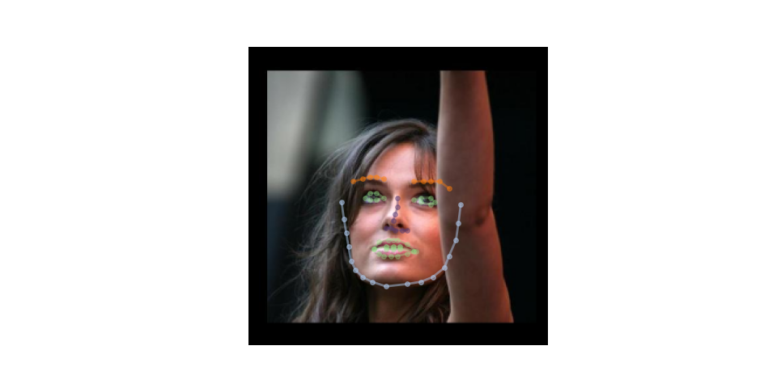
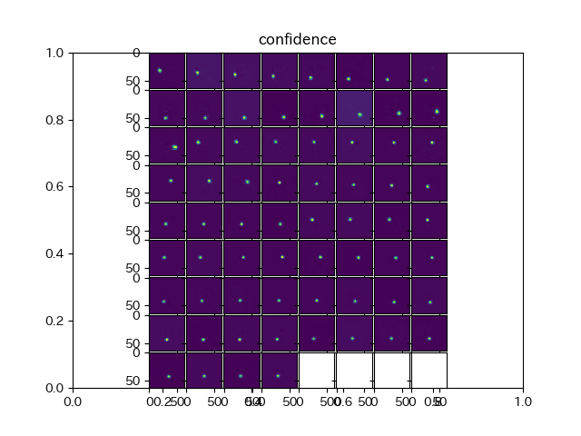

# 2D and 3D Face alignment library build using pytorch

## Input


(from https://github.com/1adrianb/face-alignment/tree/master/test/assets)

Ailia input shape : (1, 3, 256, 256)
Range : [0.0, 1.0]

## Output
- 2D mode output image  
  

- 3D mode output image  
  

- confidence map  


## Usage
Automatically downloads the onnx and prototxt files on the first run.
It is necessary to be connected to the Internet while downloading.

For the sample image,
```bash
$ python3 face_alignment.py 
```
or if you want to try 3D-mode,
```bash
$ python3 face_alignment.py --active_3d
```
will give you back 3D face alignment results.

If you want to specify the input image, put the image path after the `--input` option.  
You can use `--savepath` option to change the name of the output file to save.  
Confidence map is saved with the output image file name prefixed with `_confidence`.
- ex. output.png --> output_confidence.png
```bash
$ python3 face_alignment.py --input IMAGE_PATH --savepath SAVE_IMAGE_PATH
```

By adding the `--video` option, you can input the video.   
If you pass `0` as an argument to `VIDEO_PATH`, 
you can use the webcam input instead of the video file.
```bash
$ python3 face_alignment.py --video VIDEO_PATH
```

## Reference

[2D and 3D Face alignment library build using pytorch](https://github.com/1adrianb/face-alignment)

## Framework

Pytorch 1.2.0

## Model Format

ONNX opset = 10

## Netron

- [2DFAN-4.onnx.prototxt](https://netron.app/?url=https://storage.googleapis.com/ailia-models/face_alignment/2DFAN-4.onnx.prototxt)
- [3DFAN-4.onnx.prototxt](https://netron.app/?url=https://storage.googleapis.com/ailia-models/face_alignment/3DFAN-4.onnx.prototxt)
- [depth_estimation.onnx.prototxt](https://netron.app/?url=https://storage.googleapis.com/ailia-models/face_alignment/depth_estimation.onnx.prototxt)
