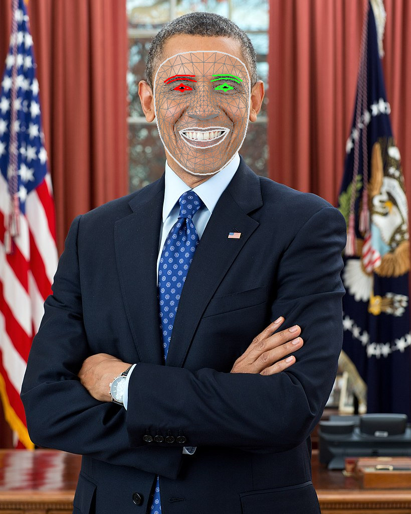

# FaceMesh-V2

## Input


(Image from https://storage.googleapis.com/mediapipe-assets/portrait.jpg)

### FaceDetector

- ailia input shape: (1, 128, 128, 3) RGB channel order
- Pixel value range: [-1, 1]

### FaceMesh-V2

- ailia input shape: (1, 256, 256, 3) RGB channel order
- Pixel value range: [0, 1]

### Blendshape

- ailia input shape: (1, 146, 2)

## Output

### Face landmark



### Blendshape


## Usage

Automatically downloads the onnx and prototxt files on the first run.
It is necessary to be connected to the Internet while downloading.

For the sample image,

``` bash
$ python3 facemesh_v2.py 
```

If you want to specify the input image, put the image path after the `--input` option.  
You can use `--savepath` option to change the name of the output file to save.

```bash
$ python3 facemesh_v2.py --input IMAGE_PATH --savepath SAVE_IMAGE_PATH
```

By adding the `--video` option, you can input the video.   
If you pass `0` as an argument to VIDEO_PATH, you can use the webcam input instead of the video file.

```bash
$ python3 facemesh_v2.py --video VIDEO_PATH --savepath SAVE_VIDEO_PATH
```

If you specify the `--blendshape` option, a bar plot of Blendshape will be output.
```bash
$ python3 facemesh_v2.py --blendshape
```

## Reference

- [MediaPipe Face landmark detection](https://developers.google.com/mediapipe/solutions/vision/face_landmarker)

## Framework

TensorFlow Lite

## Model Format

ONNX opset = 11

## Netron

- [face_detector.onnx.prototxt](https://netron.app/?url=https://storage.googleapis.com/ailia-models/facemesh_v2/face_detector.onnx.prototxt)
- [face_landmarks_detector.onnx.prototxt](https://netron.app/?url=https://storage.googleapis.com/ailia-models/facemesh_v2/face_landmarks_detector.onnx.prototxt)
- [face_blendshapes.onnx.prototxt](https://netron.app/?url=https://storage.googleapis.com/ailia-models/facemesh_v2/face_blendshapes.onnx.prototxt)
