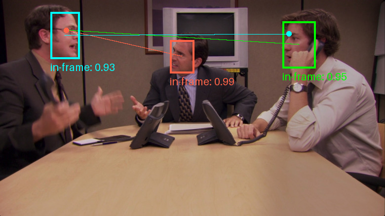

# gazelle

## Input


(Image from https://www.looper.com/img/gallery/the-office-funniest-moments-ranked/jim-and-dwights-customer-service-training-1627594561.jpg)

## Output



## Usage
Automatically downloads the onnx and prototxt files on the first run.
It is necessary to be connected to the Internet while downloading.

For the sample image,
```bash
$ python3 gazelle.py
```

If you want to specify the input image, put the image path after the `--input` option.  
You can use `--savepath` option to change the name of the output file to save.
```bash
$ python3 gazelle.py --input IMAGE_PATH --savepath SAVE_IMAGE_PATH
```

By adding the `--video` option, you can input the video.   
If you pass `0` as an argument to VIDEO_PATH, you can use the webcam input instead of the video file.
```bash
$ python3 gazelle.py --video VIDEO_PATH
```

For output heatmap, you can use `--heatmap` option.
```bash
$ python3 gazelle.py --heatmap
```

## Reference

- [gazelle](https://github.com/fkryan/gazelle)
- [retinaface](https://github.com/serengil/retinaface)

## Model Format

ONNX opset=17

## Netron

[gazelle_backbone_vitb14.onnx.prototxt](https://netron.app/?url=https://storage.googleapis.com/ailia-models/gazeml/gazelle_backbone_vitb14.onnx.prototxt)  
[gazelle_backbone_vitl14.onnx.prototxt](https://netron.app/?url=https://storage.googleapis.com/ailia-models/gazeml/gazelle_backbone_vitl14.onnx.prototxt)  
[gazelle_decoder_vitb14.onnx.prototxt](https://netron.app/?url=https://storage.googleapis.com/ailia-models/gazeml/gazelle_decoder_vitb14.onnx.prototxt)  
[gazelle_decoder_vitb14_inout.onnx.prototxt](https://netron.app/?url=https://storage.googleapis.com/ailia-models/gazeml/gazelle_decoder_vitb14_inout.onnx.prototxt)  
[gazelle_decoder_vitl14.onnx.prototxt](https://netron.app/?url=https://storage.googleapis.com/ailia-models/gazeml/gazelle_decoder_vitl14.onnx.prototxt)  
[gazelle_decoder_vitl14_inout.onnx.prototxt](https://netron.app/?url=https://storage.googleapis.com/ailia-models/gazeml/gazelle_decoder_vitl14_inout.onnx.prototxt)  
